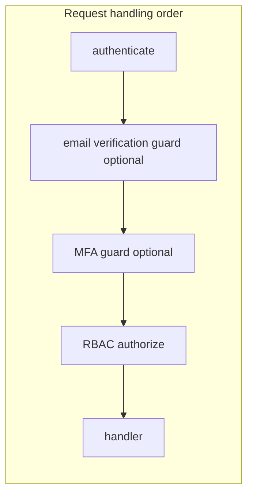

# Composable MFA gates + enforce MFA when user has enrolled

## Current gaps

1. **Bundled guards** — `[requireEmailVerificationGraphQL](apps/api/src/lib/authorization/email-verification-graphql-guard.ts)` and `[requireEmailVerificationRest](apps/api/src/lib/authorization/email-verification-rest-guard.ts)` **always** wrap the inner resolver/middleware with `[requireMfaGraphQL](apps/api/src/lib/authorization/mfa-graphql-guard.ts)` / `[requireMfaRest](apps/api/src/lib/authorization/mfa-rest-guard.ts)`. Email and MFA cannot be applied independently or reordered.
2. **MFA policy is org-centric (with a project-scope quirk)** — In `requireMfaGraphQL`, for `Tenant.Organization` scope, `requiresMfa` comes from `requireMfaForSensitiveActions`. For `OrganizationProject` / `OrganizationProjectUser`, `requiresMfa` defaults to **true** without reading the org flag (see lines 55–65). There is **no** branch for “user enrolled MFA themselves.”
3. **No single “has active MFA” primitive for guards** — Guards can call `handlers.organizations.getOrganizations` but there is no small, documented API on `[MeHandler](apps/api/src/handlers/me.handler.ts)` / `[IUserMfaService](packages/@grantjs/core/src/ports/services/user.service.port.ts)` for “user has at least one **enabled** (fully enrolled) factor,” suitable for hot paths.

### Review incorporated (plan iteration)

- **Enrollment check must not be primary-only** — `[getPrimaryFactor](apps/api/src/repositories/user-mfa-factors.repository.ts)` is a poor proxy: the repo supports multiple factors and primary switching; a user can have an **enabled non-primary** device while primary is missing or soft-deleted in edge cases (`getPrimaryFactor` does not filter deleted rows the way a semantic “active enrollment” query should). The contract must be: `**hasActiveMfaEnrollment` ⇔ exists at least one factor with `deletedAt` null and `isEnabled === true`** (implement via `listFactors` + filter, or a dedicated repository query). Do **not implement this as “primary factor is enabled” only.
- **Composition helpers are mandatory for this refactor** — Decoupling removes the single place MFA ran; **every** previous consumer of bundled email+MFA must be rewired. Require **named helpers** (see §2) for the canonical **email → MFA → RBAC** chain, and a **grep-based checklist** (or CI grep test) so no `requireEmailVerification` site ships without the paired MFA step.
- **Project scope vs stated “org OR user MFA” rule** — For `Tenant.Organization`, `orgRequiresMfa` follows `requireMfaForSensitiveActions`. For `OrganizationProject` / `OrganizationProjectUser`, the guard still sets `**requiresMfa` to true by default** without reading the org flag (`[mfa-graphql-guard.ts](apps/api/src/lib/authorization/mfa-graphql-guard.ts)` ~55–65). So **this phase does not normalize** org vs project policy: project-scoped routes remain **at least as strict as before (often stricter than org-only with flag off). Call that out in reviews so “org policy OR user enrolled MFA” is not misread as identical behavior across tenant types until the deferred alignment work lands.

## Target behavior (confirmed)

- **Route set**: Same surfaces as today — only operations that currently use `requireEmailVerification` (plus their RBAC wrappers). No expansion to all org-scoped GETs.
- **New rule**: On those surfaces, require `mfaVerified` when **either** the existing org policy says so **or** the session user has **enabled** MFA (registered + verified device). If the user has no MFA enrolled, org-only policy applies as today.

## Implementation plan

### 1. Decouple email and MFA guards

- Change `**requireEmailVerificationGraphQL**` to **only** enforce email verification (same logic as today for unverified users / `allowPersonalContext`), and call the **passed resolver directly** — remove the inner `requireMfaGraphQL(options, resolver)` indirection.
- Change `**requireEmailVerificationRest`** to **only run email checks; remove the inner `requireMfaRest` call; on success, `next()`.

### 2. Compose guards at every call site (GraphQL + REST) — **mandatory helpers + verification**

**Security requirement:** After decoupling, MFA is no longer automatic; a missed call site silently drops MFA. **Do not** rely on ad-hoc nesting only.

- **Add required composition helpers** in `[apps/api/src/lib/authorization/](apps/api/src/lib/authorization/)` and export from `[index.ts](apps/api/src/lib/authorization/index.ts)`, e.g.:
  - `**requireEmailThenMfaGraphQL(emailOpts, mfaOpts, resolver)` — equivalent to `requireEmailVerificationGraphQL(emailOpts, requireMfaGraphQL(mfaOpts, resolver))` with documented ordering.
  - `**requireEmailThenMfaRest(emailOpts, mfaOpts)` — returns a single Express middleware (or a pair) that runs email verification then `requireMfaRest(mfaOpts)` in order, for use before `authorizeRestRoute`.
  - Policy note: these helpers **only** encode order; they do not add new policy beyond composing existing guards.
- **GraphQL** (`[mutations.ts](apps/api/src/graphql/resolvers/mutations.ts)`): Replace raw nested `requireEmailVerificationGraphQL(requireMfaGraphQL(...))` with the **helper** everywhere a mutation previously relied on bundled behavior. Preserve `ALLOW_PERSONAL` / `BLOCK_UNVERIFIED` by passing the same options into the helper.
- **REST**: Apply the REST helper for every route that previously used `requireEmailVerificationRest` before sensitive `authorizeRestRoute` handlers.
- **Exhaustive verification (mandatory)**
  - Before merge: run `rg "requireEmailVerificationGraphQL|requireEmailVerificationRest" apps/api` and confirm every hit either uses the new helper **or** is documented as intentionally email-only (should be rare).
  - Optionally add a short **checklist** in the PR description or `docs/contributing/testing.md` listing files touched. Prefer a **lint/test** that fails if `requireEmailVerificationRest` appears without `requireMfaRest` or the combined helper on the same route (heuristic; tune to avoid false positives).

### 3. “User has enabled MFA” — data + policy in MFA guards

- Add a **core contract** method on `IUserMfaService`, e.g. `hasActiveMfaEnrollment(userId): Promise<boolean>`, implemented in `[UserMfaService](apps/api/src/services/user-mfa.service.ts)` / repository as:
  - **True iff** there exists **at least one** MFA factor with `**deletedAt` null (or equivalent “active”)** and `**isEnabled === true`.
  - **Do not** implement using `getPrimaryFactor` alone — primary is not a safe proxy once multiple factors exist; verify against `[user-mfa-factors.repository.ts](apps/api/src/repositories/user-mfa-factors.repository.ts)` (list/setPrimary/remove behavior).
- Expose a thin **handler** method on `[MeHandler](apps/api/src/handlers/me.handler.ts)` (e.g. `hasActiveMfaEnrollmentForUser(userId)`) so guards use **handlers → services → repos** only.
- Update `**requireMfaGraphQL`** / `**requireMfaRest\*\`:
  - Compute `orgRequiresMfa` using **existing** logic (org flag for `Tenant.Organization`; **unchanged** default for project scopes — see §5 and “Review incorporated” above).
  - `userRequiresMfa = await handlers.me.hasActiveMfaEnrollmentForUser(user!.userId)` (session tokens only).
  - `requiresMfa = orgRequiresMfa || userRequiresMfa`.
  - If `requiresMfa && !user!.mfaVerified` → `MFA_REQUIRED` (unchanged error code).

### 4. Tests and docs

- **Tests**: Adjust any tests that assumed email guard included MFA. Add unit/integration coverage for: (a) email-only guard does not check MFA; (b) composed chain enforces MFA; (c) org flag off + user with enabled MFA → still `MFA_REQUIRED` when `mfaVerified` false on a gated route; (d) `**hasActiveMfaEnrollment` true when enabled factor is non-primary (regression guard against primary-only query).
- **Docs**: Document composable guards and the new “user-enrolled MFA” rule in `[docs/architecture/security.md](docs/architecture/security.md)` (or `[docs/core-concepts/mfa-recovery.md](docs/core-concepts/mfa-recovery.md)` cross-link). Mention that **Me** MFA setup mutations remain on `authenticate` only (no MFA gate), so users can still enroll.

### 5. Follow-up (out of scope unless you want it in the same PR)

- **Project/org scope alignment**: Unify `OrganizationProject` / `OrganizationProjectUser` with `requireMfaForSensitiveActions` (and optionally resolve org id from project scope for the flag) so **org policy OR user** reads the same for all org-related tenants. **Today**, project-scoped MFA is **not** governed by the org boolean; `requiresMfa` defaults **true** there. This phase **explicitly** leaves that quirk in place; reviewers should not treat “user enrolled MFA” work as full policy normalization across tenant types.

## Risk / perf note

- `hasActiveMfaEnrollment` adds a DB read on gated requests. Acceptable for v1; optional later: cache flag on JWT at sign/refresh (`mfaEnrollmentActive`) to skip the query, invalidated on MFA enable/disable.
