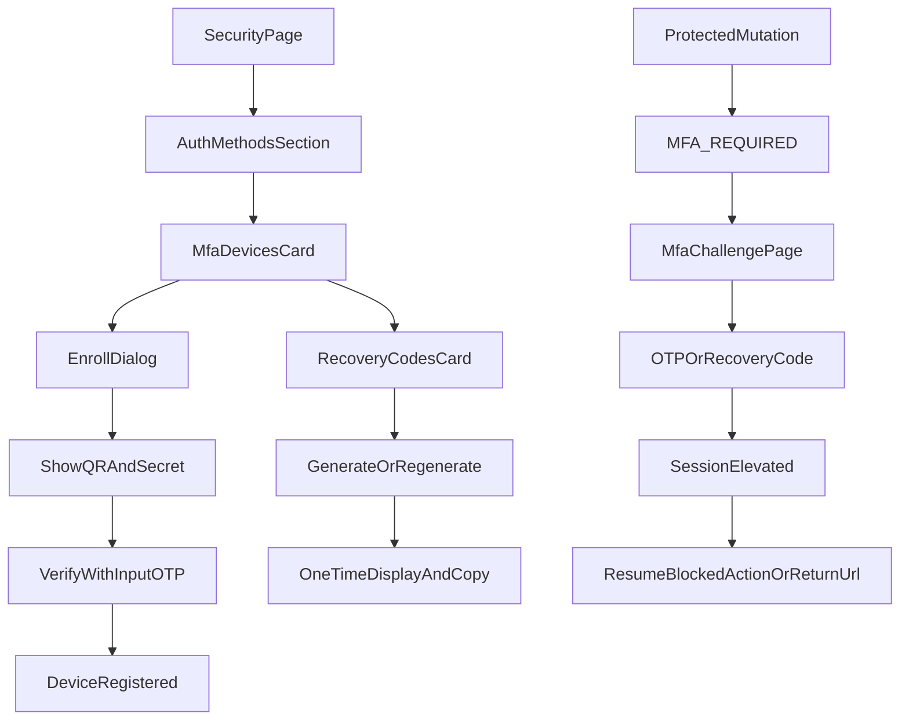

# MFA Device Management UX Plan

## Scope

Implement a complete MFA UX on top of existing MFA foundations with:

- Multi-device TOTP management in Security settings
- Enrollment flow with QR + copyable secret
- Verification flow using shadcn `InputOTP`
- Recovery code generation/display/regeneration UX
- Step-up challenge UX for `MFA_REQUIRED`

## Current Anchors to Extend

- Security page composition: `[/home/logus/Sites/logusgraphics/grant-platform/apps/web/app/[locale]/dashboard/settings/security/page.tsx](/home/logus/Sites/logusgraphics/grant-platform/apps/web/app/[locale]/dashboard/settings/security/page.tsx)`
- Auth methods section (insertion point after this block): `[/home/logus/Sites/logusgraphics/grant-platform/apps/web/components/features/settings/setting-authentication-method-list.tsx](/home/logus/Sites/logusgraphics/grant-platform/apps/web/components/features/settings/setting-authentication-method-list.tsx)`
- Existing MFA challenge route: `[/home/logus/Sites/logusgraphics/grant-platform/apps/web/app/[locale]/auth/mfa/page.tsx](/home/logus/Sites/logusgraphics/grant-platform/apps/web/app/[locale]/auth/mfa/page.tsx)`
- MFA-required redirect behavior: `[/home/logus/Sites/logusgraphics/grant-platform/apps/web/lib/apollo-client.ts](/home/logus/Sites/logusgraphics/grant-platform/apps/web/lib/apollo-client.ts)`
- Auth state store (`mfaVerified` already present): `[/home/logus/Sites/logusgraphics/grant-platform/apps/web/stores/auth.store.ts](/home/logus/Sites/logusgraphics/grant-platform/apps/web/stores/auth.store.ts)`

## UX Information Architecture

- In **Settings > Security**, add a new section directly after Authentication Methods:
  - **MFA Status** (enabled/disabled, primary device)
  - **Registered Devices** list (name, created, last used, primary badge)
  - **Actions**: add device, set primary, remove device
  - **Recovery Codes**: generate first set, view once modal, regenerate with warning
- Enrollment ownership rule:
  - **Primary enrollment surface** is Settings > Security (normal device onboarding and management).
  - `/auth/mfa` remains **challenge-first** and only enters enroll mode when users are routed there by guard logic and have no enrolled MFA device.
- Keep `/auth/mfa` split modes:
  - `challenge` mode (verify only, OTP/recovery)
  - `enroll` mode (QR + secret + verify) for guard-triggered unenrolled users

## Component and Hook Plan

- New settings components under `apps/web/components/features/settings/`:
  - `setting-mfa-devices-card.tsx`
  - `setting-mfa-enroll-dialog.tsx`
  - `setting-mfa-recovery-codes-card.tsx`
  - `setting-mfa-remove-device-dialog.tsx`
- New shared MFA components under `apps/web/components/features/auth/`:
  - `mfa-otp-input.tsx` wrapping shadcn `InputOTP` ([Input OTP docs](https://ui.shadcn.com/docs/components/radix/input-otp))
  - `mfa-qr-panel.tsx` (QR image + secret copy)
- New hooks:
  - `apps/web/hooks/mfa/use-mfa-devices.ts`
  - `apps/web/hooks/mfa/use-mfa-mutations.ts`
  - `apps/web/hooks/mfa/use-recovery-codes.ts`

## API/Contract Alignment for UX

- Add/confirm **API contracts and client operations** for:
  - list devices
  - create enrollment (returns `otpauthUrl`, secret, temporary enrollment id)
  - verify enrollment code (activates device)
  - rename device / set primary / delete device
  - generate/re-generate recovery codes
  - verify by recovery code (for challenge fallback)
- Regenerate schema docs/types and consume generated operations in hooks.

## UX Flow Details

## Accessibility and Interaction Standards

- OTP input:
  - use `InputOTP` with numeric pattern and paste support
  - auto-focus first slot; submit on completion where appropriate
  - clear inline validation and disabled/loading states
- Enrollment:
  - QR rendered with fallback plain secret
  - explicit copy button with success feedback
  - warning copy around secret visibility and one-time recovery-code display
- Destructive actions:
  - confirmation dialogs for remove device and regenerate codes

## Validation and Acceptance Criteria

- Security page renders device and recovery-code sections for authenticated users
- User can enroll multiple devices and set one as primary
- User can remove non-last device; last-device guard UX shown
- Recovery codes can be generated/regenerated and copied/downloaded once per generation
- `MFA_REQUIRED` redirects to challenge page and accepts OTP input via `InputOTP`
- Optional recovery-code challenge path works and updates session state
- Challenge flow preserves retry context or return URL and resumes expected destination/action after success
- Existing auth methods/session sections continue functioning

## Rollout Strategy

- Phase 1: UX scaffolding + read-only cards
- Phase 2: enrollment + challenge with OTP
- Phase 3: full device management actions
- Phase 4: recovery-code lifecycle and fallback challenge
- Phase 5: polish (i18n strings, empty states, analytics/audit hooks, QA)
