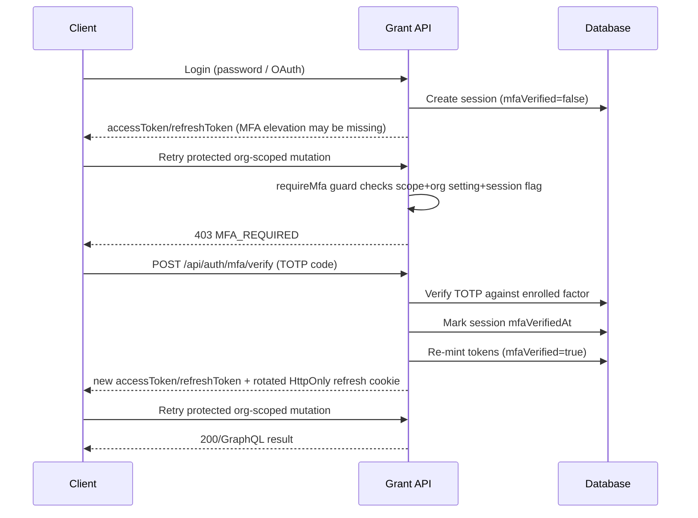

## Goals

- Implement TOTP (authenticator app) MFA.
- Enforce MFA for “login-sensitive” operations in organization contexts.
- Make MFA requirement configurable per organization.
- MVP enforcement model: **post-token** (issue session tokens with `mfaVerified=false`, then block sensitive operations until MFA is verified).

## What requires MFA (MVP policy)

Treat MFA as a step-up requirement for org-scoped sensitive actions (not a replacement for email verification).

1. **Scope-based trigger (correct guard coverage):**

- MFA is evaluated using the effective scope from the request (`Tenant.Organization`_ / `Tenant.OrganizationProject`_/`Tenant.OrganizationProjectUser`).
- Therefore, MFA must be enforced for org-scoped requests even when endpoints use `requireEmailVerification...({ allowPersonalContext: true })` today.

1. **Org setting decides the policy:**

- Only when the target organization has `requireMfaForSensitiveActions=true` should MFA be required.

Not required (MVP):

- API request authorization for API keys / projectApp tokens (enforce MFA at issuance in a later iteration).

## MFA enforcement design (post-token)

1. Login creates/returns session tokens.
2. If the user belongs to any organization that requires MFA, the session is minted with `mfaVerified=false`.
3. The new guards block sensitive mutations until the session is elevated to `mfaVerified=true`.
4. UI prompts the user to set up MFA (if not enrolled) or verify a TOTP code.
5. MFA verification updates the current session and re-mints tokens with `mfaVerified=true`.

### Sequence (verify during challenge)



### Guard logic sketch

```mermaid
flowchart TD
    A[Incoming request] --> B[Extract scope from headers/args]
    B --> C{Scope is organization*?}
    C -- No --> D[Allow (MVP)]
    C -- Yes --> E[Load org security setting requireMfaForSensitiveActions]
    E --> F{requireMfaForSensitiveActions && session.mfaVerified=false?}
    F -- Yes --> G[403 MFA_REQUIRED]
    F -- No --> H[Continue existing guards (email verification etc.)]
```

## Key missing pieces in current codebase (what we’ll add)

- There is no existing TOTP/MFA implementation; current “OTP” is used for **email verification** and **password reset**.
- Organization model currently has only `id/name/slug` in `packages/@grantjs/database/src/schemas/organizations.schema.ts`, so we’ll add org security settings storage.
- Session JWT currently carries `isVerified` (email verification). We’ll add a new session claim for MFA verification.
- MFA verify must rotate the existing HttpOnly refresh cookie (REST and GraphQL). Without this, the next `refreshSessionViaCookie` will use stale tokens.
- Rollout must define token compatibility: sessions/tokens created before `mfaVerified` exists must be treated as `mfaVerified=false`.

## Implementation steps (follow project order)

### 1) Development environment + env config (apps/api)

- Add env/config entries for:
  - TOTP issuer label (for `otpauth://`)
  - TOTP step/allowed drift (e.g. +/-1 step)
  - MFA session verification TTL (optional; MVP can be per-session only)
  - Rate limits/attempt limits for MFA verify endpoints
  - Secret at-rest encryption key (if we encrypt TOTP secrets)

### 2) Database (packages/@grantjs/database)

Add/modify:

- `user_sessions`:
  - Persist `mfaVerifiedAt` (nullable)
  - (Security hardening) persist email verification status so refresh cannot bypass email verification
- New MFA factor storage:
  - `user_mfa_factors` (TOTP only for MVP)
  - Store TOTP secret encrypted at rest
- Org security settings:
  - Add an org-level field/table (e.g. `organizations.mfaSettings` JSONB or a dedicated table) with:
    - `requireMfaForSensitiveActions` boolean

Also ensure migrations + seeds for defaults (MFA off by default).

### 3) Schema / API contracts (packages/@grantjs/schema)

- Extend `LoginResponse` and `MeResponse` GraphQL types to include MFA state:
  - `mfaVerified?: Boolean` (session-level; MVP can still rely on `403 MFA_REQUIRED`)
  - (optional) `requiresMfaSetup?: Boolean` if we want proactive enrollment guidance
- Add new GraphQL operations and REST/openapi contracts for:
  - MFA setup (generate secret + otpauth URI)
  - MFA verify (TOTP code)
- Add operations for organization MFA policy with **read + write** for the org settings UI:
  - `getOrganizationMfaSettings` (or add `mfaSettings` to `Organization` GraphQL type)
  - `updateOrganizationMfaSettings` (or extend existing `updateOrganization` input)

### 4) API (apps/api)

- Token + auth claim support:
  - Update `packages/@grantjs/core` to parse and expose `mfaVerified` in `GrantAuth`.
  - Update `apps/api/src/services/user-sessions.service.ts` to sign JWTs with `mfaVerified`.
- Login/session minting:
  - Update session minting so tokens carry `mfaVerified=false` until the user completes MFA step-up.
  - MVP choice: set `mfaVerified=false` for all sessions when the user belongs to at least one MFA-required org; the MFA guard will only require step-up for org-scoped sensitive requests.
- Session refresh hardening:
  - Ensure refresh re-mints `mfaVerified` from persisted session fields (no defaulting to `true`).
  - Backward compatibility: sessions/tokens created before `mfaVerified` exists must be treated as `mfaVerified=false`.
- Guards:
  - Implement `requireMfaRest` and `requireMfaGraphQL` in `apps/api/src/lib/authorization/`.
  - Wire MFA guards into the same sensitive route/resolver set that already uses `requireEmailVerification...` today (including routes with `allowPersonalContext: true`), since MFA enforcement is determined by effective scope tenant (org vs personal) plus org policy.
- Wiring and composition-root boundary:
  - Register new MFA services/handlers in their standard registries (`apps/api/src/services/index.ts` and `apps/api/src/handlers/index.ts`) without introducing cross-layer imports.
  - Compose request-scoped instances only in the actual composition roots: `apps/api/src/middleware/context.middleware.ts` (runtime requests) and `apps/api/src/lib/app-context.lib.ts` (app context bootstrap), so guards can consult org MFA policy via `req.context.handlers`.
- MFA factor endpoints:
  - REST + GraphQL for setup and verify.
  - Verification should:
    - validate TOTP code (with drift)
    - prevent basic replay by recording last accepted time-step (optional MVP can rely on time-step window)
    - rate-limit verification attempts
    - audit-log factor enablement and successful verification
    - rotate refresh cookie in both transports (REST response cookie + GraphQL `setRefreshTokenCookie(context.res, ...)`)

### 5) Web (apps/web)

- Auth state:
  - Extend `apps/web/stores/auth.store.ts` to store `mfaVerified` (and optionally a setup hint if available).
- MFA UI:
  - Add pages/components for:
    - TOTP setup (QR + “enter code”)
    - MFA challenge (enter code to elevate session)
  - Handle 403 `MFA_REQUIRED` by navigating to MFA challenge/setup.
- Org settings UI:
  - Add an org security settings UI surface that includes a toggle for `requireMfaForSensitiveActions`.
  - Requires the new **read** contract to render the current value, and the write mutation to persist updates.

## Testing plan (required)

- Unit tests:
  - TOTP generation/verification logic (drift handling, code validity)
- Integration/e2e:
  - MFA required org => login creates session with `mfaVerified=false`
  - org mutation fails with `MFA_REQUIRED` until MFA verify succeeds
  - include a route that currently uses `requireEmailVerification...({ allowPersonalContext: true })` to validate corrected MFA guard coverage
  - enabling org setting takes effect immediately after update
  - MFA verify rotates the HttpOnly refresh cookie for both REST and GraphQL flows
- Compatibility/rollout:
  - existing sessions created before enabling MFA are treated as `mfaVerified=false` and require step-up on the next org-scoped sensitive action

## Open design choices to confirm (we already selected)

- Enforcement timing: **post-token / action-blocking** (selected).
- MFA method: **TOTP** (selected).
- Login UX prompt scope (pending):
  - MVP can avoid proactive login prompts and instead rely on `403 MFA_REQUIRED` step-up when users attempt org-scoped sensitive actions.
