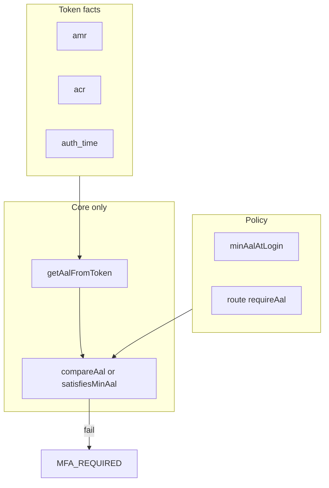
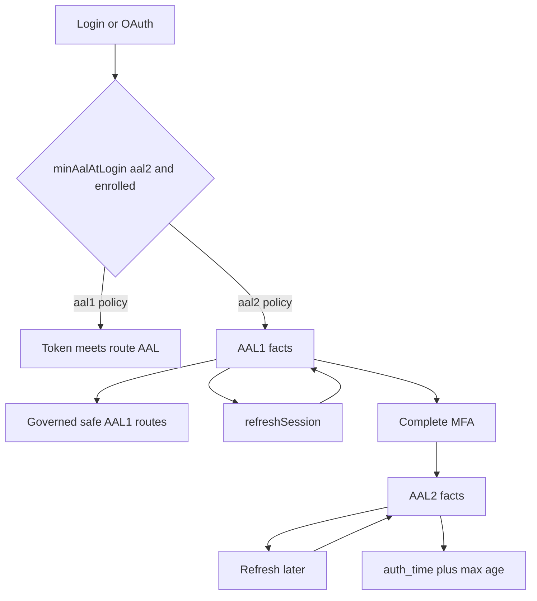

# `requireFullAuthAtLogin` + assurance-oriented tokens

**North star:** _Tokens describe how the user authenticated. Policies decide what that’s worth._

## Naming (bias AAL-first)

| Concept                          | Preferred                   | Legacy / alias                    |
| -------------------------------- | --------------------------- | --------------------------------- | ------------------------------------------------------------------------------------------------------------------------------------------------------------------------------------------------------------------------------------------------------------------------------------ |
| Platform login minimum assurance | `**minAalAtLogin`: `"aal1"` | `"aal2"` (extend to `aal3` later) | `**AUTH_REQUIRE_FULL_AUTH_AT_LOGIN`** — treat as **legacy env alias** (e.g. `true` → `minAalAtLogin = aal2` when MFA enrolled; `false` → `aal1` or “no login gate”). Document both; **new docs and code paths should say `minAalAtLogin`** so naming matches an **AAL-driven system. |

Reason: the architecture is **assurance-level driven**; a boolean flag name ages poorly next to `**requireAal`**, `**getAalFromToken\*\`, and org overrides.

---

## Target architecture (distilled)

**Token (facts)** — e.g.

```json
{
  "amr": ["pwd", "otp"],
  "acr": "aal2",
  "auth_time": 1710000000
}
```

**Policy (evaluation)** — layered:

- **Global:** `minAalAtLogin` (see naming table).
- **Route:** `requireAal("aal2")` (positive requirement).
- **Org:** overrides (future).

### Engine: first-class functions in core (no ad-hoc guards)

**Do not** check `acr` directly in guards or inspect `amr` in one-off conditionals—**centralize** or drift is guaranteed.

| Function (conceptual; live in `@grantjs/core`)                          | Responsibility                                                                                                                                                                    |
| ----------------------------------------------------------------------- | --------------------------------------------------------------------------------------------------------------------------------------------------------------------------------- |
| `**getAalFromToken(token)` → `AAL`                                      | Single derivation of **effective AAL** from JWT claims (`amr`/`acr`/`auth_time` rules per SSOT). This is the former vague `tokenAssurance`; **name it explicitly** and export it. |
| `**compareAal(a, b)`** or `**satisfiesMinAal(tokenAal, requiredAal)\*\` | **Canonical ordering only** — see below.                                                                                                                                          |
| `**requireAal(context, 'aal2')` (transport layer helper)                | Uses `**getAalFromToken`** + **ordering; never raw strings beyond the `AAL` enum / union.                                                                                         |

**Evaluation shape:**

```text
if (!satisfiesMinAal(getAalFromToken(token), requiredAalForThisRequest)) {
  throw MFA_REQUIRED // or STEP_UP_REQUIRED — domain error from @grantjs/core
}
```

👉 IAM shape: **facts → one derivation function → ordered compare → allow or challenge.**

---

## Canonical AAL ordering (strict)

**Requirement:** `**AAL1 < AAL2 < AAL3`** as a **total order in code.

- **Do not** rely on **lexicographic string compare** of `'aal1'` vs `'aal2'` (fragile, locale-free but easy to get wrong with new labels).
- **Do not** rely on **implicit** ordering.

**Do:** use a **single** representation—e.g. **numeric enum**, **ordered tuple**, or **explicit rank map**—exported next to `**getAalFromToken`:

```ts
// Conceptual
const AAL_RANK = { aal1: 1, aal2: 2, aal3: 3 } as const;
function compareAal(a: Aal, b: Aal): number { ... }
```

All **policy checks** use `**compareAal` / `satisfiesMinAal` only.

**Plan:** fold into `**aal-mapping-ssot`** todo (mapping + ordering + **getAalFromToken together).

---

## Allowlist vs positive requirements

| Model                       | What it is                         | Risk                                                   |
| --------------------------- | ---------------------------------- | ------------------------------------------------------ |
| **Negative (allowlist)**    | Block everything except listed ops | OK for **v1**; must **sunset**.                        |
| **Positive (`requireAal`)** | Route declares minimum AAL         | Scales; use `**getAalFromToken`** + `**compareAal\*\`. |

- **v1:** allowlist **shim** only — **converge-aal-guards** / **mfa-verify-path** track removal.

---

## Single source of truth: AAL mapping + derivation

One canonical place for `**amr`/`acr` ↔ AAL (extend for WebAuthn / AAL3):

```ts
// Conceptual — @grantjs/core or @grantjs/constants
const AAL_PROFILES = {
  AAL1: { acr: 'aal1', amrIncludes: ['pwd'] as const },
  AAL2: { acr: 'aal2', amrIncludes: ['pwd', 'otp'] as const },
};
// + getAalFromToken(claims) implemented HERE only
```

---

## Safe AAL1 routes — governance (anti-creep)

**Purpose:** Exceptions so users aren’t brick-walled (MFA setup, verify, recovery, logout, refresh, minimal session for challenge UI).

**Risk:** **Creep** — “just add this endpoint…” → **half the API** becomes AAL1 again.

**Rules:**

- Treat the list as a **security boundary**, like **permissions**—**not** convenience routing.
- **Review** additions in PRs with the same rigor as **new RBAC grants**; require **justification** (user must complete assurance / session ops only).
- Prefer **route metadata** (`minAal: aal1` override) over a **growing central string list** where possible—keeps scope visible in codeowners’ surfaces.
- **safe-aal1-routes** todo: document **anti-creep** policy in `docs/` or security doc.

---

## “Global deny” → default AAL2 + **governed** safe AAL1 routes

Not “deny entire API”; it’s **default higher bar** with **explicit, reviewed** low-AAL exceptions—see above.

---

## `auth_time` — core to re-auth (not optional long-term)

Step-up max age + `**auth_time`** move from “MFA once per session” to a **credible** model. Schedule with `**amr`/`acr`** stabilization (**acr-amr-auth-time todo).

---

## Two platform modes (config)

| Mode  | `minAalAtLogin` (conceptual)                 | Behavior (simplified)                                                       |
| ----- | -------------------------------------------- | --------------------------------------------------------------------------- |
| **1** | `aal1` (or legacy flag **off**)              | AAL1 often enough; step-up on sensitive routes.                             |
| **2** | `aal2` when enrolled (or legacy flag **on**) | Must reach AAL2 for general surfaces; **safe AAL1 routes** still reachable. |

`**mfaVerified`:** transitional only—derive assurance via `**getAalFromToken` long-term.

---

## Pragmatic rollout

| Phase     | What                                                                                                             |
| --------- | ---------------------------------------------------------------------------------------------------------------- |
| **Now**   | `**getAalFromToken` + ordering** + SSOT; `mfaVerified` + allowlist shim where needed; **governed safe AAL1 list. |
| **Next**  | `**requireAal` everywhere; shrink allowlist.                                                                     |
| **Later** | Drop `**mfaVerified`** from guards; `**auth_time\*\*` enforcement.                                               |

---

## Current behavior (constraints)

- `[AuthHandler.login](apps/api/src/handlers/auth.handler.ts)` issues tokens; initial `mfaVerified: false`.
- `[verifyMfa](apps/api/src/graphql/resolvers/auth/mutations/verify-mfa.resolver.ts)` needs Bearer context.
- Refresh: `[refresh-session.resolver.ts](apps/api/src/graphql/resolvers/auth/mutations/refresh-session.resolver.ts)`, `[refresh-session.ts](apps/web/lib/refresh-session.ts)`.

**Review:** Refresh parity; OAuth `[handleGithubCallbackAuth](apps/api/src/rest/utils/auth.ts)`, `[linkGithubAuthToExistingUser](apps/api/src/rest/utils/auth.ts)`, `[auth.handler](apps/api/src/handlers/auth.handler.ts)`. Keep `**TokenType.Session`.

---

## Branch B / NIST / configuration

- Restricted JWT + refresh; factual claims; policy via `**minAalAtLogin`** and route `**requireAal\*\*`.
- Add `**amr`**, `**acr`**, `\*\*auth_time\*\*`to JWT and`[TokenClaims](packages/@grantjs/core/src/types/index.ts)`; validate in `[TokenManager](packages/@grantjs/core/src/core/token-manager.ts)`/`[Grant](packages/@grantjs/core/src/core/grant.ts)`.
- **Config:** `**minAalAtLogin`** primary; `**AUTH_REQUIRE_FULL_AUTH_AT_LOGIN`** documented as **legacy alias**; `**MFA_STEP_UP_MAX_AGE_SECONDS`** when `**auth_time` enforced.

---

## Implementation phases (suggested)

1. **AAL SSOT + `getAalFromToken` + `compareAal`** — before widespread guard edits.
2. **Policy + login + OAuth** — issue via SSOT; wire `**minAalAtLogin` (and alias).
3. **Refresh** — pre-MFA restricted facts; parity.
4. **Guards** — allowlist shim + `**requireAal`**; **no raw `acr` in resolvers.
5. **Claims** — `**auth_time`** in same program as stable `**amr`/`acr\*\*`.
6. **Web + tests** — modes; ordering; **dashboard vs MFA** paths without safe-list creep.

---

## Risks

- **Drift** — Mitigate: `**getAalFromToken`** only; **aal-mapping-ssot.
- **String-order bugs** — Mitigate: **explicit AAL rank / `compareAal`**.
- **Safe-list creep** — Mitigate: **governance** + **safe-aal1-routes** policy.
- **Allowlist sticks** — Mitigate: **converge-aal-guards**.
- `**mfaVerified` semantics** — Mitigate: **AAL facts + convergence.

---



### Operational flow (login + refresh)


