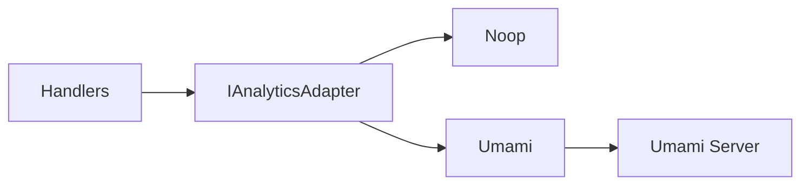

# Analytics

**Status:** Grant does not implement an analytics event store or dashboards. This page describes how to add analytics via **integrations** (e.g. [Umami](https://umami.is/), or other backends), so your app can send events without Grant owning the storage or UI. Analytics is optional; enable it by configuring a provider.

## Overview

Analytics is delivered through **integrations** using the port-and-adapter pattern: you plug in an adapter (noop by default, or Umami, etc.). The platform exposes a single `trackEvent` contract; integrations forward events to the backend of your choice. Grant does not store events; adapters send them to external or open-source platforms.

- **Port:** `IAnalyticsAdapter` in `@grantjs/core`; event shape is minimal (name, optional category, properties, optional user/account/org IDs, requestId, timestamp). No PII in the contract; compliance is the adapter's and deployer's responsibility.
- **Integrations:** Noop (default), Umami (self-hosted, privacy-friendly). Additional integrations can be implemented and registered in the factory.
- **Usage:** Config and adapter are wired in the API app; handlers call `trackEvent` (fire-and-forget, same pattern as telemetry).



## Current implementation

Config is in `ANALYTICS_CONFIG` ([apps/api/src/config/env.config.ts](apps/api/src/config/env.config.ts)); the adapter is created in [apps/api/src/lib/analytics/index.ts](apps/api/src/lib/analytics/index.ts). Use `getAnalyticsAdapter()` from `@/lib/analytics` in handlers; call `trackEvent` fire-and-forget (do not await in the hot path).

### Config

| Variable                     | Default     | Description                                                                           |
| ---------------------------- | ----------- | ------------------------------------------------------------------------------------- |
| `ANALYTICS_ENABLED`          | `false`     | Enable event tracking when provider is not `none`                                     |
| `ANALYTICS_PROVIDER`         | `none`      | `none` or `umami`                                                                     |
| `ANALYTICS_UMAMI_API_URL`    | —           | Umami API base URL (e.g. `https://analytics.example.com` or `https://cloud.umami.is`) |
| `ANALYTICS_UMAMI_WEBSITE_ID` | —           | Website ID from Umami dashboard                                                       |
| `ANALYTICS_UMAMI_HOSTNAME`   | `grant-api` | Hostname sent with each event                                                         |

See `apps/api/.env.example` for all analytics variables.

### Usage

```typescript
import { getAnalyticsAdapter } from '@/lib/analytics';
import { getRequestLogger } from '@/middleware/request-logging.middleware';

// In a handler: fire-and-forget
const adapter = getAnalyticsAdapter();
adapter
  .trackEvent({
    name: 'organization.created',
    category: 'organization',
    organizationId: organization.id,
    accountId: req.context?.accountId,
    userId: req.user?.id,
    requestId: (req as any).requestId,
    properties: { name: organization.name },
  })
  .catch((err) => getRequestLogger(req).error({ msg: 'Analytics track failed', err }));
```

### Example event names

Use a consistent pattern such as `<entity>.<action>`:

- `user.signup`, `user.login`, `user.logout`
- `organization.created`, `organization.member.invited`
- `permission.granted`, `feature.<name>.used`

## Best practices

- **Fire-and-forget:** Do not `await` `trackEvent` in the request path; use `.catch(log)` so failures do not break the app.
- **No PII in payloads:** Do not put email, passwords, or other sensitive data in `properties`; compliance is the adapter's and deployer's responsibility.
- **Stable event names:** Use the same name for the same semantic action so dashboards in the backend (e.g. Umami) can aggregate correctly.

## Adding another integration

Implement the `IAnalyticsAdapter` interface from `@grantjs/core` (method `trackEvent`) and register it in the analytics factory. See [@grantjs/analytics](packages/@grantjs/analytics) and the existing Umami adapter ([packages/@grantjs/analytics/src/umami.ts](packages/@grantjs/analytics/src/umami.ts)) as the reference; add a new provider branch in the factory and the corresponding config in `ANALYTICS_CONFIG`.

---

**Related:**

- [Observability overview](/advanced-topics/observability-overview) — Integrations for logging, metrics, telemetry, tracing
- [Umami dashboards](/advanced-topics/umami-dashboards) — Walkthrough to connect Grant to Umami and build a first analytics dashboard
- Runbook: `observability/README.md` in the repo
