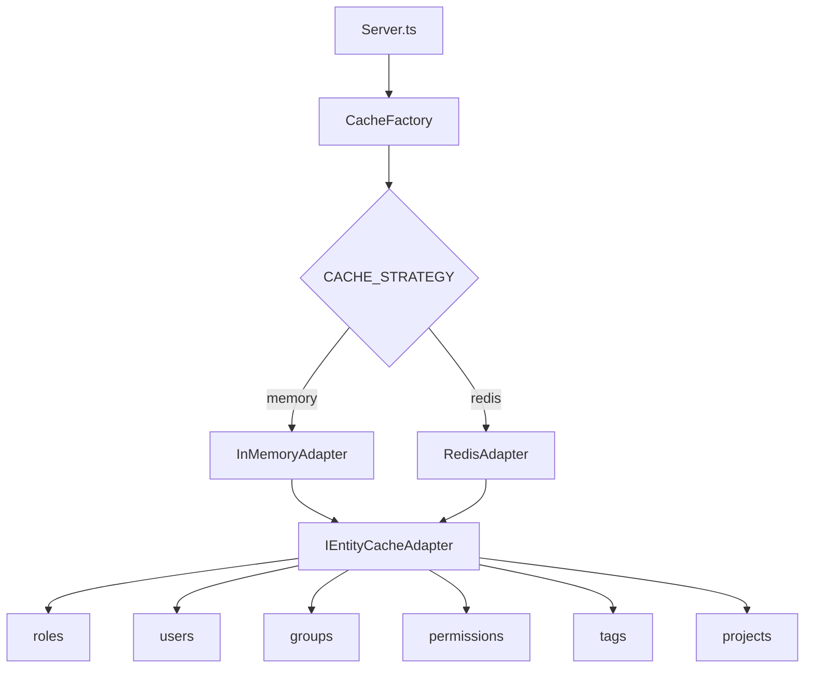

# Caching System

Grant uses the **Adapter Pattern** for caching — a single interface with swappable backends. In development you get zero-config in-memory caching; in production you switch to Redis by setting one environment variable.

## Architecture



## Adapter Comparison

|                      | In-Memory                    | Redis                      |
| -------------------- | ---------------------------- | -------------------------- |
| **Best for**         | Development, single instance | Production, multi-instance |
| **Setup**            | None (default)               | Requires Redis server      |
| **Persistence**      | Lost on restart              | Survives restarts          |
| **Cross-process**    | No                           | Yes                        |
| **Network overhead** | None                         | Minimal                    |

## Configuration

| Variable         | Default     | Description         |
| ---------------- | ----------- | ------------------- |
| `CACHE_STRATEGY` | `memory`    | `memory` or `redis` |
| `REDIS_HOST`     | `localhost` | Redis hostname      |
| `REDIS_PORT`     | `6379`      | Redis port          |
| `REDIS_PASSWORD` | —           | Redis auth password |

Redis is already included in the project's `docker-compose.yml`. Start it with:

```bash
docker compose up redis -d
```

Then set the strategy:

```bash
CACHE_STRATEGY=redis
REDIS_PASSWORD=grant_redis_password
```

## Interfaces

The `ICacheAdapter` interface is implemented by both backends:

```typescript
interface ICacheAdapter {
  get(key: CacheKey): Promise<Set<string> | null>;
  set(key: CacheKey, value: Set<string>): Promise<void>;
  has(key: CacheKey): Promise<boolean>;
  delete(key: CacheKey): Promise<void>;
  clear(): Promise<void>;
  keys(pattern?: string): Promise<CacheKey[]>;
  disconnect(): Promise<void>;
}
```

The application uses `IEntityCacheAdapter`, which provides a namespaced `ICacheAdapter` per entity type:

```typescript
interface IEntityCacheAdapter {
  roles: ICacheAdapter;
  users: ICacheAdapter;
  groups: ICacheAdapter;
  permissions: ICacheAdapter;
  tags: ICacheAdapter;
  projects: ICacheAdapter;
}
```

## Cache Keys

Keys are scoped by tenant:

```
{tenant}:{id}
```

Redis adds an entity prefix to prevent collisions:

```
grant:{entity}:{tenant}:{id}
```

For example: `grant:roles:organization:550e8400-e29b-41d4-a716-446655440000`

Redis entries expire after **24 hours** by default to prevent stale data.

## Usage

```typescript
// Read from cache
const roleIds = await scopeCache.roles.get('organization:123');

// Write to cache
await scopeCache.roles.set('organization:123', new Set(['role-1', 'role-2']));

// Invalidate
await scopeCache.roles.delete('organization:123');

// Clear all entries for an entity type
await scopeCache.roles.clear();
```

Cache entries are automatically invalidated when entities are created, updated, or deleted through the API. If you modify data directly in the database, clear the relevant cache manually.

::: tip Extending
The cache system is designed for extensibility. To add a new backend (e.g., Valkey), implement `ICacheAdapter` and register it in `CacheFactory`. See `packages/@grantjs/cache/src/` for reference implementations.
:::

---

**Related:**

- [Configuration](/getting-started/configuration) — Environment variable reference
- [Multi-Tenancy](/architecture/multi-tenancy) — Tenant-scoped cache keys
