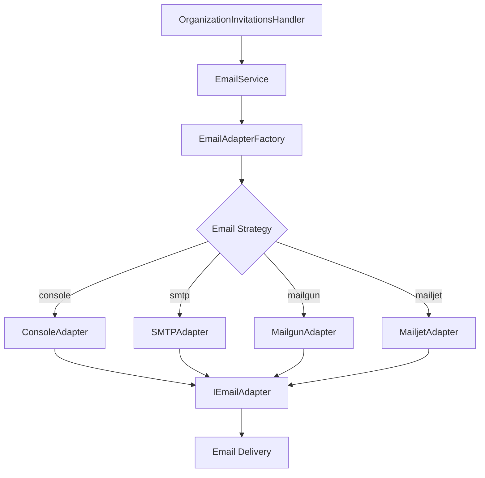

# Email Service & Adapters

Grant Platform features a flexible, adapter-based email delivery system that supports multiple email providers (Mailgun, Mailjet, SMTP, Console) through a unified interface. This document explains the architecture, implementation, and usage of the email system.

## Overview

The email service follows the **Adapter Pattern**, providing a consistent interface while allowing you to swap email providers via configuration. This architecture ensures flexibility for different deployment scenarios:

- **Development**: Console adapter (logs to stdout)
- **Testing**: Console adapter or test email service
- **Staging**: SMTP or API-based providers
- **Production**: Enterprise email providers (Mailgun, Mailjet)

## Architecture



## Core Components

### 1. Email Service Interface

The `IEmailService` interface defines the contract for all email operations:

```typescript
// apps/api/src/lib/email/email.interface.ts

export interface SendInvitationParams {
  to: string;
  organizationName: string;
  inviterName: string;
  invitationUrl: string;
  roleName: string;
}

export interface SendOtpParams {
  to: string;
  token: string;
}

export interface IEmailService {
  sendInvitation(params: SendInvitationParams): Promise<void>;
  sendOtp(params: SendOtpParams): Promise<void>;
}
```

**Design Principles:**

- **Method per Use Case**: Each email type has its own method (not generic `sendEmail`)
- **Type-Safe Parameters**: Strongly typed parameters for each email type
- **Promise-Based**: All operations are async
- **No Return Data**: Email sending is fire-and-forget (failures logged, not thrown)

### 2. Email Service Implementation

The `EmailService` class implements `IEmailService` and delegates to adapters:

```typescript
// apps/api/src/lib/email/email.service.ts

export class EmailService implements IEmailService {
  private adapter: IEmailAdapter;

  constructor(adapterFactory: EmailAdapterFactory) {
    this.adapter = adapterFactory.create();
  }

  async sendInvitation(params: SendInvitationParams): Promise<void> {
    const { to, organizationName, inviterName, invitationUrl, roleName } = params;

    const subject = `You've been invited to join ${organizationName}`;
    const html = `
      <div style="font-family: Arial, sans-serif; max-width: 600px; margin: 0 auto;">
        <h1>You've been invited!</h1>
        <p>${inviterName} has invited you to join <strong>${organizationName}</strong> as a <strong>${roleName}</strong>.</p>
        <a href="${invitationUrl}" style="display: inline-block; padding: 12px 24px; background-color: #2563eb; color: white; text-decoration: none; border-radius: 4px;">
          Accept Invitation
        </a>
        <p style="color: #666; font-size: 14px; margin-top: 20px;">
          This invitation expires in 7 days.
        </p>
      </div>
    `;

    await this.adapter.send({ to, subject, html });
  }

  async sendOtp(params: SendOtpParams): Promise<void> {
    const { to, token } = params;

    const subject = 'Your verification code';
    const html = `
      <div style="font-family: Arial, sans-serif; max-width: 600px; margin: 0 auto;">
        <h1>Verification Code</h1>
        <p>Your verification code is:</p>
        <div style="font-size: 32px; font-weight: bold; letter-spacing: 4px; padding: 20px; background-color: #f3f4f6; text-align: center;">
          ${token}
        </div>
        <p style="color: #666; font-size: 14px; margin-top: 20px;">
          This code expires in 10 minutes.
        </p>
      </div>
    `;

    await this.adapter.send({ to, subject, html });
  }
}
```

**Key Design Decisions:**

- **Adapter Injection**: Adapter created via factory and injected
- **HTML Email Templates**: Inline styles for maximum compatibility
- **Error Handling**: Errors logged but not thrown (handled in adapters)
- **Extensibility**: Add new methods for new email types

### 3. Email Adapter Interface

All adapters implement `IEmailAdapter`:

```typescript
// apps/api/src/lib/email/adapters/email.adapter.interface.ts

export interface EmailMessage {
  to: string | string[];
  subject: string;
  html: string;
  from?: string;
  cc?: string | string[];
  bcc?: string | string[];
  replyTo?: string;
  attachments?: Array<{
    filename: string;
    content: Buffer | string;
    contentType?: string;
  }>;
}

export interface IEmailAdapter {
  send(message: EmailMessage): Promise<void>;
  close?(): Promise<void>;
}
```

**Interface Properties:**

- **`send()`**: Core method to send email
- **`close()`**: Optional cleanup method (for connection pooling)
- **Flexible Recipients**: Support single or multiple recipients
- **Rich Features**: CC, BCC, attachments, reply-to

### 4. Adapter Factory

The factory creates the appropriate adapter based on configuration:

```typescript
// apps/api/src/lib/email/adapters/email-adapter.factory.ts

export class EmailAdapterFactory {
  private readonly config: EmailConfig;

  constructor(config: EmailConfig) {
    this.config = config;
  }

  create(): IEmailAdapter {
    switch (this.config.strategy) {
      case 'console':
        return new ConsoleAdapter(this.config);
      case 'smtp':
        return new SMTPAdapter(this.config);
      case 'mailgun':
        return new MailgunAdapter(this.config);
      case 'mailjet':
        return new MailjetAdapter(this.config);
      default:
        throw new Error(`Unknown email strategy: ${this.config.strategy}`);
    }
  }
}
```

**Factory Pattern Benefits:**

- **Centralized Creation**: Single place to instantiate adapters
- **Runtime Selection**: Strategy determined by environment variables
- **Easy Testing**: Inject mock factory in tests
- **Type Safety**: TypeScript enforces adapter interface

## Adapter Implementations

### Console Adapter (Development)

Logs email to console (stdout) for development:

```typescript
// apps/api/src/lib/email/adapters/console.adapter.ts

export class ConsoleAdapter implements IEmailAdapter {
  async send(message: EmailMessage): Promise<void> {
    console.log('📧 Email (Console Adapter):');
    console.log('To:', message.to);
    console.log('Subject:', message.subject);
    console.log('HTML:', message.html);
  }
}
```

**Use Cases:**

- Local development without email service
- Quick testing of email content
- CI/CD pipelines

**Pros:**

- Zero configuration
- Instant feedback
- No external dependencies

**Cons:**

- Cannot test actual delivery
- No real email validation

### SMTP Adapter (Generic)

Uses standard SMTP protocol via `nodemailer`:

```typescript
// apps/api/src/lib/email/adapters/smtp.adapter.ts

import nodemailer from 'nodemailer';
import type { Transporter } from 'nodemailer';

export class SMTPAdapter implements IEmailAdapter {
  private transporter: Transporter;

  constructor(private readonly config: EmailConfig) {
    this.transporter = nodemailer.createTransport({
      host: config.smtp.host,
      port: config.smtp.port,
      secure: config.smtp.secure, // true for 465, false for other ports
      auth: {
        user: config.smtp.user,
        pass: config.smtp.password,
      },
    });
  }

  async send(message: EmailMessage): Promise<void> {
    try {
      await this.transporter.sendMail({
        from: this.config.from,
        to: message.to,
        subject: message.subject,
        html: message.html,
        cc: message.cc,
        bcc: message.bcc,
        replyTo: message.replyTo,
        attachments: message.attachments,
      });
      console.log(`Email sent to ${message.to}`);
    } catch (error) {
      console.error('Failed to send email:', error);
      // Don't throw - email failures shouldn't crash the app
    }
  }

  async close(): Promise<void> {
    this.transporter.close();
  }
}
```

**Configuration:**

```bash
EMAIL_STRATEGY=smtp
SMTP_HOST=smtp.gmail.com
SMTP_PORT=587
SMTP_SECURE=false
SMTP_USER=your-email@gmail.com
SMTP_PASSWORD=your-app-password
EMAIL_FROM=noreply@yourdomain.com
```

**Use Cases:**

- Self-hosted email servers
- Gmail (with app passwords)
- Office 365
- Any SMTP-compatible service

**Pros:**

- Universal compatibility
- No vendor lock-in
- Simple setup

**Cons:**

- Limited features (no templates, tracking)
- Requires managing SMTP credentials
- Potential deliverability issues

### Mailgun Adapter (Production)

Uses Mailgun API for reliable email delivery:

```typescript
// apps/api/src/lib/email/adapters/mailgun.adapter.ts

import formData from 'form-data';
import Mailgun from 'mailgun.js';
import type { IMailgunClient } from 'mailgun.js/Interfaces';

export class MailgunAdapter implements IEmailAdapter {
  private client: IMailgunClient;
  private domain: string;

  constructor(private readonly config: EmailConfig) {
    const mailgun = new Mailgun(formData);
    this.client = mailgun.client({
      username: 'api',
      key: config.mailgun.apiKey,
      url: config.mailgun.domain.startsWith('eu-')
        ? 'https://api.eu.mailgun.net'
        : 'https://api.mailgun.net',
    });
    this.domain = config.mailgun.domain;
  }

  async send(message: EmailMessage): Promise<void> {
    try {
      const result = await this.client.messages.create(this.domain, {
        from: this.config.from,
        to: message.to,
        subject: message.subject,
        html: message.html,
        cc: message.cc,
        bcc: message.bcc,
        'h:Reply-To': message.replyTo,
      });
      console.log(`Email sent via Mailgun: ${result.id}`);
    } catch (error) {
      console.error('Failed to send email via Mailgun:', error);
    }
  }
}
```

**Configuration:**

```bash
EMAIL_STRATEGY=mailgun
MAILGUN_API_KEY=your-api-key
MAILGUN_DOMAIN=mg.yourdomain.com
EMAIL_FROM=noreply@yourdomain.com
```

**Use Cases:**

- Production email delivery
- Transactional emails at scale
- Email analytics and tracking

**Pros:**

- High deliverability rates
- Detailed analytics
- Webhook support for events
- Batch sending

**Cons:**

- Requires Mailgun account
- Pay-per-email pricing
- Vendor lock-in

### Mailjet Adapter (Production)

Uses Mailjet API for email delivery:

```typescript
// apps/api/src/lib/email/adapters/mailjet.adapter.ts

import { Client, SendEmailV3_1, LibraryResponse } from 'node-mailjet';

export class MailjetAdapter implements IEmailAdapter {
  private client: Client;

  constructor(private readonly config: EmailConfig) {
    this.client = new Client({
      apiKey: config.mailjet.apiKey,
      apiSecret: config.mailjet.apiSecret,
    });
  }

  async send(message: EmailMessage): Promise<void> {
    try {
      const request = this.client.post('send', { version: 'v3.1' });

      const data: SendEmailV3_1.Body = {
        Messages: [
          {
            From: {
              Email: this.config.from,
              Name: this.config.fromName || 'Grant Platform',
            },
            To: Array.isArray(message.to)
              ? message.to.map((email) => ({ Email: email }))
              : [{ Email: message.to }],
            Subject: message.subject,
            HTMLPart: message.html,
          },
        ],
      };

      const response: LibraryResponse<SendEmailV3_1.Response> = await request.request(data);
      console.log(`Email sent via Mailjet: ${response.body.Messages[0].Status}`);
    } catch (error) {
      console.error('Failed to send email via Mailjet:', error);
    }
  }
}
```

**Configuration:**

```bash
EMAIL_STRATEGY=mailjet
MAILJET_API_KEY=your-api-key
MAILJET_API_SECRET=your-api-secret
EMAIL_FROM=noreply@yourdomain.com
EMAIL_FROM_NAME=Grant Platform
```

**Use Cases:**

- Production email delivery
- Marketing emails
- International delivery

**Pros:**

- Real-time monitoring
- Template management
- A/B testing support
- SMS support

**Cons:**

- Requires Mailjet account
- Pricing based on volume
- Vendor lock-in

## Configuration

### Environment Variables

Complete environment variable reference:

```bash
# ============================================================================
# EMAIL CONFIGURATION
# ============================================================================

# Email strategy: console, smtp, mailgun, mailjet
EMAIL_STRATEGY=console

# Default sender
EMAIL_FROM=noreply@yourdomain.com
EMAIL_FROM_NAME=Grant Platform

# ============================================================================
# SMTP CONFIGURATION (when EMAIL_STRATEGY=smtp)
# ============================================================================
SMTP_HOST=smtp.gmail.com
SMTP_PORT=587
SMTP_SECURE=false # true for port 465, false for other ports
SMTP_USER=your-email@gmail.com
SMTP_PASSWORD=your-app-password

# ============================================================================
# MAILGUN CONFIGURATION (when EMAIL_STRATEGY=mailgun)
# ============================================================================
MAILGUN_API_KEY=your-mailgun-api-key
MAILGUN_DOMAIN=mg.yourdomain.com

# ============================================================================
# MAILJET CONFIGURATION (when EMAIL_STRATEGY=mailjet)
# ============================================================================
MAILJET_API_KEY=your-mailjet-api-key
MAILJET_API_SECRET=your-mailjet-api-secret
```

### Configuration Object

The config is loaded and validated via Zod:

```typescript
// apps/api/src/config/email.config.ts

import { z } from 'zod';

const emailConfigSchema = z.object({
  strategy: z.enum(['console', 'smtp', 'mailgun', 'mailjet']),
  from: z.string().email(),
  fromName: z.string().optional(),
  smtp: z
    .object({
      host: z.string(),
      port: z.number(),
      secure: z.boolean(),
      user: z.string(),
      password: z.string(),
    })
    .optional(),
  mailgun: z
    .object({
      apiKey: z.string(),
      domain: z.string(),
    })
    .optional(),
  mailjet: z
    .object({
      apiKey: z.string(),
      apiSecret: z.string(),
    })
    .optional(),
});

export type EmailConfig = z.infer<typeof emailConfigSchema>;

export const emailConfig: EmailConfig = emailConfigSchema.parse({
  strategy: process.env.EMAIL_STRATEGY || 'console',
  from: process.env.EMAIL_FROM || 'noreply@example.com',
  fromName: process.env.EMAIL_FROM_NAME,
  smtp:
    process.env.EMAIL_STRATEGY === 'smtp'
      ? {
          host: process.env.SMTP_HOST!,
          port: parseInt(process.env.SMTP_PORT || '587'),
          secure: process.env.SMTP_SECURE === 'true',
          user: process.env.SMTP_USER!,
          password: process.env.SMTP_PASSWORD!,
        }
      : undefined,
  mailgun:
    process.env.EMAIL_STRATEGY === 'mailgun'
      ? {
          apiKey: process.env.MAILGUN_API_KEY!,
          domain: process.env.MAILGUN_DOMAIN!,
        }
      : undefined,
  mailjet:
    process.env.EMAIL_STRATEGY === 'mailjet'
      ? {
          apiKey: process.env.MAILJET_API_KEY!,
          apiSecret: process.env.MAILJET_API_SECRET!,
        }
      : undefined,
});
```

## Usage in Application

### Service Layer Integration

Email service is injected into services that need it:

```typescript
// apps/api/src/services/index.ts

export class Services {
  public readonly email: EmailService;

  constructor(
    private readonly user: AuthenticatedUser | null,
    private readonly db: DbSchema,
    private readonly repositories: Repositories
  ) {
    // Initialize email service
    const emailAdapterFactory = new EmailAdapterFactory(emailConfig);
    this.email = new EmailService(emailAdapterFactory);

    // ... other services
  }
}
```

### Handler Usage

Handlers use the email service from context:

```typescript
// apps/api/src/handlers/organization-invitations.handler.ts

export class OrganizationInvitationsHandler {
  async inviteMember(input: InviteMemberInput, invitedBy: string) {
    return await TransactionManager.withTransaction(this.db, async (tx) => {
      // ... validation and invitation creation

      // Send invitation email (async, fire-and-forget)
      this.services.email
        .sendInvitation({
          to: email,
          organizationName: organization.name,
          inviterName: inviter.name,
          invitationUrl: `${config.security.frontendUrl}/invitations/${token}`,
          roleName: role.name,
        })
        .catch((error) => {
          console.error('Failed to send invitation email:', error);
          // Don't throw - invitation is already created
        });

      return invitation;
    });
  }
}
```

**Key Points:**

- **Fire-and-Forget**: Email sending doesn't block the API response
- **Error Handling**: Failures logged but don't crash the app
- **Transaction Isolation**: Email sent after transaction commits

## Testing

### Unit Testing

Mock the adapter for unit tests:

```typescript
// tests/unit/services/email.service.test.ts

import { EmailService } from '@/lib/email/email.service';
import { IEmailAdapter } from '@/lib/email/adapters/email.adapter.interface';

const mockAdapter: IEmailAdapter = {
  send: vi.fn().mockResolvedValue(undefined),
};

const emailService = new EmailService({
  create: () => mockAdapter,
} as any);

describe('EmailService', () => {
  it('should send invitation email', async () => {
    await emailService.sendInvitation({
      to: 'test@example.com',
      organizationName: 'Acme Corp',
      inviterName: 'John Doe',
      invitationUrl: 'https://example.com/invite/abc123',
      roleName: 'Developer',
    });

    expect(mockAdapter.send).toHaveBeenCalledWith(
      expect.objectContaining({
        to: 'test@example.com',
        subject: expect.stringContaining('Acme Corp'),
        html: expect.stringContaining('John Doe'),
      })
    );
  });
});
```

### Integration Testing

Test with real email providers in staging:

```typescript
// tests/integration/email.test.ts

describe('Email Integration', () => {
  it('should send email via Mailgun', async () => {
    const emailService = new EmailService(
      new EmailAdapterFactory({
        strategy: 'mailgun',
        from: 'test@example.com',
        mailgun: {
          apiKey: process.env.MAILGUN_API_KEY!,
          domain: process.env.MAILGUN_DOMAIN!,
        },
      })
    );

    await emailService.sendInvitation({
      to: 'test-recipient@example.com',
      organizationName: 'Test Org',
      inviterName: 'Test User',
      invitationUrl: 'https://example.com/invite/test',
      roleName: 'Tester',
    });

    // Check email received (manual verification or webhook listener)
  });
});
```

## Advanced Features

### Custom Email Templates

Extend the email service with template support:

```typescript
// apps/api/src/lib/email/templates/invitation.template.ts

export interface InvitationTemplateData {
  organizationName: string;
  inviterName: string;
  invitationUrl: string;
  roleName: string;
}

export function renderInvitationTemplate(data: InvitationTemplateData): string {
  return `
    <!DOCTYPE html>
    <html>
    <head>
      <style>
        body { font-family: Arial, sans-serif; }
        .container { max-width: 600px; margin: 0 auto; }
        .button { 
          display: inline-block; 
          padding: 12px 24px; 
          background-color: #2563eb; 
          color: white; 
          text-decoration: none; 
          border-radius: 4px; 
        }
      </style>
    </head>
    <body>
      <div class="container">
        <h1>You've been invited!</h1>
        <p>${data.inviterName} has invited you to join <strong>${data.organizationName}</strong> as a <strong>${data.roleName}</strong>.</p>
        <a href="${data.invitationUrl}" class="button">Accept Invitation</a>
        <p style="color: #666; font-size: 14px; margin-top: 20px;">
          This invitation expires in 7 days.
        </p>
      </div>
    </body>
    </html>
  `;
}
```

### Webhook Handling (Mailgun)

Receive delivery notifications:

```typescript
// apps/api/src/rest/routes/webhooks.routes.ts

router.post('/webhooks/mailgun', async (req, res) => {
  const event = req.body;

  switch (event.event) {
    case 'delivered':
      // Email delivered successfully
      await logEmailDelivery(event);
      break;
    case 'failed':
      // Email delivery failed
      await handleEmailFailure(event);
      break;
    case 'opened':
      // Email was opened
      await trackEmailOpen(event);
      break;
  }

  res.status(200).send('OK');
});
```

### Rate Limiting

Prevent abuse with rate limiting:

```typescript
// apps/api/src/lib/email/rate-limiter.ts

export class EmailRateLimiter {
  private attempts = new Map<string, number[]>();

  async checkLimit(email: string, maxPerHour: number = 5): Promise<boolean> {
    const now = Date.now();
    const hourAgo = now - 60 * 60 * 1000;

    const attempts = this.attempts.get(email) || [];
    const recentAttempts = attempts.filter((t) => t > hourAgo);

    if (recentAttempts.length >= maxPerHour) {
      return false; // Limit exceeded
    }

    recentAttempts.push(now);
    this.attempts.set(email, recentAttempts);
    return true; // OK to send
  }
}
```

### Email Queue (Optional)

For high-volume scenarios, use a job queue:

```typescript
// apps/api/src/lib/email/email.queue.ts

import { Queue } from 'bullmq';

export class EmailQueue {
  private queue: Queue;

  constructor() {
    this.queue = new Queue('email', {
      connection: {
        host: process.env.REDIS_HOST,
        port: parseInt(process.env.REDIS_PORT || '6379'),
      },
    });
  }

  async enqueueInvitation(params: SendInvitationParams) {
    await this.queue.add('send-invitation', params, {
      attempts: 3,
      backoff: {
        type: 'exponential',
        delay: 5000,
      },
    });
  }
}
```

## Best Practices

### 1. Error Handling

- **Don't Throw**: Email failures shouldn't crash the app
- **Log Errors**: Detailed logging for debugging
- **Graceful Degradation**: App continues if email fails

### 2. Content

- **Plain Text Fallback**: Always include plain text version
- **Inline Styles**: Maximize email client compatibility
- **Responsive Design**: Mobile-friendly templates
- **Accessible**: Use semantic HTML and alt text

### 3. Deliverability

- **SPF/DKIM/DMARC**: Configure DNS records properly
- **Warm Up**: Gradually increase sending volume
- **Monitor Bounces**: Track and handle bounces
- **Unsubscribe Link**: Include for marketing emails

### 4. Security

- **HTTPS Links**: All links must use HTTPS
- **No Sensitive Data**: Don't include passwords or tokens in emails
- **Rate Limiting**: Prevent abuse
- **Validate Recipients**: Verify email format before sending

### 5. Performance

- **Async Sending**: Never block API responses
- **Connection Pooling**: Reuse SMTP connections
- **Batch Sending**: Group emails when possible
- **Queue System**: Use job queue for high volume

## Comparison: Email Adapters

| Feature              | Console | SMTP    | Mailgun | Mailjet   |
| -------------------- | ------- | ------- | ------- | --------- |
| **Setup Difficulty** | None    | Easy    | Medium  | Medium    |
| **Cost**             | Free    | Free\*  | Paid    | Paid      |
| **Deliverability**   | N/A     | Medium  | High    | High      |
| **Analytics**        | No      | No      | Yes     | Yes       |
| **Templates**        | No      | No      | Yes     | Yes       |
| **Webhooks**         | No      | No      | Yes     | Yes       |
| **Batch Sending**    | No      | Limited | Yes     | Yes       |
| **Best For**         | Dev     | Small   | Scale   | Marketing |

\*SMTP cost depends on the provider (Gmail, Sendgrid, etc.)

## Troubleshooting

### Email not received

**Possible Causes:**

- Incorrect email address
- Spam folder
- Email provider rejection
- DNS misconfiguration

**Solutions:**

- Check adapter logs for errors
- Verify SPF/DKIM/DMARC records
- Test with different email addresses
- Check email provider's bounce logs

### Authentication failed (SMTP)

**Possible Causes:**

- Incorrect credentials
- App password required (Gmail)
- Account security settings

**Solutions:**

- Verify `SMTP_USER` and `SMTP_PASSWORD`
- Enable "Less secure app access" or use app password
- Check firewall and port access

### Rate limit exceeded

**Possible Causes:**

- Too many emails sent in short time
- Provider rate limits

**Solutions:**

- Implement rate limiting on your side
- Upgrade to higher tier with provider
- Use email queue with throttling

## Migration Guide

### From Direct Nodemailer to Email Service

**Before:**

```typescript
import nodemailer from 'nodemailer';

const transporter = nodemailer.createTransport({...});
await transporter.sendMail({
  to: email,
  subject: 'Invitation',
  html: '<p>...</p>',
});
```

**After:**

```typescript
await context.services.email.sendInvitation({
  to: email,
  organizationName: org.name,
  inviterName: user.name,
  invitationUrl: url,
  roleName: role.name,
});
```

**Benefits:**

- Centralized email logic
- Swappable adapters
- Type-safe parameters
- Consistent error handling

## Related Documentation

- [Organization Members & Invitations](/core-concepts/organization-invitations) - User-facing explanation
- [Caching System](/advanced-topics/caching) - Similar adapter pattern
- [Configuration](/getting-started/configuration) - Environment setup
- [Transaction Management](/advanced-topics/transactions) - Handling transactions

---

**Next:** Learn about [Organization Members & Invitations](/core-concepts/organization-invitations) for the user-facing flow.
