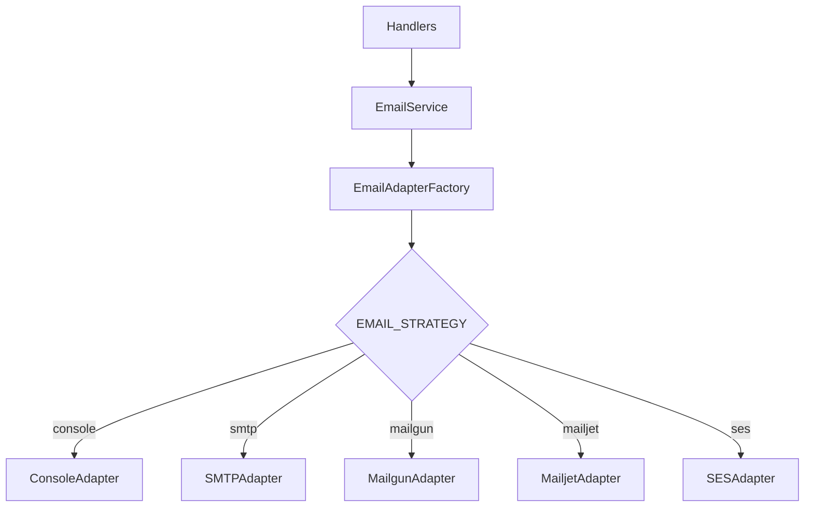

# Email Service & Adapters

Grant uses the **Adapter Pattern** for email delivery — a single `IEmailAdapter` interface with swappable backends. Switch providers by changing one environment variable.

## Architecture



## Adapters

| Adapter     | Use Case                       | Setup                    | Deliverability |
| ----------- | ------------------------------ | ------------------------ | -------------- |
| **Console** | Development — logs to stdout   | None                     | N/A            |
| **SMTP**    | Self-hosted, Gmail, Office 365 | Host/port/credentials    | Medium         |
| **Mailgun** | Production at scale            | API key + domain         | High           |
| **Mailjet** | Production, marketing          | API key + secret         | High           |
| **SES**     | AWS environments               | AWS credentials + region | High           |

## Interface

All adapters implement:

```typescript
interface IEmailAdapter {
  send(message: EmailMessage): Promise<void>;
  close?(): Promise<void>;
}

interface EmailMessage {
  to: string | string[];
  subject: string;
  html: string;
  from?: string;
  cc?: string | string[];
  bcc?: string | string[];
  replyTo?: string;
  attachments?: Array<{ filename: string; content: Buffer | string; contentType?: string }>;
}
```

The `EmailService` wraps adapters with use-case methods (`sendInvitation`, `sendOtp`) that build HTML content and delegate to `adapter.send()`. Email sending is **fire-and-forget** — failures are logged but never thrown.

## Configuration

| Variable          | Default               | Description                                       |
| ----------------- | --------------------- | ------------------------------------------------- |
| `EMAIL_STRATEGY`  | `console`             | `console`, `smtp`, `mailgun`, `mailjet`, or `ses` |
| `EMAIL_FROM`      | `noreply@example.com` | Default sender address                            |
| `EMAIL_FROM_NAME` | `Grant`               | Sender display name                               |

**SMTP-specific:**

| Variable        | Description                            |
| --------------- | -------------------------------------- |
| `SMTP_HOST`     | SMTP server hostname                   |
| `SMTP_PORT`     | SMTP port (587 for TLS, 465 for SSL)   |
| `SMTP_SECURE`   | `true` for port 465, `false` otherwise |
| `SMTP_USER`     | SMTP username                          |
| `SMTP_PASSWORD` | SMTP password                          |

**Mailgun-specific:**

| Variable          | Description                                |
| ----------------- | ------------------------------------------ |
| `MAILGUN_API_KEY` | Mailgun API key                            |
| `MAILGUN_DOMAIN`  | Sending domain (e.g., `mg.yourdomain.com`) |

**Mailjet-specific:**

| Variable             | Description        |
| -------------------- | ------------------ |
| `MAILJET_API_KEY`    | Mailjet API key    |
| `MAILJET_API_SECRET` | Mailjet API secret |

## Usage

Handlers access the email service through context:

```typescript
// Send organization invitation (fire-and-forget)
this.services.email
  .sendInvitation({
    to: email,
    organizationName: organization.name,
    inviterName: inviter.name,
    invitationUrl: `${config.security.frontendUrl}/invitations/${token}`,
    roleName: role.name,
  })
  .catch((error) => logger.error({ err: error }, 'Failed to send invitation email'));
```

The email service is created once at startup via the `EmailAdapterFactory` and injected into the service layer.

::: tip Extending
To add a new provider, implement `IEmailAdapter` and register it in `EmailAdapterFactory`. See `packages/@grantjs/email/src/` for the existing adapter implementations.
:::

---

**Related:**

- [Organization Invitations](/core-concepts/organization-invitations) — Invitation workflow that triggers emails
- [Configuration](/getting-started/configuration) — Environment variable reference
