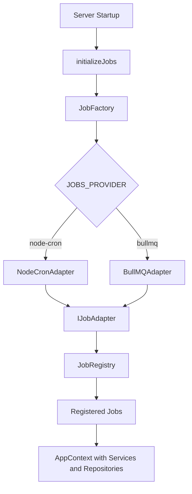

# Job Scheduling & Background Tasks

Grant uses the **Adapter Pattern** for background jobs — a single `IJobAdapter` interface with swappable providers. Use node-cron for development and BullMQ for production.

## Architecture



## Provider Comparison

|                         | node-cron                    | BullMQ                        |
| ----------------------- | ---------------------------- | ----------------------------- |
| **Best for**            | Development, single instance | Production, multi-instance    |
| **External deps**       | None                         | Redis                         |
| **Job persistence**     | No (lost on restart)         | Yes (stored in Redis)         |
| **Distributed locking** | No                           | Yes (prevents duplicate runs) |
| **Retries**             | No                           | Yes (exponential backoff)     |
| **Monitoring**          | Logs only                    | Built-in job tracking         |

## Configuration

| Variable                       | Default     | Description                   |
| ------------------------------ | ----------- | ----------------------------- |
| `JOBS_ENABLED`                 | `true`      | Enable/disable job scheduling |
| `JOBS_PROVIDER`                | `node-cron` | `node-cron` or `bullmq`       |
| `JOBS_DATA_RETENTION_SCHEDULE` | `0 2 * * *` | Cron pattern for data cleanup |

**BullMQ-specific** (requires `CACHE_STRATEGY=redis`):

| Variable                    | Default       | Description                    |
| --------------------------- | ------------- | ------------------------------ |
| `JOBS_BULLMQ_ATTEMPTS`      | `3`           | Retry attempts for failed jobs |
| `JOBS_BULLMQ_BACKOFF_TYPE`  | `exponential` | `exponential` or `fixed`       |
| `JOBS_BULLMQ_BACKOFF_DELAY` | `2000`        | Backoff delay in ms            |

## Interface

```typescript
interface IJobAdapter {
  schedule(job: ScheduledJob, handler: JobHandler): Promise<void>;
  cancel(jobId: string): Promise<void>;
  isScheduled(jobId: string): Promise<boolean>;
  getScheduledJobs(): Promise<ScheduledJob[]>;
  trigger(jobId: string): Promise<JobResult>;
  shutdown(): Promise<void>;
}
```

Jobs receive an `AppContext` (repositories + services + system user) — background jobs run without a request/user context.

## Creating a Job

1. Create a file in `apps/api/src/jobs/`:

```typescript
// apps/api/src/jobs/my-job.job.ts
import { config } from '@/config';
import type { AppContext } from '@/lib/app-context';
import type { JobExecutionContext, JobHandler, JobResult, ScheduledJob } from '@/lib/jobs';
import { jobRegistry } from '@/lib/jobs/job-registry';
import { createModuleLogger } from '@/lib/logger';

const logger = createModuleLogger('MyJob');

function createHandler(): JobHandler {
  return async (context: JobExecutionContext & { appContext?: AppContext }): Promise<JobResult> => {
    const appContext = context.appContext;
    if (!appContext) return { success: false, message: 'No app context' };

    const result = await appContext.services.myService.doWork();
    logger.info({ jobId: context.jobId, result }, 'Job completed');
    return { success: true, data: result };
  };
}

const job: ScheduledJob = {
  id: 'my-job',
  name: 'My Background Job',
  schedule: '0 3 * * *', // Daily at 3 AM
  enabled: true,
};

jobRegistry.register({ job, handler: createHandler() });
```

2. Import in `apps/api/src/jobs/index.ts`:

```typescript
import './my-job.job';
```

Jobs auto-register when imported. At startup, `initializeJobs()` discovers all registered jobs and schedules them with the configured adapter.

## Built-in Job: Data Retention Cleanup

The platform ships with a data retention cleanup job that runs daily at 2 AM (configurable). It permanently deletes soft-deleted accounts and backups that have exceeded their retention period.

## Tenant Context

Background jobs fall into two categories:

| Type                   | Tenant context                    | Example                            |
| ---------------------- | --------------------------------- | ---------------------------------- |
| **Scheduled (cron)**   | Not needed — platform-wide        | Data retention, system maintenance |
| **Enqueued (one-off)** | Required — pass `scope` from auth | Project export, send notification  |

For tenant-scoped enqueued jobs, always validate the scope:

```typescript
import { assertTenantActive, validateTenantJobContext } from '@/lib/jobs';

async execute(context: JobExecutionContext): Promise<JobResult> {
  validateTenantJobContext(context, true);                    // structural check
  await assertTenantActive(context.scope!, this.appContext.db); // DB check
  // ... tenant-scoped work
}
```

## Cron Patterns

| Pattern        | Description                  |
| -------------- | ---------------------------- |
| `0 2 * * *`    | Daily at 2:00 AM             |
| `0 */6 * * *`  | Every 6 hours                |
| `0 0 * * 0`    | Weekly on Sunday at midnight |
| `*/15 * * * *` | Every 15 minutes             |

See [crontab.guru](https://crontab.guru/) for interactive pattern building.

---

**Related:**

- [Privacy Settings](/advanced-topics/privacy-settings) — Data retention cleanup job
- [Multi-Tenancy](/architecture/multi-tenancy) — Tenant context in background jobs
- [Configuration](/getting-started/configuration) — Environment variable reference
