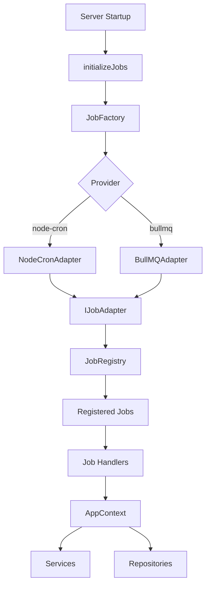
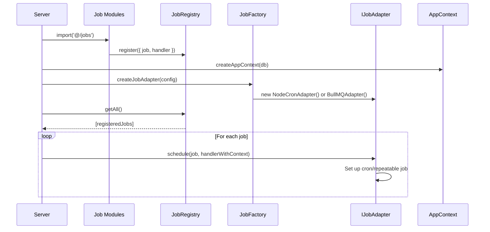

# Job Scheduling & Background Tasks

Grant features a flexible, adapter-based job scheduling system that supports multiple scheduling providers (node-cron, BullMQ) through a unified interface. This document explains the architecture, implementation, and usage of the job scheduling system.

## Overview

The job scheduling system follows the **Adapter Pattern**, providing a consistent interface while allowing you to swap scheduling providers via configuration. This architecture ensures flexibility for different deployment scenarios:

- **Development/Single Instance**: node-cron adapter (simple, no external dependencies)
- **Production/Multi-Instance**: BullMQ adapter (distributed locking, job persistence, retries)
- **Testing**: Easy to mock adapter interface

## Architecture



## Core Components

### 1. Job Adapter Interface

The `IJobAdapter` interface defines the contract for all job scheduling implementations:

```typescript
// apps/api/src/lib/jobs/job-adapter.interface.ts

export interface ScheduledJob {
  id: string;
  name: string;
  schedule: string; // Cron pattern (e.g., '0 2 * * *')
  enabled: boolean;
}

export interface JobExecutionContext {
  jobId: string;
  jobName: string;
  scheduledAt: Date;
  startedAt: Date;
}

export interface JobResult {
  success: boolean;
  message?: string;
  data?: unknown;
}

export type JobHandler = (context: JobExecutionContext) => Promise<JobResult>;

export interface IJobAdapter {
  schedule(job: ScheduledJob, handler: JobHandler): Promise<void>;
  cancel(jobId: string): Promise<void>;
  isScheduled(jobId: string): Promise<boolean>;
  getScheduledJobs(): Promise<ScheduledJob[]>;
  trigger(jobId: string): Promise<JobResult>;
  shutdown(): Promise<void>;
}
```

**Design Principles:**

- **Provider Agnostic**: Same interface regardless of underlying provider
- **Type-Safe**: Strongly typed job definitions and handlers
- **Promise-Based**: All operations are async
- **Observable**: Methods to check job status and trigger manually

### 2. Job Factory

The `JobFactory` creates adapter instances based on configuration:

```typescript
// apps/api/src/lib/jobs/job.factory.ts

export type JobProvider = 'node-cron' | 'bullmq';

export interface JobFactoryConfig {
  provider: JobProvider;
  redis?: {
    host: string;
    port: number;
    password?: string;
  };
  bullmqJobOptions?: DefaultJobOptions;
}

export class JobFactory {
  static createJobAdapter(config: JobFactoryConfig): IJobAdapter {
    switch (config.provider) {
      case 'node-cron':
        return new NodeCronJobAdapter();
      case 'bullmq':
        if (!config.redis) {
          throw new Error('Redis configuration required for BullMQ');
        }
        return new BullMQJobAdapter(config.redis, config.bullmqJobOptions);
      default:
        throw new Error(`Unknown job provider: ${config.provider}`);
    }
  }
}
```

### 3. Job Registry

The `JobRegistry` provides a centralized registry for all scheduled jobs, enabling auto-discovery:

```typescript
// apps/api/src/lib/jobs/job-registry.ts

export interface RegisteredJob {
  job: ScheduledJob;
  handler: JobHandler;
}

class JobRegistry {
  private jobs: Map<string, RegisteredJob> = new Map();

  register(registeredJob: RegisteredJob): void {
    if (this.jobs.has(registeredJob.job.id)) {
      throw new Error(`Job with ID '${registeredJob.job.id}' is already registered`);
    }
    this.jobs.set(registeredJob.job.id, registeredJob);
  }

  getAll(): RegisteredJob[] {
    return Array.from(this.jobs.values());
  }

  get(jobId: string): RegisteredJob | undefined {
    return this.jobs.get(jobId);
  }
}

export const jobRegistry = new JobRegistry();
```

**Benefits:**

- **Auto-Discovery**: Jobs register themselves when modules are imported
- **Separation of Concerns**: Jobs defined in separate modules
- **Testability**: Easy to mock registry for testing
- **No Manual Registration**: Import job modules, they register automatically

### 4. AppContext & Dependency Injection

Jobs receive an `AppContext` containing repositories and services:

```typescript
// apps/api/src/lib/app-context.ts

export interface AppContext {
  repositories: Repositories;
  services: Services;
  db: DbSchema;
  systemUser: AuthenticatedUser;
}

export function createAppContext(db: DbSchema): AppContext {
  const repositories = createRepositories(db);
  const services = createServices(repositories, SYSTEM_USER, db);
  return {
    repositories,
    services,
    db,
    systemUser: SYSTEM_USER,
  };
}
```

**Why AppContext?**

- **No User Context**: Background jobs don't have a request/user context
- **System User**: All job operations are attributed to the system user
- **Shared Services**: Jobs can use the same services as request handlers
- **Database Access**: Direct database access when needed

## Scheduling Providers

### 1. Node-Cron Adapter (`node-cron`)

**Use Case**: Development, single-instance deployments, simple jobs

**Configuration**:

```bash
JOBS_ENABLED=true
JOBS_PROVIDER=node-cron
JOBS_DATA_RETENTION_SCHEDULE=0 2 * * *
```

**Characteristics**:

- ✅ Simple setup, no external dependencies
- ✅ Lightweight (~50KB)
- ✅ Good for single-instance deployments
- ❌ No job persistence (lost on server restart)
- ❌ No distributed locking (multiple instances = duplicate jobs)
- ❌ Limited monitoring/observability
- ❌ No retry mechanism

**Best For**: Development, single-instance deployments, non-critical jobs

### 2. BullMQ Adapter (`bullmq`)

**Use Case**: Production, multi-instance deployments, critical jobs

**Configuration**:

```bash
JOBS_ENABLED=true
JOBS_PROVIDER=bullmq
CACHE_STRATEGY=redis  # Required for BullMQ
REDIS_HOST=localhost
REDIS_PORT=6379
REDIS_PASSWORD=your-password
JOBS_DATA_RETENTION_SCHEDULE=0 2 * * *
JOBS_BULLMQ_ATTEMPTS=3
JOBS_BULLMQ_BACKOFF_TYPE=exponential
JOBS_BULLMQ_BACKOFF_DELAY=2000
```

**Characteristics**:

- ✅ **Job Persistence**: Jobs stored in Redis, survive restarts
- ✅ **Distributed Locking**: Only one instance executes each job
- ✅ **Retry Mechanism**: Automatic retries with exponential backoff
- ✅ **Job History**: Track completed and failed jobs
- ✅ **Monitoring**: Built-in job tracking and observability
- ✅ **Scalable**: Works in multi-instance deployments
- ❌ Requires Redis infrastructure

**Best For**: Production, multi-instance deployments, critical jobs

## Configuration

### Environment Variables

Add to `apps/api/.env`:

```bash
# ----------------------------------------------------------------------------
# Job Scheduling Configuration
# ----------------------------------------------------------------------------

# Enable job scheduling (default: true)
JOBS_ENABLED=true

# Job scheduling provider: 'node-cron' | 'bullmq'
# - node-cron: Simple, single-instance (development)
# - bullmq: Distributed, multi-instance (production)
JOBS_PROVIDER=node-cron

# Cron pattern for data retention cleanup (default: '0 2 * * *' = daily at 2 AM)
JOBS_DATA_RETENTION_SCHEDULE=0 2 * * *

# BullMQ Configuration (only needed if JOBS_PROVIDER=bullmq)
# Note: BullMQ uses the same Redis instance as cache (if CACHE_STRATEGY=redis)

# Number of retry attempts for failed jobs (default: 3)
JOBS_BULLMQ_ATTEMPTS=3

# Backoff type: 'exponential' | 'fixed' (default: exponential)
JOBS_BULLMQ_BACKOFF_TYPE=exponential

# Backoff delay in milliseconds (default: 2000)
JOBS_BULLMQ_BACKOFF_DELAY=2000

# Completed job retention age in seconds (default: 7 days)
JOBS_BULLMQ_REMOVE_ON_COMPLETE_AGE=604800

# Failed job retention age in seconds (default: 30 days)
JOBS_BULLMQ_REMOVE_ON_FAIL_AGE=2592000
```

### Config Structure

```typescript
// apps/api/src/config/env.config.ts

export const JOB_CONFIG = {
  enabled: getEnvBoolean('JOBS_ENABLED', true),
  provider: getEnvEnum('JOBS_PROVIDER', ['node-cron', 'bullmq'] as const, 'node-cron'),
  redis:
    CACHE_CONFIG.strategy === 'redis'
      ? {
          host: REDIS_CONFIG.host,
          port: REDIS_CONFIG.port,
          password: REDIS_CONFIG.password,
        }
      : undefined,
  dataRetention: {
    schedule: getEnv('JOBS_DATA_RETENTION_SCHEDULE', '0 2 * * *'),
  },
  bullmq: {
    attempts: getEnvNumber('JOBS_BULLMQ_ATTEMPTS', 3),
    backoff: {
      type: getEnvEnum(
        'JOBS_BULLMQ_BACKOFF_TYPE',
        ['exponential', 'fixed'] as const,
        'exponential'
      ),
      delay: getEnvNumber('JOBS_BULLMQ_BACKOFF_DELAY', 2000),
    },
    removeOnComplete: {
      age: getEnvNumber('JOBS_BULLMQ_REMOVE_ON_COMPLETE_AGE', 7 * 24 * 3600),
    },
    removeOnFail: {
      age: getEnvNumber('JOBS_BULLMQ_REMOVE_ON_FAIL_AGE', 30 * 24 * 3600),
    },
  },
} as const;
```

## Creating a Job

### Step 1: Create Job Module

Create a new file in `apps/api/src/jobs/`:

```typescript
// apps/api/src/jobs/my-custom-job.job.ts

import { config } from '@/config';
import { AppContext } from '@/lib/app-context';
import { JobExecutionContext, JobHandler, JobResult, ScheduledJob } from '@/lib/jobs';
import { jobRegistry } from '@/lib/jobs/job-registry';
import { createModuleLogger } from '@/lib/logger';

const logger = createModuleLogger('MyCustomJob');

export const MY_CUSTOM_JOB_ID = 'my-custom-job';

/**
 * Create the job handler
 * App context (with services) will be injected via job context at runtime
 */
function createHandler(): JobHandler {
  return async (context: JobExecutionContext & { appContext?: AppContext }): Promise<JobResult> => {
    logger.info({ jobId: context.jobId }, 'Starting my custom job');

    const appContext = context.appContext;
    if (!appContext) {
      logger.error({ jobId: context.jobId }, 'App context not available');
      return {
        success: false,
        message: 'App context not available',
      };
    }

    try {
      // Access services from app context
      const myService = appContext.services.myService;

      // Perform job work
      const result = await myService.doSomething();

      logger.info({ jobId: context.jobId, result }, 'Job completed successfully');

      return {
        success: true,
        data: result,
      };
    } catch (error) {
      logger.error({ jobId: context.jobId, err: error }, 'Job failed');
      return {
        success: false,
        message: error instanceof Error ? error.message : 'Unknown error',
      };
    }
  };
}

/**
 * Register the job
 * This function is automatically called when the module is imported
 */
export function registerMyCustomJob(): void {
  const schedule = config.jobs.dataRetention.schedule; // Or use your own schedule
  const job: ScheduledJob = {
    id: MY_CUSTOM_JOB_ID,
    name: 'My Custom Job',
    schedule, // Cron pattern: '0 2 * * *' = daily at 2 AM
    enabled: true,
  };

  jobRegistry.register({
    job,
    handler: createHandler(),
  });

  logger.debug({ jobId: job.id }, 'My custom job registered');
}

// Auto-register when module is imported
registerMyCustomJob();
```

### Step 2: Export from Jobs Index

Add to `apps/api/src/jobs/index.ts`:

```typescript
// Import all job modules to ensure they are registered
import './data-retention-cleanup.job';
import './my-custom-job.job'; // Add your job here

// Add other job imports here as they are created
```

### Step 3: Jobs Are Auto-Discovered

When the server starts, `initializeJobs()` is called:

```typescript
// apps/api/src/server.ts

import '@/jobs'; // Import all jobs to trigger registration

// Later in startup...
const appContext = createAppContext(db);
await initializeJobs(appContext);
```

The `initializeJobs()` function:

1. Creates the appropriate adapter (node-cron or BullMQ)
2. Discovers all registered jobs from the registry
3. Injects `AppContext` into each job handler
4. Schedules all enabled jobs

## Job Initialization Flow



## Example: Data Retention Cleanup Job

Here's the complete example of the data retention cleanup job:

```typescript
// apps/api/src/jobs/data-retention-cleanup.job.ts

import { config } from '@/config';
import { AppContext } from '@/lib/app-context';
import { JobExecutionContext, JobHandler, JobResult, ScheduledJob } from '@/lib/jobs';
import { jobRegistry } from '@/lib/jobs/job-registry';
import { createModuleLogger } from '@/lib/logger';

const logger = createModuleLogger('DataRetentionJob');

export const DATA_RETENTION_JOB_ID = 'data-retention-cleanup';

function createHandler(): JobHandler {
  return async (context: JobExecutionContext & { appContext?: AppContext }): Promise<JobResult> => {
    logger.info({ jobId: context.jobId }, 'Starting data retention cleanup job');

    const appContext = context.appContext;
    if (!appContext) {
      logger.error({ jobId: context.jobId }, 'App context not available');
      return {
        success: false,
        message: 'App context not available',
      };
    }

    const cleanupService = appContext.services.dataRetentionCleanup;
    if (!cleanupService) {
      logger.warn({ jobId: context.jobId }, 'Cleanup service not available');
      return {
        success: true,
        data: { accountsDeleted: 0, backupsDeleted: 0 },
        message: 'Cleanup service not yet implemented',
      };
    }

    try {
      const accountsDeleted = await cleanupService.cleanupExpiredAccounts();
      const backupsDeleted = await cleanupService.cleanupExpiredBackups();

      logger.info(
        { jobId: context.jobId, accountsDeleted, backupsDeleted },
        'Data retention cleanup completed'
      );

      return {
        success: true,
        data: { accountsDeleted, backupsDeleted },
      };
    } catch (error) {
      logger.error({ jobId: context.jobId, err: error }, 'Data retention cleanup failed');
      return {
        success: false,
        message: error instanceof Error ? error.message : 'Unknown error',
      };
    }
  };
}

export function registerDataRetentionJob(): void {
  const schedule = config.jobs.dataRetention.schedule;
  const job: ScheduledJob = {
    id: DATA_RETENTION_JOB_ID,
    name: 'Data Retention Cleanup',
    schedule,
    enabled: true,
  };

  jobRegistry.register({
    job,
    handler: createHandler(),
  });

  logger.debug({ jobId: job.id }, 'Data retention cleanup job registered');
}

// Auto-register when module is imported
registerDataRetentionJob();
```

## Cron Pattern Reference

Common cron patterns:

| Pattern          | Description                                    |
| ---------------- | ---------------------------------------------- |
| `0 2 * * *`      | Daily at 2:00 AM                               |
| `0 */6 * * *`    | Every 6 hours                                  |
| `0 0 * * 0`      | Weekly on Sunday at midnight                   |
| `0 0 1 * *`      | Monthly on the 1st at midnight                 |
| `*/15 * * * *`   | Every 15 minutes                               |
| `0 9-17 * * 1-5` | Every hour from 9 AM to 5 PM, Monday to Friday |

## Best Practices

### 1. Error Handling

Always wrap job logic in try-catch and return appropriate `JobResult`:

```typescript
try {
  // Job work
  return { success: true, data: result };
} catch (error) {
  logger.error({ jobId: context.jobId, err: error }, 'Job failed');
  return {
    success: false,
    message: error instanceof Error ? error.message : 'Unknown error',
  };
}
```

### 2. Logging

Use structured logging with job context:

```typescript
logger.info({ jobId: context.jobId, data: result }, 'Job completed');
logger.error({ jobId: context.jobId, err: error }, 'Job failed');
```

### 3. Idempotency

Design jobs to be idempotent (safe to run multiple times):

```typescript
// Good: Idempotent
await cleanupService.cleanupExpiredAccounts(); // Only deletes expired accounts

// Bad: Not idempotent
await sendWelcomeEmails(); // Would send duplicate emails
```

### 4. Long-Running Jobs

For long-running jobs, consider breaking them into smaller chunks:

```typescript
// Process in batches
const batchSize = 100;
let offset = 0;

while (true) {
  const batch = await getBatch(offset, batchSize);
  if (batch.length === 0) break;

  await processBatch(batch);
  offset += batchSize;
}
```

### 5. Testing

Mock the adapter interface for unit tests:

```typescript
const mockAdapter: IJobAdapter = {
  schedule: jest.fn(),
  cancel: jest.fn(),
  // ... other methods
};
```

### 6. Background jobs and tenant context

For multi-tenant security, jobs that act on tenant-scoped data must receive and validate tenant/scope and never rely on global or implicit context. See [Multi-Tenancy](/architecture/multi-tenancy#background-jobs-and-tenant-context) for the full pattern.

**Use cases**

| Use case                                 | How to run                             | Tenant context                               | Example                                       |
| ---------------------------------------- | -------------------------------------- | -------------------------------------------- | --------------------------------------------- |
| **Recurring, platform-wide work**        | **Schedule** (cron)                    | Not needed                                   | Data retention cleanup, system maintenance    |
| **One-off work triggered by a user**     | **Enqueue** from request handler       | Required: pass `scope` from auth             | Project export, org report, send notification |
| **Manual/admin trigger (no user scope)** | **Trigger** (or enqueue without scope) | Depends on job; global jobs don’t need scope | Admin cleanup, one-off migration              |

- **Scheduled jobs** run on a timer with no request context; they are usually global (e.g. data retention). They don’t receive `scope` or `payload` from the adapter.
- **Enqueued jobs** run once, triggered by your code (e.g. after a REST/GraphQL request). For work that touches a single tenant, always pass `scope` from the authenticated request and validate it in the job.

**Contract:**

- **Job payload:** Use the `TenantJobPayload` type from `@/lib/jobs` and `Scope` from `@grantjs/schema`. For any job that operates on tenant-scoped data, include `scope` in the execution context (scope is tenant type + id).
- **Validation:** In the job’s `execute()` method, call `validateTenantJobContext(context, true)` at the start when the job is tenant-scoped. This rejects jobs missing or invalid scope.
- **Enqueue from request handlers:** When enqueueing one-off jobs from REST/GraphQL handlers, always pass `scope` from the **authenticated request context** (e.g. `req.context.scope`), never from client-only input. Use `getJobAdapter()` from `@/lib/jobs` and call `adapter.enqueue?.(jobId, { scope, payload })`.
- **Scheduled vs enqueued:** Recurring scheduled jobs (e.g. data retention) may be global and not require tenant context. Enqueued one-off jobs that touch tenant data must include scope and validate it in the processor.

**Example (tenant-scoped job):**

```typescript
import { validateTenantJobContext } from '@/lib/jobs';

async execute(context: JobExecutionContext): Promise<JobResult> {
  validateTenantJobContext(context, true); // throws if scope missing
  const { scope, payload } = context;
  // ... use scope and payload for tenant-scoped work
}
```

**Example (enqueue from handler):**

```typescript
const adapter = getJobAdapter();
if (adapter?.enqueue) {
  await adapter.enqueue('my-tenant-job', {
    scope: req.context.scope, // from auth only; scope is tenant (type + id)
    payload: { resourceId },
  });
}
```

## Provider Selection Guide

| Scenario        | Recommended Provider | Reason                                  |
| --------------- | -------------------- | --------------------------------------- |
| Development     | `node-cron`          | Simple, no Redis needed                 |
| Single Instance | `node-cron`          | Sufficient for single server            |
| Multi-Instance  | `bullmq`             | Distributed locking prevents duplicates |
| Production      | `bullmq`             | Persistence, retries, monitoring        |
| Critical Jobs   | `bullmq`             | Reliability and observability           |

## Troubleshooting

### Jobs Not Running

1. **Check if jobs are enabled**:

   ```bash
   JOBS_ENABLED=true
   ```

2. **Verify job registration**:
   Check logs for "Job registered" messages

3. **Check adapter initialization**:
   Look for "Job scheduling initialized" in logs

4. **For BullMQ**: Verify Redis connection

### Jobs Running Multiple Times

- **Single Instance**: Use `node-cron` (no distributed locking)
- **Multi-Instance**: Use `bullmq` (distributed locking)

### Jobs Lost on Restart

- **node-cron**: Jobs are lost on restart (expected behavior)
- **bullmq**: Jobs persist in Redis (should survive restarts)

## Migration Between Providers

Switching providers is as simple as changing configuration:

```bash
# From node-cron to BullMQ
JOBS_PROVIDER=bullmq
CACHE_STRATEGY=redis  # Required for BullMQ
REDIS_HOST=localhost
REDIS_PORT=6379
```

No code changes required! The adapter pattern ensures the same interface works with both providers.

## References

- [BullMQ Documentation](https://docs.bullmq.io/)
- [node-cron Documentation](https://github.com/node-cron/node-cron)
- [Cron Expression Guide](https://crontab.guru/)
