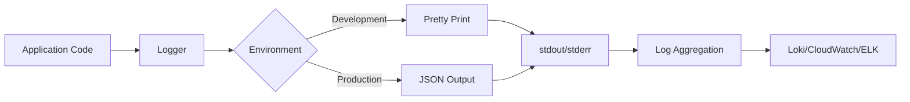

# Structured Logging

Grant uses [Pino](https://getpino.io/) for fast, structured JSON logging. This guide covers logging best practices, configuration, and usage patterns.

## Why Pino?

Pino is chosen for several key reasons:

- **Performance**: 5-10x faster than alternatives (Winston, Bunyan)
- **Low overhead**: Minimal CPU and memory usage
- **Structured**: JSON-formatted logs by default
- **Cloud-friendly**: Works seamlessly with log aggregation tools
- **Secure**: Built-in PII redaction capabilities

## Architecture



## Installation

Pino is included in the API dependencies:

```json
{
  "dependencies": {
    "pino": "^8.17.0",
    "pino-http": "^9.0.0"
  },
  "devDependencies": {
    "pino-pretty": "^10.3.0"
  }
}
```

Install if not already present:

```bash
cd apps/api
pnpm add pino pino-http
pnpm add -D pino-pretty
```

## Configuration

### Environment Variables

Add to your `.env` file:

```bash
# Log level: trace, debug, info, warn, error, fatal
LOG_LEVEL=info

# Pretty print (development only)
LOG_PRETTY_PRINT=true

# Redact sensitive fields
LOG_REDACT_ENABLED=true
```

### Logger Configuration

The logger is configured in `src/lib/logger/logger.ts`:

```typescript
import pino from 'pino';
import { config } from '@/config';

export const logger = pino({
  // Log level from config
  level: config.logging.level,

  // Pretty print in development
  transport:
    config.app.isDevelopment && config.logging.prettyPrint
      ? {
          target: 'pino-pretty',
          options: {
            colorize: true,
            translateTime: 'HH:MM:ss.l',
            ignore: 'pid,hostname',
            singleLine: false,
            messageFormat: '{msg}',
            errorLikeObjectKeys: ['err', 'error'],
          },
        }
      : undefined,

  // Base fields (included in every log)
  base: {
    env: config.app.nodeEnv,
    service: 'grant-api',
    version: config.app.version,
  },

  // Formatters
  formatters: {
    level: (label) => ({ level: label }),
    bindings: (bindings) => ({
      pid: bindings.pid,
      host: bindings.hostname,
    }),
  },

  // Serializers for common objects
  serializers: {
    req: pino.stdSerializers.req,
    res: pino.stdSerializers.res,
    err: pino.stdSerializers.err,
  },

  // Redact sensitive information
  redact: {
    paths: [
      'req.headers.authorization',
      'req.headers.cookie',
      'req.headers["x-api-key"]',
      '*.password',
      '*.token',
      '*.accessToken',
      '*.refreshToken',
      '*.secret',
      '*.apiKey',
      '*.creditCard',
      '*.ssn',
    ],
    remove: true,
  },

  // Timestamp
  timestamp: pino.stdTimeFunctions.isoTime,
});

/**
 * Create a child logger with additional context
 */
export function createContextLogger(context: Record<string, unknown>) {
  return logger.child(context);
}

/**
 * Create a logger for a specific module
 */
export function createModuleLogger(moduleName: string) {
  return logger.child({ module: moduleName });
}
```

## Request Logging

### Request Logging Middleware

Automatically log all HTTP requests with correlation IDs:

```typescript
// src/middleware/request-logging.middleware.ts
import { Request, Response, NextFunction } from 'express';
import { v4 as uuidv4 } from 'uuid';
import { logger } from '@/lib/logger';

export interface RequestWithLogger extends Request {
  requestId: string;
  logger: pino.Logger;
}

export function requestLoggingMiddleware(req: Request, res: Response, next: NextFunction): void {
  const startTime = Date.now();

  // Get or generate request ID
  const requestId = (req.headers['x-request-id'] as string) || uuidv4();

  // Create child logger with request context
  const requestLogger = logger.child({
    requestId,
    userId: (req as any).user?.id,
    accountId: (req as any).context?.accountId,
    organizationId: (req as any).context?.organizationId,
  });

  // Attach to request
  (req as any).requestId = requestId;
  (req as any).logger = requestLogger;

  // Set response header
  res.setHeader('X-Request-ID', requestId);

  // Log incoming request
  requestLogger.info({
    msg: 'Incoming request',
    method: req.method,
    path: req.path,
    query: req.query,
    ip: req.ip,
    userAgent: req.headers['user-agent'],
  });

  // Log response when finished
  res.on('finish', () => {
    const duration = Date.now() - startTime;
    const level = res.statusCode >= 500 ? 'error' : res.statusCode >= 400 ? 'warn' : 'info';

    requestLogger[level]({
      msg: 'Request completed',
      method: req.method,
      path: req.path,
      statusCode: res.statusCode,
      duration,
    });
  });

  next();
}
```

### Integration in Server

Add the middleware early in your middleware chain:

```typescript
// src/server.ts
import { requestLoggingMiddleware } from '@/middleware/request-logging.middleware';

// ... other imports

async function startServer() {
  const app = express();

  // Basic middleware
  app.use(cors(config.cors));
  app.use(helmet(config.helmet));
  app.use(express.json());

  // Add request logging middleware
  app.use(requestLoggingMiddleware);

  // ... rest of your middleware
}
```

## Usage Patterns

### Basic Logging

```typescript
import { logger } from '@/lib/logger';

// Info level
logger.info('Server started successfully');

// With structured data
logger.info({
  msg: 'User logged in',
  userId: 'user-123',
  accountId: 'account-456',
  loginMethod: 'password',
});

// Warning
logger.warn({
  msg: 'Rate limit approaching',
  userId: 'user-123',
  requestCount: 95,
  limit: 100,
});

// Error
logger.error({
  msg: 'Database connection failed',
  err: error,
  retryCount: 3,
});
```

### Using Request Logger

In routes and controllers, use the request logger for automatic context:

```typescript
export async function createOrganization(req: Request, res: Response) {
  // Use request logger - automatically includes requestId, userId, etc.
  req.logger.info({
    msg: 'Creating organization',
    name: req.body.name,
  });

  try {
    const organization = await organizationService.create(req.body);

    req.logger.info({
      msg: 'Organization created successfully',
      organizationId: organization.id,
    });

    res.json(organization);
  } catch (error) {
    req.logger.error({
      msg: 'Failed to create organization',
      err: error,
      input: req.body,
    });
    throw error;
  }
}
```

### Module Logger

Create module-specific loggers:

```typescript
import { createModuleLogger } from '@/lib/logger';

export class EmailService {
  private logger = createModuleLogger('EmailService');

  async sendEmail(to: string, template: string) {
    this.logger.info({
      msg: 'Sending email',
      to,
      template,
    });

    try {
      await this.emailProvider.send({ to, template });

      this.logger.info({
        msg: 'Email sent successfully',
        to,
        template,
      });
    } catch (error) {
      this.logger.error({
        msg: 'Failed to send email',
        err: error,
        to,
        template,
      });
      throw error;
    }
  }
}
```

### Child Logger with Context

For long-running operations, create a child logger with operation context:

```typescript
export async function processImport(importId: string) {
  const logger = createContextLogger({
    importId,
    operation: 'import',
  });

  logger.info('Starting import process');

  try {
    logger.debug('Parsing CSV file');
    const records = await parseCSV();

    logger.info({
      msg: 'CSV parsed successfully',
      recordCount: records.length,
    });

    logger.debug('Validating records');
    const validRecords = await validateRecords(records);

    logger.info({
      msg: 'Records validated',
      validCount: validRecords.length,
      invalidCount: records.length - validRecords.length,
    });

    logger.debug('Inserting into database');
    await insertRecords(validRecords);

    logger.info('Import completed successfully');
  } catch (error) {
    logger.error({
      msg: 'Import failed',
      err: error,
    });
    throw error;
  }
}
```

## Log Levels

### Level Guidelines

| Level     | Usage                                         | Example                                     |
| --------- | --------------------------------------------- | ------------------------------------------- |
| **fatal** | System is unusable, immediate action required | Database unreachable, critical service down |
| **error** | Error occurred, operation failed              | API call failed, validation error           |
| **warn**  | Something unexpected but handled              | Deprecated API used, rate limit approaching |
| **info**  | Important business events                     | User logged in, order created               |
| **debug** | Detailed debugging information                | Function entry/exit, variable values        |
| **trace** | Very detailed, typically only in development  | Loop iterations, low-level operations       |

### Setting Log Levels

```bash
# Production: Only log important events
LOG_LEVEL=info

# Staging: Include warnings and errors
LOG_LEVEL=warn

# Development: Detailed debugging
LOG_LEVEL=debug

# Troubleshooting: Everything
LOG_LEVEL=trace
```

### Per-Module Log Levels

You can set different log levels for different modules:

```typescript
const logger = createModuleLogger('AuthService');
logger.level = 'debug'; // Override for this module
```

## Best Practices

### 1. Always Use Structured Logging

❌ **Bad**: String interpolation

```typescript
logger.info(`User ${userId} created organization ${orgId}`);
```

✅ **Good**: Structured data

```typescript
logger.info({
  msg: 'Organization created',
  userId,
  organizationId: orgId,
});
```

### 2. Include Relevant Context

Always include relevant IDs and context:

```typescript
logger.info({
  msg: 'Processing payment',
  userId: user.id,
  accountId: account.id,
  organizationId: organization.id,
  paymentId: payment.id,
  amount: payment.amount,
  currency: payment.currency,
});
```

### 3. Log Errors Properly

Always include the error object:

```typescript
try {
  await riskyOperation();
} catch (error) {
  logger.error({
    msg: 'Operation failed',
    err: error, // ← Pino will serialize this properly
    userId,
    operation: 'riskyOperation',
  });
  throw error;
}
```

### 4. Use Appropriate Log Levels

Don't over-log or under-log:

```typescript
// ❌ Too much (info level for debug-level details)
logger.info('Entering function');
logger.info('Variable x is', x);
logger.info('Exiting function');

// ✅ Appropriate
logger.debug({ msg: 'Processing records', count: records.length });
logger.info({ msg: 'Records processed successfully', count: records.length });
```

### 5. Avoid Logging Sensitive Data

Even with redaction, be careful:

```typescript
// ❌ Bad
logger.info({ msg: 'User data', user }); // May contain PII

// ✅ Good
logger.info({
  msg: 'User updated',
  userId: user.id,
  updatedFields: Object.keys(updateData),
});
```

### 6. Use Correlation IDs

Always use the request logger to maintain correlation:

```typescript
// ❌ Bad
logger.info('Processing request');

// ✅ Good
req.logger.info('Processing request'); // Includes requestId automatically
```

## Development vs Production

### Development

In development, use pretty printing for readability:

```bash
LOG_LEVEL=debug
LOG_PRETTY_PRINT=true
```

Output:

```
[15:42:13.456] INFO (grant-api): Server started
    requestId: "f47ac10b-58cc-4372-a567-0e02b2c3d479"
    port: 4000
```

### Production

In production, use JSON for machine parsing:

```bash
LOG_LEVEL=info
LOG_PRETTY_PRINT=false
```

Output:

```json
{
  "level": "info",
  "time": "2024-10-25T15:42:13.456Z",
  "env": "production",
  "service": "grant-api",
  "version": "1.0.0",
  "requestId": "f47ac10b-58cc-4372-a567-0e02b2c3d479",
  "msg": "Server started",
  "port": 4000
}
```

## Log Aggregation

### Docker Logs

```bash
# Follow logs
docker logs -f grant-api

# Last 100 lines
docker logs --tail 100 grant-api

# With timestamps
docker logs -t grant-api
```

### PM2 Logs

```bash
# Follow logs
pm2 logs grant-api

# Flush logs
pm2 flush grant-api
```

### CloudWatch Logs

```bash
# Install AWS CLI
aws logs tail /aws/ecs/grant/api --follow
```

### Loki Integration

Use Grafana Loki for log aggregation:

```yaml
# docker-compose.yml
services:
  loki:
    image: grafana/loki:latest
    ports:
      - '3100:3100'

  promtail:
    image: grafana/promtail:latest
    volumes:
      - /var/log:/var/log
      - ./promtail-config.yml:/etc/promtail/config.yml
```

## Querying Logs

### With jq (JSON processor)

```bash
# Filter by log level
docker logs grant-api | jq 'select(.level == "error")'

# Filter by user
docker logs grant-api | jq 'select(.userId == "user-123")'

# Extract specific fields
docker logs grant-api | jq '{time, level, msg, userId}'

# Count errors by type
docker logs grant-api | jq 'select(.level == "error") | .msg' | sort | uniq -c
```

### With grep

```bash
# Find all errors
docker logs grant-api | grep '"level":"error"'

# Find specific request
docker logs grant-api | grep 'f47ac10b-58cc-4372-a567-0e02b2c3d479'
```

## Performance Considerations

### Pino is Fast

Pino is designed for minimal overhead:

- Asynchronous logging by default
- Worker thread for formatting (pino-pretty)
- Minimal CPU usage
- Low memory footprint

### Avoid Expensive Operations

```typescript
// ❌ Bad: Expensive operation always executed
logger.debug(`Complex: ${JSON.stringify(complexObject)}`);

// ✅ Good: Only evaluated if debug logging enabled
logger.debug({ complexObject });

// ✅ Better: Lazy evaluation
if (logger.isLevelEnabled('debug')) {
  logger.debug({ result: expensiveComputation() });
}
```

## Testing

### Mocking Logger in Tests

```typescript
import { jest } from '@jest/globals';
import pino from 'pino';

describe('MyService', () => {
  const mockLogger = {
    info: jest.fn(),
    error: jest.fn(),
    warn: jest.fn(),
    debug: jest.fn(),
  } as unknown as pino.Logger;

  it('should log errors', async () => {
    const service = new MyService(mockLogger);

    await service.failingOperation();

    expect(mockLogger.error).toHaveBeenCalledWith({
      msg: 'Operation failed',
      err: expect.any(Error),
    });
  });
});
```

## Troubleshooting

### Logs Not Appearing

1. Check log level:

   ```bash
   echo $LOG_LEVEL
   ```

2. Verify logger configuration:

   ```typescript
   console.log('Logger level:', logger.level);
   ```

3. Check if logs are being redirected:

   ```bash
   # Docker
   docker logs grant-api 2>&1

   # PM2
   pm2 logs --lines 100
   ```

### Performance Issues

If logging causes performance issues:

1. Increase log level (reduce verbosity):

   ```bash
   LOG_LEVEL=warn
   ```

2. Disable pretty printing in production:

   ```bash
   LOG_PRETTY_PRINT=false
   ```

3. Use sampling for high-volume logs:
   ```typescript
   if (Math.random() < 0.1) { // 10% sampling
     logger.debug({ ... });
   }
   ```

## Next Steps

- **Add metrics**: [Metrics Guide](/advanced-topics/metrics)
- **Enable tracing**: [Tracing Guide](/advanced-topics/tracing)

## Resources

- [Pino Documentation](https://getpino.io/)
- [Best Practices for Node.js Logging](https://betterstack.com/community/guides/logging/how-to-install-setup-and-use-pino-to-log-node-js-applications/)
- [Structured Logging Best Practices](https://www.loggly.com/ultimate-guide/node-logging-basics/)

---

**Next**: Learn about [Distributed Tracing](/advanced-topics/tracing) →
