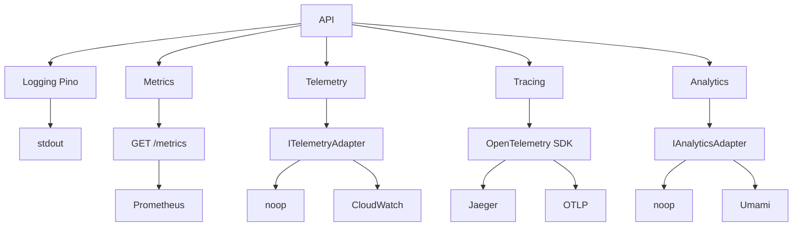

# Observability Overview

The API provides **structured logging**, **metrics**, **log-shipping**, **tracing**, and optional **analytics** via a small set of ports and adapters — the same pattern as the [Caching System](/advanced-topics/caching).

## Architecture



## Ports and adapters

| Pillar        | Purpose                      | Port / contract       | Adapters / backends | Config prefix                     | Wired in                                    |
| ------------- | ---------------------------- | --------------------- | ------------------- | --------------------------------- | ------------------------------------------- |
| **Logging**   | Structured JSON logs         | Config only (no port) | Pino → stdout       | `LOG_*`                           | `lib/logger`                                |
| **Metrics**   | HTTP request metrics         | GET /metrics scrape   | Prometheus          | `METRICS_*`                       | `lib/metrics`                               |
| **Telemetry** | Request-summary log shipping | `ITelemetryAdapter`   | noop, CloudWatch    | `TELEMETRY_*`                     | `lib/telemetry`, request-logging middleware |
| **Tracing**   | Distributed traces           | OpenTelemetry SDK     | Jaeger, OTLP        | `TRACING_*`, `JAEGER_*`, `OTLP_*` | `lib/tracing` (first import in server)      |
| **Analytics** | Optional event tracking      | `IAnalyticsAdapter`   | noop, Umami         | `ANALYTICS_*`                     | `lib/analytics`                             |

Runbook and Prometheus config: `observability/README.md`, `observability/prometheus.yml`. First dashboard: [Grafana dashboards](/advanced-topics/grafana-dashboards).

## Quick start

```bash
LOG_LEVEL=info
LOG_PRETTY_PRINT=false
METRICS_ENABLED=true
# Optional: TRACING_ENABLED=true, TRACING_BACKEND=jaeger, JAEGER_ENDPOINT=http://localhost:14268/api/traces
```

---

## Logging

Structured JSON via Pino. Level and pretty-print in `LOGGING_CONFIG` ([env.config.ts](apps/api/src/config/env.config.ts)); applied at bootstrap in [lib/logger](apps/api/src/lib/logger/logger.ts).

| Variable           | Default (prod / dev) | Description                                        |
| ------------------ | -------------------- | -------------------------------------------------- |
| `LOG_LEVEL`        | `info` / `debug`     | `trace`, `debug`, `info`, `warn`, `error`, `fatal` |
| `LOG_PRETTY_PRINT` | `false` / `true`     | Human-readable in dev                              |

**Wired in:** Request middleware attaches `requestId` and a child logger. The context built for each request includes `requestLogger` (see [Structured Logging](/advanced-topics/logging#request-scoped-logger)).

**Request-scoped logger:** In REST routes use `context.requestLogger`; in GraphQL resolvers use `context.requestLogger` (same context). For code that only has `req`, use `getRequestLogger(req)` from `@/middleware/request-logging.middleware`. Any log from that logger includes `requestId`. Handlers that log (e.g. on error) accept an optional last parameter `requestLogger?: ILogger`; pass `context.requestLogger` from routes and resolvers so handler-originated logs are correlated by requestId.

```typescript
context.requestLogger.info({ msg: 'Organization created', organizationId: org.id });
// In a handler: (requestLogger ?? this.logger).error({ msg: 'Send failed', err: error });
```

Log objects with `msg`; avoid string interpolation. In `apps/api`: import `createLogger`, `createModuleLogger` from `@/lib/logger`. Never import `@grantjs/logger` directly.

| Level   | Use                  |
| ------- | -------------------- |
| `trace` | Very noisy, dev only |
| `debug` | Diagnostic           |
| `info`  | Business events      |
| `warn`  | Handled anomalies    |
| `error` | Failures             |
| `fatal` | Unrecoverable        |

---

## Metrics

HTTP request duration and count for Prometheus when enabled. Labels: `method`, `route`, `status_code`.

| Variable                   | Default    | Description             |
| -------------------------- | ---------- | ----------------------- |
| `METRICS_ENABLED`          | `false`    | Expose GET /metrics     |
| `METRICS_ENDPOINT`         | `/metrics` | Path                    |
| `METRICS_COLLECT_DEFAULTS` | `true`     | CPU, memory, event loop |

**Wired in:** [lib/metrics](apps/api/src/lib/metrics/). Middleware records on response finish; handler serves at `METRICS_ENDPOINT`.

**Runbook:** Start API with `METRICS_ENABLED=true`; `docker compose up -d prometheus grafana`; in Grafana add Prometheus data source `http://prometheus:9090`. See [Grafana dashboards](/advanced-topics/grafana-dashboards) for first dashboard steps.

**PromQL:** Request rate `rate(http_requests_total[5m])`. P95 duration by route: `histogram_quantile(0.95, sum(rate(http_request_duration_seconds_bucket[5m])) by (le, route))`.

---

## Telemetry (log shipping)

Optional adapter to send request-summary logs to a backend (e.g. CloudWatch Logs). Port: `ITelemetryAdapter` ([@grantjs/core](packages/@grantjs/core)); adapters in [@grantjs/telemetry](packages/@grantjs/telemetry) (noop, CloudWatch).

| Variable                                 | Default     | Description            |
| ---------------------------------------- | ----------- | ---------------------- |
| `TELEMETRY_PROVIDER`                     | `none`      | `none` or `cloudwatch` |
| `TELEMETRY_CLOUDWATCH_REGION`            | `us-east-1` | AWS region             |
| `TELEMETRY_CLOUDWATCH_LOG_GROUP`         | —           | Log group name         |
| `TELEMETRY_CLOUDWATCH_LOG_STREAM_PREFIX` | `grant-api` | Stream prefix          |

**Wired in:** [lib/telemetry](apps/api/src/lib/telemetry/). Request-logging middleware calls `getTelemetryAdapter().sendLog(...)` on response finish (fire-and-forget).

---

## Tracing

Distributed tracing via OpenTelemetry. **Implemented.** Spans include `http.request_id` and optional `http.user_id` for correlation with logs.

| Variable                | Default                             | Description              |
| ----------------------- | ----------------------------------- | ------------------------ |
| `TRACING_ENABLED`       | `false`                             | Enable OTel SDK          |
| `TRACING_BACKEND`       | `jaeger`                            | `jaeger`, `otlp`, `xray` |
| `JAEGER_ENDPOINT`       | `http://localhost:14268/api/traces` | Jaeger collector         |
| `OTLP_ENDPOINT`         | `http://localhost:4318/v1/traces`   | OTLP endpoint            |
| `TRACING_SAMPLING_RATE` | `1.0`                               | Sampling 0–1             |
| `TRACING_SERVICE_NAME`  | `grant-api`                         | Service name in traces   |

**Wired in:** [lib/tracing](apps/api/src/lib/tracing/) — **first import** in [server.ts](apps/api/src/server.ts) so the SDK patches http/express before they load. Request-logging middleware sets `http.request_id` and `http.user_id` on the active span. `shutdownTracing()` called in graceful shutdown before DB/cache close.

**Runbook:** Start Jaeger (`docker compose up -d jaeger`); set `TRACING_ENABLED=true`, `TRACING_BACKEND=jaeger`, `JAEGER_ENDPOINT`; restart API; open Jaeger UI (http://localhost:16686), service `grant-api`. Full reference: [Tracing](/advanced-topics/tracing).

---

## Analytics

Optional event tracking. Port: `IAnalyticsAdapter` ([@grantjs/core](packages/@grantjs/core)); adapters in [@grantjs/analytics](packages/@grantjs/analytics) (noop, Umami). Grant does not store events; adapters forward to the backend of your choice.

| Variable                     | Default     | Description           |
| ---------------------------- | ----------- | --------------------- |
| `ANALYTICS_ENABLED`          | `false`     | Enable tracking       |
| `ANALYTICS_PROVIDER`         | `none`      | `none` or `umami`     |
| `ANALYTICS_UMAMI_API_URL`    | —           | Umami API base URL    |
| `ANALYTICS_UMAMI_WEBSITE_ID` | —           | Website ID from Umami |
| `ANALYTICS_UMAMI_HOSTNAME`   | `grant-api` | Hostname per event    |

**Wired in:** [lib/analytics](apps/api/src/lib/analytics/). Handlers call `getAnalyticsAdapter().trackEvent(...)` (fire-and-forget). Usage: [Analytics](/advanced-topics/analytics). First dashboard: [Umami dashboards](/advanced-topics/umami-dashboards).

---

## Practices

- Use `req.logger` (or `getRequestLogger(req)`) in request handlers so logs include `requestId`.
- Log structured objects with `msg`; avoid string interpolation.
- Set `LOG_LEVEL` by environment (e.g. `debug` in dev, `info` in prod).
- Correlation: requestId is automatic via request-scoped logger and is set on trace spans.

---

**Related:**

- [Configuration](/getting-started/configuration) — Environment variable reference
- [Grafana dashboards](/advanced-topics/grafana-dashboards) — First dashboard walkthrough
- [Audit Logging](/advanced-topics/audit-logging) — Compliance trail (separate from runtime logs)
