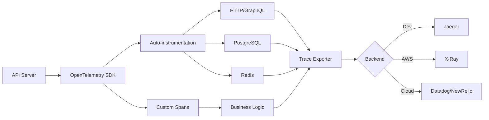

# Distributed Tracing

Grant uses [OpenTelemetry](https://opentelemetry.io/) for distributed tracing, providing visibility into request flows across services, databases, and external APIs.

## What is Distributed Tracing?

Distributed tracing tracks a request as it flows through your system, creating a detailed timeline of operations:

```mermaid
gantt
    title Request Trace Example
    dateFormat  X
    axisFormat %L ms

    section API
    HTTP Request     :0, 150
    Auth Middleware  :10, 30
    Permission Check :40, 20

    section Database
    Query Users     :60, 25
    Query Permissions :85, 30

    section Cache
    Cache Lookup    :115, 15

    section External
    Email Service   :130, 20
```



## Why OpenTelemetry?

- **Vendor-neutral**: Works with Jaeger, Zipkin, AWS X-Ray, Datadog, New Relic
- **Auto-instrumentation**: Automatically traces HTTP, GraphQL, PostgreSQL, Redis
- **Standard**: Industry-standard observability framework
- **Flexible**: Easy to add custom spans and attributes
- **Industry-backed**: CNCF project supported by major cloud providers

## Architecture



## Installation

Install OpenTelemetry packages:

```bash
cd apps/api
pnpm add @opentelemetry/sdk-node \
         @opentelemetry/auto-instrumentations-node \
         @opentelemetry/exporter-trace-otlp-http \
         @opentelemetry/exporter-jaeger \
         @opentelemetry/propagator-aws-xray \
         @opentelemetry/id-generator-aws-xray \
         @opentelemetry/semantic-conventions
```

## Configuration

### Environment Variables

Add to your `.env` file:

```bash
# Enable tracing
TRACING_ENABLED=true

# Trace backend
TRACING_BACKEND=jaeger  # jaeger, otlp, xray

# Jaeger endpoint (for local development)
JAEGER_ENDPOINT=http://localhost:14268/api/traces

# OTLP endpoint (for cloud providers)
OTLP_ENDPOINT=http://localhost:4318/v1/traces

# Sampling rate (0.0 to 1.0)
TRACING_SAMPLING_RATE=1.0

# Service name
TRACING_SERVICE_NAME=grant-api
```

### Tracing Configuration

Create tracing configuration:

```typescript
// src/config/env.config.ts

export const TRACING_CONFIG = {
  /** Enable distributed tracing */
  enabled: getEnvBoolean('TRACING_ENABLED', !APP_CONFIG.isProduction),

  /** Trace backend: jaeger, otlp, xray */
  backend: getEnvEnum('TRACING_BACKEND', ['jaeger', 'otlp', 'xray'] as const, 'jaeger'),

  /** Jaeger endpoint */
  jaegerEndpoint: getEnv('JAEGER_ENDPOINT', 'http://localhost:14268/api/traces'),

  /** OTLP endpoint */
  otlpEndpoint: getEnv('OTLP_ENDPOINT', 'http://localhost:4318/v1/traces'),

  /** Sampling rate (0.0 to 1.0) */
  samplingRate: getEnvNumber('TRACING_SAMPLING_RATE', 1.0),

  /** Service name */
  serviceName: getEnv('TRACING_SERVICE_NAME', 'grant-api'),
} as const;
```

## Implementation

### Initialize Tracing

Create the tracing module:

```typescript
// src/lib/telemetry/tracing.ts
import { NodeSDK } from '@opentelemetry/sdk-node';
import { getNodeAutoInstrumentations } from '@opentelemetry/auto-instrumentations-node';
import { Resource } from '@opentelemetry/resources';
import {
  SemanticResourceAttributes,
  SemanticAttributes,
} from '@opentelemetry/semantic-conventions';
import { JaegerExporter } from '@opentelemetry/exporter-jaeger';
import { OTLPTraceExporter } from '@opentelemetry/exporter-trace-otlp-http';
import { AWSXRayPropagator } from '@opentelemetry/propagator-aws-xray';
import { AWSXRayIdGenerator } from '@opentelemetry/id-generator-aws-xray';
import { BatchSpanProcessor } from '@opentelemetry/sdk-trace-base';
import { config } from '@/config';
import { logger } from '@/lib/logger';

let sdk: NodeSDK | null = null;

/**
 * Initialize OpenTelemetry tracing
 */
export function initializeTracing(): NodeSDK | null {
  if (!config.tracing.enabled) {
    logger.info('Tracing is disabled');
    return null;
  }

  try {
    // Create exporter based on backend
    const exporter = createExporter();

    // Create SDK
    sdk = new NodeSDK({
      resource: new Resource({
        [SemanticResourceAttributes.SERVICE_NAME]: config.tracing.serviceName,
        [SemanticResourceAttributes.SERVICE_VERSION]: config.app.version,
        [SemanticResourceAttributes.DEPLOYMENT_ENVIRONMENT]: config.app.nodeEnv,
      }),

      spanProcessor: new BatchSpanProcessor(exporter, {
        maxQueueSize: 2048,
        scheduledDelayMillis: 5000,
      }),

      instrumentations: [
        getNodeAutoInstrumentations({
          // Disable file system instrumentation (too verbose)
          '@opentelemetry/instrumentation-fs': {
            enabled: false,
          },

          // HTTP instrumentation
          '@opentelemetry/instrumentation-http': {
            enabled: true,
            ignoreIncomingPaths: ['/health', '/metrics'],
            applyCustomAttributesOnSpan: (span, request, response) => {
              span.setAttribute('http.request_id', (request as any).requestId);
              span.setAttribute('http.user_id', (request as any).user?.id);
            },
          },

          // Express instrumentation
          '@opentelemetry/instrumentation-express': {
            enabled: true,
          },

          // GraphQL instrumentation
          '@opentelemetry/instrumentation-graphql': {
            enabled: true,
            allowAttributes: true,
            mergeItems: true,
          },

          // PostgreSQL instrumentation
          '@opentelemetry/instrumentation-pg': {
            enabled: true,
            enhancedDatabaseReporting: true,
          },

          // Redis instrumentation
          '@opentelemetry/instrumentation-redis-4': {
            enabled: true,
          },

          // DNS instrumentation
          '@opentelemetry/instrumentation-dns': {
            enabled: false, // Usually too verbose
          },
        }),
      ],

      // Use AWS X-Ray propagator if on AWS
      textMapPropagator: config.tracing.backend === 'xray' ? new AWSXRayPropagator() : undefined,

      // Use AWS X-Ray ID generator if on AWS
      idGenerator: config.tracing.backend === 'xray' ? new AWSXRayIdGenerator() : undefined,
    });

    sdk.start();

    logger.info({
      msg: 'OpenTelemetry tracing initialized',
      backend: config.tracing.backend,
      serviceName: config.tracing.serviceName,
      samplingRate: config.tracing.samplingRate,
    });

    // Graceful shutdown
    process.on('SIGTERM', () => {
      logger.info('Shutting down OpenTelemetry...');
      sdk
        ?.shutdown()
        .then(() => logger.info('OpenTelemetry shut down successfully'))
        .catch((error) => logger.error({ msg: 'Error shutting down OpenTelemetry', err: error }))
        .finally(() => process.exit(0));
    });

    return sdk;
  } catch (error) {
    logger.error({
      msg: 'Failed to initialize tracing',
      err: error,
    });
    return null;
  }
}

/**
 * Create trace exporter based on backend
 */
function createExporter() {
  switch (config.tracing.backend) {
    case 'jaeger':
      return new JaegerExporter({
        endpoint: config.tracing.jaegerEndpoint,
      });

    case 'otlp':
      return new OTLPTraceExporter({
        url: config.tracing.otlpEndpoint,
      });

    case 'xray':
      // AWS X-Ray uses OTLP exporter with AWS SDK
      return new OTLPTraceExporter({
        url: config.tracing.otlpEndpoint,
      });

    default:
      throw new Error(`Unknown tracing backend: ${config.tracing.backend}`);
  }
}

/**
 * Get the active tracer
 */
export function getTracer() {
  const trace = require('@opentelemetry/api').trace;
  return trace.getTracer(config.tracing.serviceName, config.app.version);
}
```

### Initialize in Server

Add tracing initialization to your server:

```typescript
// src/server.ts
import { initializeTracing } from '@/lib/telemetry/tracing';

async function startServer() {
  validateConfig();
  printConfigSummary();

  // Initialize tracing first (before any other operations)
  initializeTracing();

  // Initialize i18n
  await initializeI18n();

  // ... rest of server setup
}
```

## Custom Spans

### Creating Custom Spans

Add custom spans for important operations:

```typescript
import { getTracer } from '@/lib/telemetry/tracing';
import { SpanStatusCode } from '@opentelemetry/api';

export class OrganizationService {
  private tracer = getTracer();

  async createOrganization(data: CreateOrganizationInput): Promise<Organization> {
    // Create a span
    return this.tracer.startActiveSpan('OrganizationService.createOrganization', async (span) => {
      try {
        // Add attributes
        span.setAttribute('organization.name', data.name);
        span.setAttribute('organization.accountId', data.accountId);

        // Your business logic
        const organization = await this.repository.create(data);

        // Add more attributes
        span.setAttribute('organization.id', organization.id);

        // Mark as successful
        span.setStatus({ code: SpanStatusCode.OK });

        return organization;
      } catch (error) {
        // Record error
        span.recordException(error);
        span.setStatus({
          code: SpanStatusCode.ERROR,
          message: error.message,
        });
        throw error;
      } finally {
        // End span
        span.end();
      }
    });
  }
}
```

### Span Attributes

Add meaningful attributes to spans:

```typescript
// User context
span.setAttribute('user.id', userId);
span.setAttribute('user.accountId', accountId);

// Business context
span.setAttribute('organization.id', organizationId);
span.setAttribute('project.id', projectId);

// Operation details
span.setAttribute('operation.type', 'create');
span.setAttribute('operation.entity', 'organization');

// Performance metrics
span.setAttribute('records.count', recordCount);
span.setAttribute('batch.size', batchSize);
```

### Nested Spans

Create child spans for sub-operations:

```typescript
async function processImport(data: ImportData) {
  return this.tracer.startActiveSpan('processImport', async (parentSpan) => {
    try {
      // Parse CSV
      const records = await this.tracer.startActiveSpan('parseCSV', async (span) => {
        const result = await parseCSV(data.file);
        span.setAttribute('records.count', result.length);
        span.end();
        return result;
      });

      // Validate records
      const valid = await this.tracer.startActiveSpan('validateRecords', async (span) => {
        const result = await validateRecords(records);
        span.setAttribute('valid.count', result.length);
        span.setAttribute('invalid.count', records.length - result.length);
        span.end();
        return result;
      });

      // Insert into database
      await this.tracer.startActiveSpan('insertRecords', async (span) => {
        await insertRecords(valid);
        span.setAttribute('inserted.count', valid.length);
        span.end();
      });

      parentSpan.setStatus({ code: SpanStatusCode.OK });
    } catch (error) {
      parentSpan.recordException(error);
      parentSpan.setStatus({ code: SpanStatusCode.ERROR });
      throw error;
    } finally {
      parentSpan.end();
    }
  });
}
```

## Local Development with Jaeger

### Start Jaeger

Use Docker to run Jaeger locally:

```bash
docker run -d --name jaeger \
  -e COLLECTOR_OTLP_ENABLED=true \
  -p 16686:16686 \
  -p 14268:14268 \
  -p 14250:14250 \
  -p 4318:4318 \
  jaegertracing/all-in-one:latest
```

**Ports**:

- `16686`: Jaeger UI
- `14268`: Jaeger collector (HTTP)
- `14250`: Jaeger collector (gRPC)
- `4318`: OTLP HTTP receiver

### Access Jaeger UI

Open [http://localhost:16686](http://localhost:16686) to view traces.

### Configure API

```bash
# .env
TRACING_ENABLED=true
TRACING_BACKEND=jaeger
JAEGER_ENDPOINT=http://localhost:14268/api/traces
```

## AWS X-Ray Integration

### Configure X-Ray

For AWS deployments:

```bash
# .env
TRACING_ENABLED=true
TRACING_BACKEND=xray
AWS_REGION=us-east-1
```

### IAM Permissions

Add X-Ray permissions to your ECS task role:

```json
{
  "Version": "2012-10-17",
  "Statement": [
    {
      "Effect": "Allow",
      "Action": ["xray:PutTraceSegments", "xray:PutTelemetryRecords"],
      "Resource": "*"
    }
  ]
}
```

### X-Ray Daemon

Deploy the X-Ray daemon as a sidecar container:

```yaml
# docker-compose.yml or ECS task definition
xray-daemon:
  image: amazon/aws-xray-daemon
  ports:
    - '2000:2000/udp'
  environment:
    AWS_REGION: us-east-1
```

## Cloud Provider Integration

### Datadog

```bash
# Install Datadog exporter
pnpm add @opentelemetry/exporter-datadog

# Configure
TRACING_BACKEND=otlp
OTLP_ENDPOINT=http://localhost:8126/v0.4/traces
DD_API_KEY=your-api-key
```

### New Relic

```bash
# Configure
TRACING_BACKEND=otlp
OTLP_ENDPOINT=https://otlp.nr-data.net:4318/v1/traces
NEW_RELIC_API_KEY=your-api-key
```

### Honeycomb

```bash
# Configure
TRACING_BACKEND=otlp
OTLP_ENDPOINT=https://api.honeycomb.io/v1/traces
HONEYCOMB_API_KEY=your-api-key
```

## Best Practices

### 1. Add Business Context

Include business-relevant attributes:

```typescript
span.setAttribute('tenant.id', accountId);
span.setAttribute('user.role', userRole);
span.setAttribute('feature.name', 'advanced-permissions');
```

### 2. Trace Important Operations

Focus on:

- API requests
- Database queries
- External API calls
- Cache operations
- Authentication/authorization
- Business-critical operations

### 3. Use Sampling in Production

Reduce cost and overhead with sampling:

```bash
# Sample 10% of traces
TRACING_SAMPLING_RATE=0.1
```

### 4. Add Error Information

Always record exceptions:

```typescript
try {
  await operation();
} catch (error) {
  span.recordException(error);
  span.setStatus({ code: SpanStatusCode.ERROR, message: error.message });
  throw error;
}
```

### 5. Keep Spans Short

Avoid long-running spans:

```typescript
// ❌ Bad: Span for entire background job
span.startActiveSpan('processAll', async (span) => {
  for (const item of items) {
    await process(item); // Could take hours
  }
  span.end();
});

// ✅ Good: Span per item
for (const item of items) {
  await tracer.startActiveSpan('processItem', async (span) => {
    await process(item);
    span.end();
  });
}
```

## Querying Traces

### Find Slow Requests

In Jaeger UI:

1. Select service: `grant-api`
2. Set minimum duration: `500ms`
3. Click "Find Traces"

### Find Errors

1. Select service: `grant-api`
2. Add tag: `error=true`
3. Click "Find Traces"

### Find by User

1. Select service: `grant-api`
2. Add tag: `user.id=user-123`
3. Click "Find Traces"

## Performance Impact

OpenTelemetry is designed for minimal overhead:

- **CPU**: < 5% increase
- **Memory**: < 50MB additional
- **Latency**: < 1ms per span
- **Network**: Batched exports (default: 5s intervals)

### Optimization Tips

1. **Use sampling**: Sample 10-50% in high-traffic production
2. **Batch exports**: Default batch interval is good for most cases
3. **Limit attributes**: Don't add too many attributes per span
4. **Async exports**: Exports happen in background, not blocking

## Troubleshooting

### Traces Not Appearing

1. Check if tracing is enabled:

   ```bash
   echo $TRACING_ENABLED
   ```

2. Check exporter endpoint:

   ```bash
   curl http://localhost:14268/api/traces
   ```

3. Check logs for errors:
   ```bash
   docker logs grant-api | grep -i "tracing\|opentelemetry"
   ```

### High Overhead

1. Reduce sampling rate:

   ```bash
   TRACING_SAMPLING_RATE=0.1
   ```

2. Disable verbose instrumentations:
   ```typescript
   '@opentelemetry/instrumentation-fs': { enabled: false },
   '@opentelemetry/instrumentation-dns': { enabled: false },
   ```

### Missing Context

Ensure you're using the tracer properly:

```typescript
// ❌ Bad: New span without context
const span = tracer.startSpan('operation');

// ✅ Good: Active span maintains context
tracer.startActiveSpan('operation', (span) => {
  // Context is propagated automatically
});
```

## Next Steps

- **Add custom metrics**: [Metrics Guide](/advanced-topics/metrics)
- **Set up dashboards and alerts**: [Metrics & Monitoring](/advanced-topics/metrics)

## Resources

- [OpenTelemetry Documentation](https://opentelemetry.io/docs/)
- [OpenTelemetry JavaScript](https://opentelemetry.io/docs/instrumentation/js/)
- [Jaeger Documentation](https://www.jaegertracing.io/docs/)
- [AWS X-Ray Documentation](https://docs.aws.amazon.com/xray/)

---

**Next**: Learn about [Metrics Collection](/advanced-topics/metrics) →
