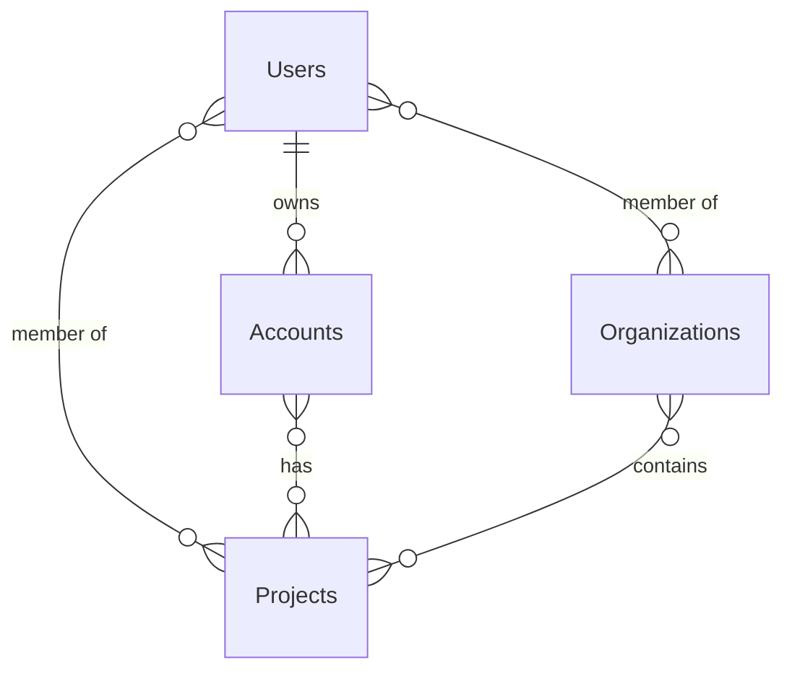
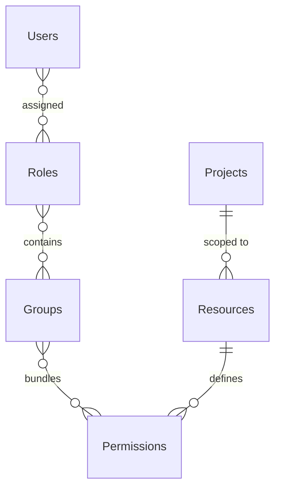

# Data Model

Grant stores all data in PostgreSQL using [Drizzle ORM](https://orm.drizzle.team/). The database schemas in `packages/@grantjs/database/src/schemas/` are the single source of truth — the GraphQL types in `@grantjs/schema` are generated from them.

## Entities

| Entity           | Purpose                                                                   | Key relationships                                                                          |
| ---------------- | ------------------------------------------------------------------------- | ------------------------------------------------------------------------------------------ |
| **User**         | A person who can log in                                                   | Owns accounts, belongs to organizations and projects via pivots                            |
| **Account**      | Person-centric identity (personal or organization)                        | Owned by a user; links to projects via `account_projects`                                  |
| **Organization** | Business entity that groups projects and members                          | Contains projects and users via pivot tables                                               |
| **Project**      | Isolated environment for managing external identities                     | Contains resources, users, roles, groups, permissions, API keys, signing keys              |
| **Resource**     | Domain entity defined by an external system (e.g. invoice, order, policy) | Belongs to a project; permissions are scoped to resources                                  |
| **Role**         | Named collection of groups                                                | Assigned to users via `user_roles`; contains groups via `role_groups`                      |
| **Group**        | Collection of permissions                                                 | Belongs to roles; contains permissions via `group_permissions`                             |
| **Permission**   | A specific action on a resource (e.g. `user:read`)                        | Belongs to groups; linked to a resource                                                    |
| **Tag**          | Flexible label for categorization                                         | Applied to users, roles, groups, permissions, organizations, and projects via pivot tables |
| **API Key**      | Programmatic access credential scoped to a project                        | Belongs to a user and a project; exchanged for a JWT                                       |
| **Signing Key**  | RSA key pair for JWT signing (system or per-project)                      | Scoped to system or a project; exposed via JWKS                                            |

## Entity Relationships

### Tenant Hierarchy

How users, accounts, organizations, and projects relate to each other:



Each many-to-many relationship is backed by a pivot table (`organization_users`, `project_users`, `account_projects`, `organization_projects`) with soft-delete-aware unique constraints.

### RBAC Chain

How permissions are structured from user down to resource:



Each link is a pivot table (`user_roles`, `role_groups`, `group_permissions`). A permission is a specific action (e.g. `read`, `create`) on a resource.

## Tenant Hierarchy

Data is organized in three levels. Each level provides full isolation — there is no data leakage between accounts, and projects within an organization are independent of each other.

```
Account (top-level tenant)
 └── Organization (business entity, groups projects and members)
      └── Project (isolated environment with its own users, roles, resources)
```

- **Account** — A person's identity. One user can own multiple accounts (personal and organization types). Accounts can switch context without re-authenticating.
- **Organization** — Groups related projects and team members. Users can belong to multiple organizations.
- **Project** — A fully isolated environment. Each project manages its own users, roles, groups, permissions, resources, API keys, and signing keys independently.

::: tip
For the full isolation model including Row-Level Security, see [Multi-Tenancy](/architecture/multi-tenancy).
:::

## RBAC Chain

Permissions are evaluated through a fixed chain:

```
User → Role → Group → Permission → Resource
```

A user is assigned roles; each role contains groups; each group bundles permissions; each permission authorizes a specific action on a resource. Roles, groups, and permissions are all scoped to a specific tenant (account, organization, or project).

::: tip
For the complete permission model, evaluation flow, and standard roles, see [RBAC](/architecture/rbac).
:::

## Tagging

Tags provide a generic labeling system for organizing and filtering entities. A tag can be applied to any of the following via a dedicated pivot table:

- Users, Roles, Groups, Permissions, Organizations, Projects

Tags are scoped to the same tenant as the entity they are applied to.

## Audit Logging

Every entity has a corresponding `*_audit_logs` table that records a complete change history. Audit records capture the old and new values, the action performed, and who performed it.

| Event     | Description                 |
| --------- | --------------------------- |
| `CREATE`  | Entity created              |
| `UPDATE`  | Entity modified             |
| `DELETE`  | Entity soft-deleted         |
| `RESTORE` | Entity restored             |
| `ASSIGN`  | Role or permission assigned |
| `REVOKE`  | Role or permission revoked  |

## Common Patterns

All tables in the schema share these conventions:

- **UUID primary keys** — Generated with `gen_random_uuid()`
- **Soft deletes** — `deleted_at` column; records are never physically removed
- **Timestamps** — `created_at` and `updated_at` on every table
- **Composite unique indexes** — Pivot tables enforce uniqueness only where `deleted_at IS NULL`

::: info Schema references

- **Drizzle schemas:** `packages/@grantjs/database/src/schemas/`
- **GraphQL types:** `packages/@grantjs/schema/src/generated/`
- **Migrations:** `pnpm --filter @grantjs/database db:generate` and `db:migrate`
  :::

---

**Next:** Learn about [Security](/architecture/security) to understand authentication and session management.
