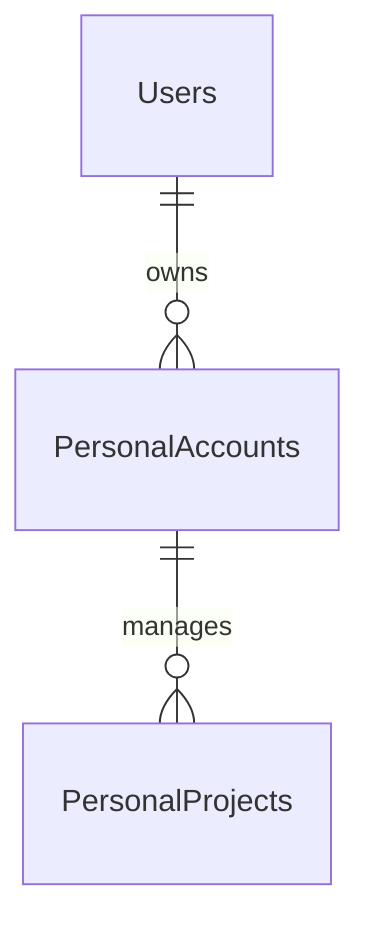
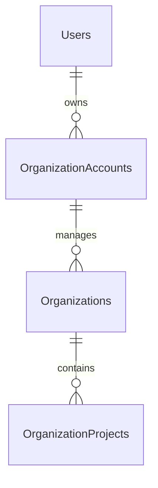
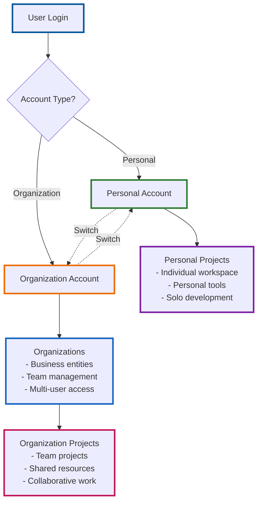
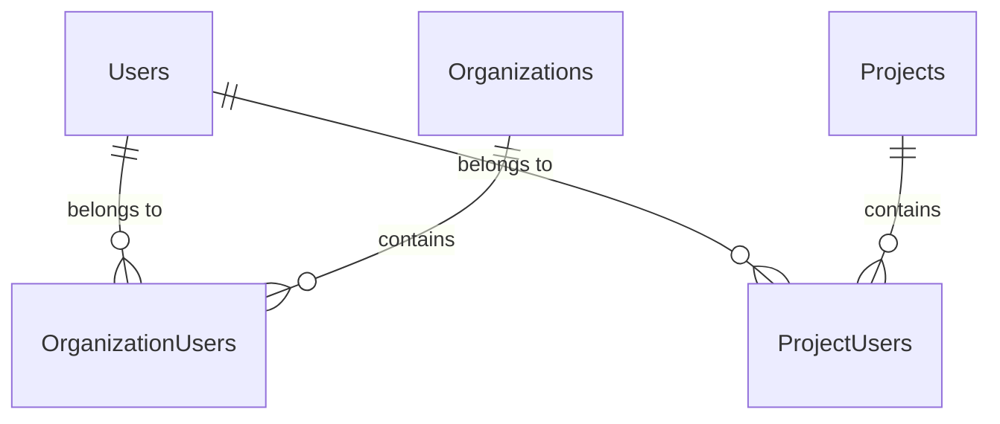
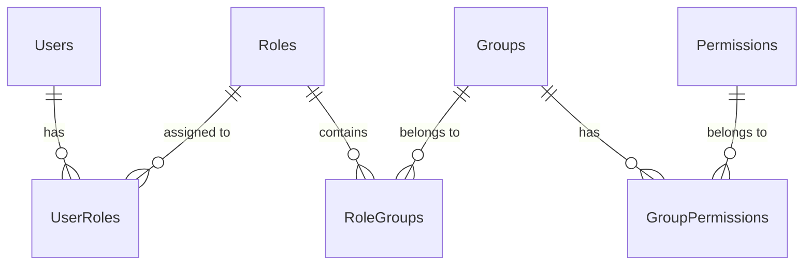
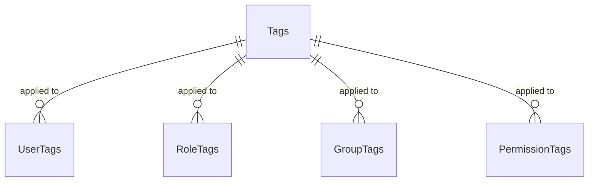
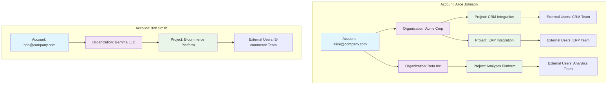
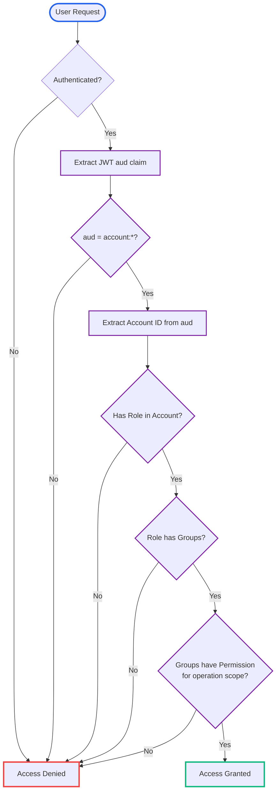
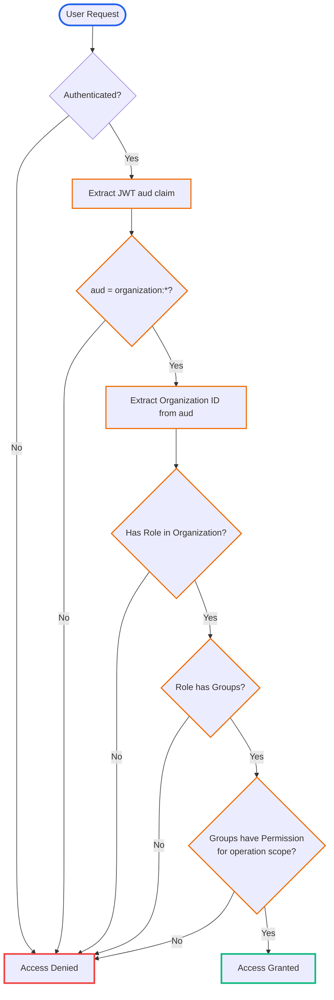
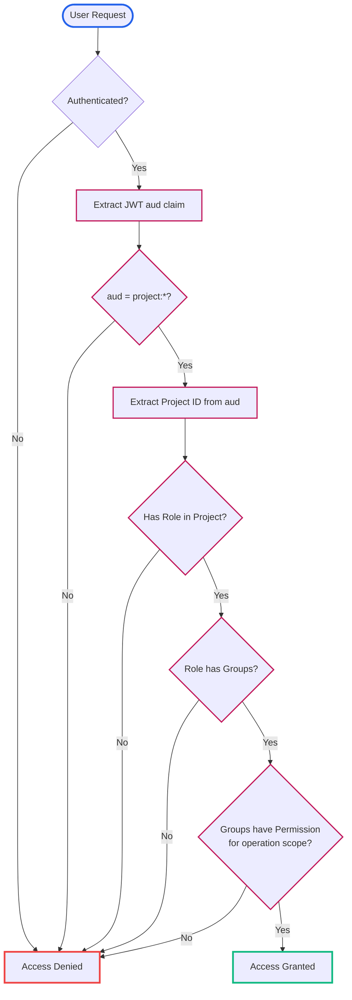

# Data Model

The Grant Platform uses a sophisticated multi-tenant data model built on PostgreSQL with Drizzle ORM. This document provides a comprehensive overview of the database schema, entity relationships, and design patterns.

## Core Entities

The platform is built around several core entities that work together to provide multi-tenant RBAC/ACL functionality:

### Primary Entities

- **Users** - Individual people who can access the platform
- **Accounts** - Person-centric identities that can own multiple organizations
- **Organizations** - Business entities that contain projects and users
- **Projects** - Isolated environments for managing external system identities
- **Roles** - Named collections of permissions
- **Groups** - Collections of permissions that can be assigned to roles
- **Permissions** - Specific actions that can be performed
- **Tags** - Flexible labeling system for categorization

## Entity Relationship Diagram

The Grant Platform uses a complex multi-tenant data model. To make the relationships clearer, we'll break this into focused diagrams:

### Core Entity Relationships

The Grant Platform supports two types of accounts with different relationship patterns:

#### Personal Account Relationships

Personal accounts are for individual users managing their own workspace projects:



#### Organization Account Relationships

Organization accounts are for managing business entities and their projects:



#### Account Switching Flow

Users can switch between different account types to access different workspaces:



### Multi-Tenant User Relationships



### RBAC Entity Relationships



### Tagging System Relationships



## Multi-Tenancy Architecture

The platform implements account-based multi-tenancy with three levels of isolation:

### 1. Account Level

- **Accounts** represent person-centric identities
- Each account can own multiple organizations
- Account-level permissions control platform access

### 2. Organization Level

- **Organizations** are business entities
- Users can belong to multiple organizations
- Organization-level roles and permissions

### 3. Project Level

- **Projects** are isolated environments
- Each project manages external system identities
- Complete isolation between projects



## RBAC Permission Model

The platform uses a flexible Role-Based Access Control (RBAC) system with different evaluation flows depending on the account type:

### Permission Flow

```
User → Role → Group → Permission
```

### Personal Account Permission Evaluation

For personal accounts, the JWT `aud` claim contains `account:{account-id}`, and permissions are evaluated within that account scope:



### Organization Account Permission Evaluation

For organization accounts, the JWT `aud` claim contains `organization:{org-id}`, and permissions are evaluated within that organization scope:



### Project-Scoped Permission Evaluation

For project-specific operations, the JWT `aud` claim can be scoped to `project:{project-id}` for maximum granularity:



### JWT Audience Claim Examples

The ACL package uses the JWT `aud` claim to determine the tenant context:

```typescript
// Personal Account
const personalAud = 'account:8043dfac-2d28-4b37-a066-b7d1902442b4';

// Organization Account
const orgAud = 'organization:24f865c9-7200-43fa-99cc-7fc5dcd87a20';

// Project-Scoped Account
const projectAud = 'project:8a9b2c3d-4e5f-6789-abcd-ef0123456789';
```

### Operation Scope Matching

Permissions are evaluated against the operation's scope:

```typescript
interface Operation {
  projectId?: string; // Optional project context
  resource: string; // Resource being accessed
  action: string; // Action being performed
}

// Example operations
const readUserOperation = {
  projectId: 'proj-123',
  resource: 'user',
  action: 'read',
};

const createProjectOperation = {
  resource: 'project',
  action: 'create',
};
```

## Database Schema Details

### Core Tables

#### Users Table

```sql
CREATE TABLE users (
    id UUID PRIMARY KEY DEFAULT gen_random_uuid(),
    name VARCHAR(255) NOT NULL,
    created_at TIMESTAMP DEFAULT NOW() NOT NULL,
    updated_at TIMESTAMP DEFAULT NOW() NOT NULL,
    deleted_at TIMESTAMP
);
```

#### Accounts Table

```sql
CREATE TABLE accounts (
    id UUID PRIMARY KEY DEFAULT gen_random_uuid(),
    name VARCHAR(255) NOT NULL,
    slug VARCHAR(255) NOT NULL,
    type VARCHAR(50) NOT NULL,
    owner_id UUID REFERENCES users(id) NOT NULL,
    created_at TIMESTAMP DEFAULT NOW() NOT NULL,
    updated_at TIMESTAMP DEFAULT NOW() NOT NULL,
    deleted_at TIMESTAMP
);
```

#### Organizations Table

```sql
CREATE TABLE organizations (
    id UUID PRIMARY KEY DEFAULT gen_random_uuid(),
    name VARCHAR(255) NOT NULL,
    slug VARCHAR(255) NOT NULL,
    created_at TIMESTAMP DEFAULT NOW() NOT NULL,
    updated_at TIMESTAMP DEFAULT NOW() NOT NULL,
    deleted_at TIMESTAMP
);
```

#### Projects Table

```sql
CREATE TABLE projects (
    id UUID PRIMARY KEY DEFAULT gen_random_uuid(),
    name VARCHAR(255) NOT NULL,
    slug VARCHAR(255) NOT NULL,
    description VARCHAR(1000),
    created_at TIMESTAMP DEFAULT NOW() NOT NULL,
    updated_at TIMESTAMP DEFAULT NOW() NOT NULL,
    deleted_at TIMESTAMP
);
```

### Pivot Tables

The platform uses extensive pivot tables to manage many-to-many relationships:

#### User-Organization Relationship

```sql
CREATE TABLE organization_users (
    id UUID PRIMARY KEY DEFAULT gen_random_uuid(),
    organization_id UUID REFERENCES organizations(id) ON DELETE CASCADE,
    user_id UUID REFERENCES users(id) ON DELETE CASCADE,
    created_at TIMESTAMP DEFAULT NOW() NOT NULL,
    updated_at TIMESTAMP DEFAULT NOW() NOT NULL,
    deleted_at TIMESTAMP,
    UNIQUE(organization_id, user_id) WHERE deleted_at IS NULL
);
```

#### User-Project Relationship

```sql
CREATE TABLE project_users (
    id UUID PRIMARY KEY DEFAULT gen_random_uuid(),
    project_id UUID REFERENCES projects(id) ON DELETE CASCADE,
    user_id UUID REFERENCES users(id) ON DELETE CASCADE,
    created_at TIMESTAMP DEFAULT NOW() NOT NULL,
    updated_at TIMESTAMP DEFAULT NOW() NOT NULL,
    deleted_at TIMESTAMP,
    UNIQUE(project_id, user_id) WHERE deleted_at IS NULL
);
```

#### Role-Group Relationship

```sql
CREATE TABLE role_groups (
    id UUID PRIMARY KEY DEFAULT gen_random_uuid(),
    role_id UUID REFERENCES roles(id) ON DELETE CASCADE,
    group_id UUID REFERENCES groups(id) ON DELETE CASCADE,
    created_at TIMESTAMP DEFAULT NOW() NOT NULL,
    updated_at TIMESTAMP DEFAULT NOW() NOT NULL,
    deleted_at TIMESTAMP,
    UNIQUE(role_id, group_id) WHERE deleted_at IS NULL
);
```

#### Group-Permission Relationship

```sql
CREATE TABLE group_permissions (
    id UUID PRIMARY KEY DEFAULT gen_random_uuid(),
    group_id UUID REFERENCES groups(id) ON DELETE CASCADE,
    permission_id UUID REFERENCES permissions(id) ON DELETE CASCADE,
    created_at TIMESTAMP DEFAULT NOW() NOT NULL,
    updated_at TIMESTAMP DEFAULT NOW() NOT NULL,
    deleted_at TIMESTAMP,
    UNIQUE(group_id, permission_id) WHERE deleted_at IS NULL
);
```

## Tagging System

The platform includes a comprehensive tagging system for flexible categorization:

### Tag Relationships

```mermaid
graph LR
    subgraph "Tagging System"
        T[Tags<br/>Flexible Labels]
        T --> UT[User Tags<br/>User Categorization]
        T --> RT[Role Tags<br/>Role Classification]
        T --> GT[Group Tags<br/>Group Organization]
        T --> PT[Permission Tags<br/>Permission Types]
        T --> OT[Organization Tags<br/>Org Classification]
        T --> PRT[Project Tags<br/>Project Categories]

        UT --> U[Users]
        RT --> R[Roles]
        GT --> G[Groups]
        PT --> P[Permissions]
        OT --> O[Organizations]
        PRT --> PR[Projects]
    end

    style T fill:rgba(255, 193, 7, 0.8),stroke:#ff9800,stroke-width:2px,color:#000
    style UT fill:rgba(33, 150, 243, 0.8),stroke:#1976d2,stroke-width:2px,color:#fff
    style RT fill:rgba(33, 150, 243, 0.8),stroke:#1976d2,stroke-width:2px,color:#fff
    style GT fill:rgba(33, 150, 243, 0.8),stroke:#1976d2,stroke-width:2px,color:#fff
    style PT fill:rgba(33, 150, 243, 0.8),stroke:#1976d2,stroke-width:2px,color:#fff
    style OT fill:rgba(33, 150, 243, 0.8),stroke:#1976d2,stroke-width:2px,color:#fff
    style PRT fill:rgba(33, 150, 243, 0.8),stroke:#1976d2,stroke-width:2px,color:#fff
    style U fill:rgba(76, 175, 80, 0.8),stroke:#388e3c,stroke-width:2px,color:#fff
    style R fill:rgba(76, 175, 80, 0.8),stroke:#388e3c,stroke-width:2px,color:#fff
    style G fill:rgba(76, 175, 80, 0.8),stroke:#388e3c,stroke-width:2px,color:#fff
    style P fill:rgba(76, 175, 80, 0.8),stroke:#388e3c,stroke-width:2px,color:#fff
    style O fill:rgba(76, 175, 80, 0.8),stroke:#388e3c,stroke-width:2px,color:#fff
    style PR fill:rgba(76, 175, 80, 0.8),stroke:#388e3c,stroke-width:2px,color:#fff
```

### Tag Usage Examples

- **User Tags**: "admin", "developer", "contractor"
- **Role Tags**: "management", "technical", "support"
- **Group Tags**: "read-only", "write-access", "admin-only"
- **Permission Tags**: "sensitive", "public", "internal"

## Audit Logging

Every entity includes comprehensive audit logging:

### Audit Log Structure

```sql
CREATE TABLE user_audit_logs (
    id UUID PRIMARY KEY DEFAULT gen_random_uuid(),
    user_id UUID REFERENCES users(id) NOT NULL,
    action VARCHAR(50) NOT NULL,
    old_values VARCHAR(1000),
    new_values VARCHAR(1000),
    metadata VARCHAR(1000),
    performed_by UUID NOT NULL,
    created_at TIMESTAMP DEFAULT NOW() NOT NULL
);
```

### Audit Events

- **CREATE** - Entity creation
- **UPDATE** - Entity modification
- **DELETE** - Entity deletion (soft delete)
- **RESTORE** - Entity restoration
- **ASSIGN** - Role/permission assignment
- **REVOKE** - Role/permission revocation

## Indexing Strategy

The database uses strategic indexing for optimal performance:

### Primary Indexes

- **Primary Keys**: All tables have UUID primary keys
- **Foreign Keys**: All foreign key relationships are indexed
- **Soft Deletes**: `deleted_at` columns are indexed for efficient filtering

### Unique Constraints

- **Composite Uniqueness**: Pivot tables use composite unique indexes
- **Soft Delete Awareness**: Unique constraints respect soft delete status
- **Slug Uniqueness**: Organizations and projects have unique slugs

### Performance Indexes

```sql
-- User lookup by organization
CREATE INDEX idx_organization_users_org_id ON organization_users(organization_id);

-- User lookup by project
CREATE INDEX idx_project_users_project_id ON project_users(project_id);

-- Role permission lookup
CREATE INDEX idx_role_groups_role_id ON role_groups(role_id);
CREATE INDEX idx_group_permissions_group_id ON group_permissions(group_id);

-- Audit log queries
CREATE INDEX idx_user_audit_logs_user_id ON user_audit_logs(user_id);
CREATE INDEX idx_user_audit_logs_action ON user_audit_logs(action);
```

## Data Isolation Patterns

### Tenant Isolation

- **Account Level**: Complete isolation between accounts
- **Organization Level**: Users can belong to multiple organizations
- **Project Level**: Complete isolation between projects

### Permission Isolation

- **Role Scoping**: Roles are scoped to specific tenants
- **Group Scoping**: Groups are scoped to specific tenants
- **Permission Scoping**: Permissions are scoped to specific tenants

### Data Access Patterns

- **Cross-Tenant Queries**: Prevented by tenant scoping
- **Soft Deletes**: All entities support soft deletion
- **Audit Trails**: Complete audit trail for all changes

## GraphQL Schema Integration

The database schema is automatically exposed through GraphQL:

### Type Generation

- **Drizzle ORM** generates TypeScript types
- **GraphQL Code Generator** creates GraphQL types
- **Type Safety** maintained across the entire stack

### Query Optimization

- **Field Selection**: Only requested fields are fetched
- **Relationship Loading**: Efficient relationship loading
- **Caching**: Strategic caching for frequently accessed data

## Migration Strategy

### Schema Evolution

- **Drizzle Migrations**: Automated migration generation
- **Backward Compatibility**: Careful schema evolution
- **Data Preservation**: Safe data migration patterns

### Deployment Patterns

- **Zero Downtime**: Rolling deployments with migrations
- **Rollback Support**: Safe rollback procedures
- **Data Validation**: Comprehensive data validation

---

**Next:** Learn about [Security](/architecture/security) to understand authentication and authorization mechanisms.
