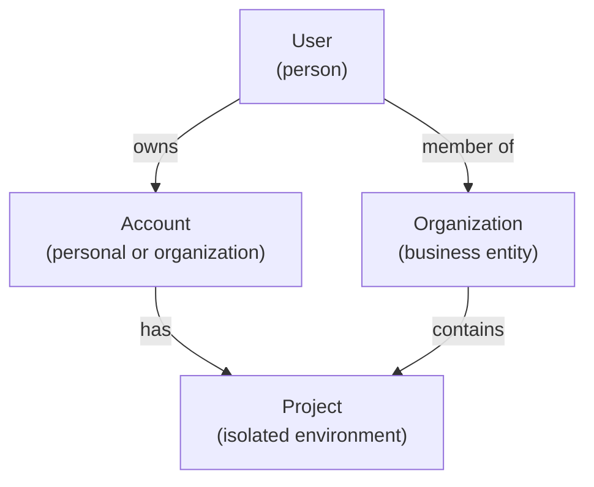

# Multi-Tenancy

Grant uses account-based multi-tenancy with three isolation levels: **Account**, **Organization**, and **Project**. Every entity in the system is scoped to one of these levels, and there is no implicit data sharing between them.

## Tenant Levels



### Account

A person-centric identity. Each account has an **owner** (User) and a **type** — personal or organization. Accounts are the top-level tenant and link to projects via the `account_projects` pivot table. Users can own multiple accounts and switch between them without re-authenticating.

### Organization

A business entity that groups related projects and team members. Organizations contain:

- **Members** — users who belong to the organization (via `organization_users`)
- **Projects** — isolated environments managed by the organization (via `organization_projects`)
- **Roles, Groups, Permissions** — scoped to the organization level for managing access to the organization itself

### Project

A fully isolated environment for managing external system identities. Each project independently contains:

- **Users, Roles, Groups, Permissions, Resources** — all scoped to the project
- **API Keys and Signing Keys** — project-scoped credentials and JWT signing

There is **no cross-project inheritance**. Two projects within the same organization share nothing unless entities are explicitly created in both.

## Entity Scoping

Every RBAC entity (role, group, permission) is scoped to exactly one tenant via a pivot table. The same entity types exist at both the organization and project levels, but they are separate instances with separate pivot tables.

| Entity           | Organization scope         | Project scope                          |
| ---------------- | -------------------------- | -------------------------------------- |
| **Users**        | `organization_users`       | `project_users`                        |
| **Roles**        | `organization_roles`       | `project_roles`                        |
| **Groups**       | `organization_groups`      | `project_groups`                       |
| **Permissions**  | `organization_permissions` | `project_permissions`                  |
| **Resources**    | —                          | `project` (direct FK)                  |
| **API Keys**     | —                          | `project` (direct FK)                  |
| **Signing Keys** | —                          | Scoped via `scope_tenant` + `scope_id` |

::: info
Organization-level roles and groups control access to the organization itself (e.g. managing members, creating projects). Project-level roles and groups control access to the entities within that project.
:::

## Isolation Rules

1. **Explicit access only** — All relationships go through pivot tables. A user has no access to an organization or project unless a pivot record exists.
2. **No inheritance** — Organization membership does not grant automatic access to that organization's projects. Project access must be granted separately.
3. **Tenant-scoped queries** — Every authenticated request carries a `Scope` (tenant type + ID) derived from the auth token. Repositories filter all queries by this scope.
4. **Database enforcement** — PostgreSQL Row-Level Security on all 21 pivot tables ensures isolation even if application logic is bypassed. See [Security - RLS](/architecture/security#row-level-security-rls).

## Example: Multi-Organization User

```
User: "Alice"
├── Account (personal)
│   └── Project: "Side Project"
│
├── Organization: "Acme Corp"
│   ├── Project: "CRM Integration"
│   │   ├── Users: [Alice, John, Jane]
│   │   ├── Roles: [CRM Admin, CRM Viewer]
│   │   └── Resources: [Customer, Invoice, Order]
│   └── Project: "ERP Integration"
│       ├── Users: [Alice, Bob]
│       └── Resources: [Employee, Payroll]
│
└── Organization: "Beta Inc"
    └── Project: "Analytics"
        ├── Users: [Alice, David]
        └── Resources: [Report, Dashboard]
```

Alice has roles in each organization and each project independently. Her `CRM Admin` role in "CRM Integration" grants zero access to "ERP Integration" or "Analytics" — those projects have their own role assignments.

## Background Jobs and Tenant Context

Async jobs that act on tenant-scoped data must receive and validate the tenant scope so that cross-tenant actions are prevented:

- **Job payload** includes an optional `scope` (`{ tenant, id }`). For tenant-scoped jobs, scope is required and must come from the authenticated context when the job is enqueued — never from client input.
- **Validation** — tenant-scoped jobs call `validateTenantJobContext(context, true)` at start; jobs with missing or invalid scope are rejected.
- **System jobs** (e.g. data retention, key rotation) run without scope and use the table-owner role that bypasses RLS.

See [Job Scheduling](/advanced-topics/job-scheduling#6-background-jobs-and-tenant-context) for the full pattern.

---

**Next:** Learn about the [RBAC System](/architecture/rbac) to understand how permissions work within each tenant scope.
