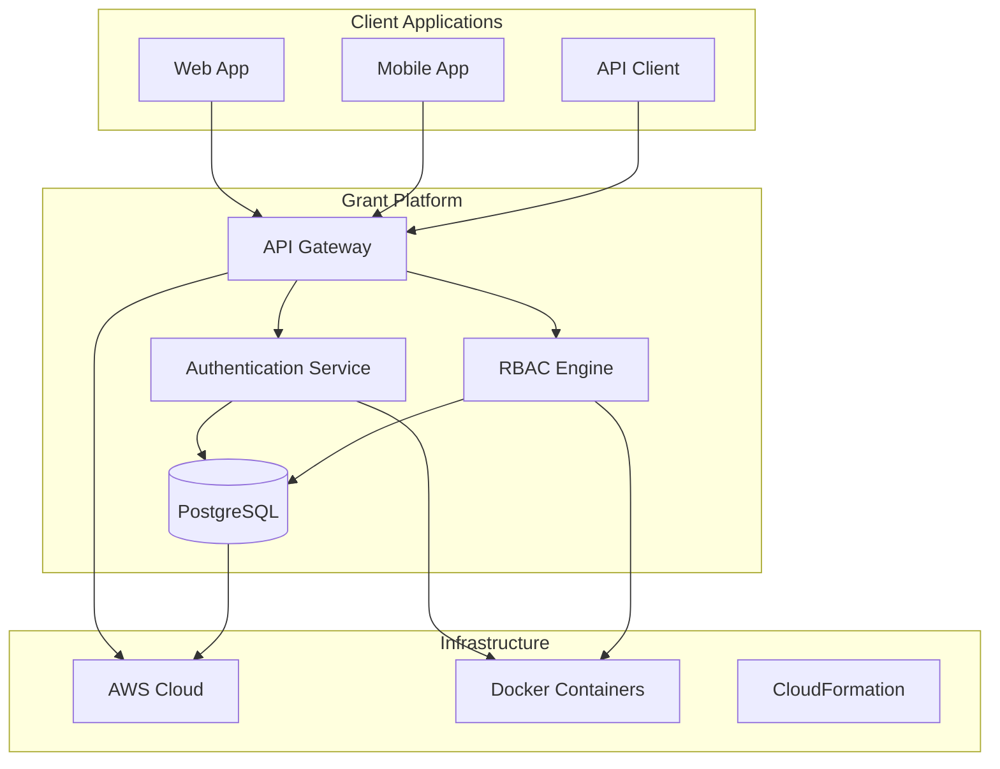
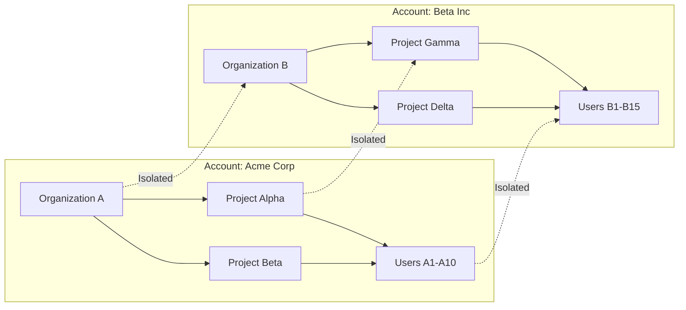
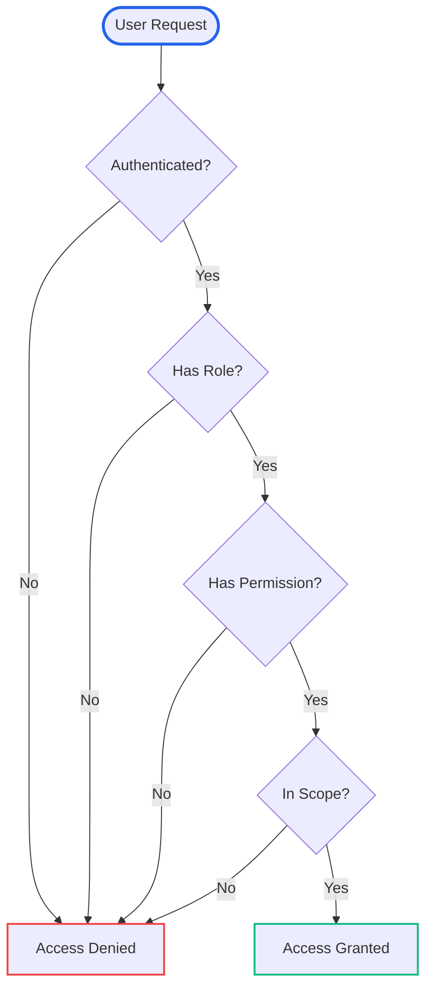

# Architecture Overview

Grant Platform follows a modern, scalable architecture designed for multi-tenancy and high performance.

## System Architecture

## Core Components

### Frontend Layer

- **Web App** - Next.js frontend with authentication and user management
- **Mobile App** - React Native mobile application (future)
- **API Client** - SDK for integrating with external applications

### API Layer

- **API Server** - Apollo GraphQL server with comprehensive RBAC/ACL
- **Authentication Service** - JWT-based authentication with multiple providers
- **RBAC Engine** - Permission evaluation and access control

### Data Layer

- **Database** - PostgreSQL with Drizzle ORM and migration system
- **Cache Layer** - Redis for session management and performance
- **File Storage** - AWS S3 for document and asset storage

### Core Packages

- **Core Package** - Shared RBAC/ACL logic and middleware
- **Schema Package** - GraphQL schema and generated types
- **Database Package** - Database schemas, migrations, and utilities
- **Constants Package** - Shared constants and enums

## Multi-Tenancy Model

Our account-based multi-tenancy ensures complete isolation between organizations:

## Permission Flow

Here's how permissions are evaluated in Grant Platform:

## Technology Stack

### Backend

- **Node.js** - Runtime environment
- **TypeScript** - Type-safe development
- **Apollo Server** - GraphQL API server
- **Drizzle ORM** - Type-safe database operations
- **PostgreSQL** - Primary database
- **Redis** - Caching and session storage

### Frontend

- **Next.js** - React framework
- **TypeScript** - Type-safe development
- **Tailwind CSS** - Utility-first CSS framework
- **Apollo Client** - GraphQL client
- **React Hook Form** - Form management
- **Zod** - Schema validation

### Infrastructure

- **Docker** - Containerization
- **AWS** - Cloud infrastructure
- **CloudFormation** - Infrastructure as code
- **GitHub Actions** - CI/CD pipeline

## Design Principles

### 1. Type Safety First

- Full TypeScript coverage across the stack
- Generated types from GraphQL schema
- Compile-time error checking

### 2. Modular Architecture

- Monorepo structure with shared packages
- Clear separation of concerns
- Reusable components and utilities

### 3. Security by Design

- Multi-tenant isolation
- Role-based access control
- Comprehensive audit logging
- Input validation and sanitization

### 4. Performance Optimization

- Efficient database queries
- Caching strategies
- Optimized GraphQL field selection
- CDN for static assets

### 5. Developer Experience

- Comprehensive documentation
- Type-safe APIs
- Hot reloading in development
- Automated testing and deployment

## Scalability Considerations

### Horizontal Scaling

- Stateless API servers
- Database read replicas
- Load balancing across instances
- Microservices architecture (future)

### Performance Optimization

- Database indexing strategies
- Query optimization
- Caching layers
- CDN integration

### Monitoring and Observability

- Application performance monitoring
- Error tracking and alerting
- Business metrics and analytics
- Health checks and uptime monitoring

## Future Architecture Evolution

### Phase 1: Current Monolith

- Single API server
- Shared database
- Basic multi-tenancy

### Phase 2: Service Separation

- Separate authentication service
- Dedicated RBAC service
- Event-driven architecture

### Phase 3: Microservices

- Domain-driven service boundaries
- Event sourcing for audit trails
- Advanced caching strategies
- Global distribution

---

**Next:** Learn about [Multi-Tenancy](/architecture/multi-tenancy) to understand how organizations and projects are isolated.
