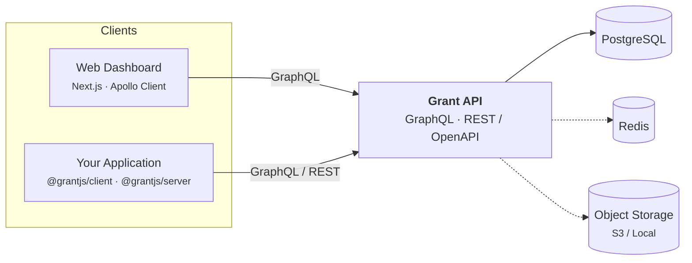
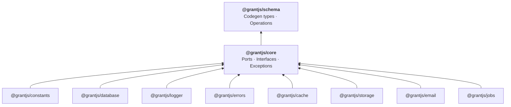
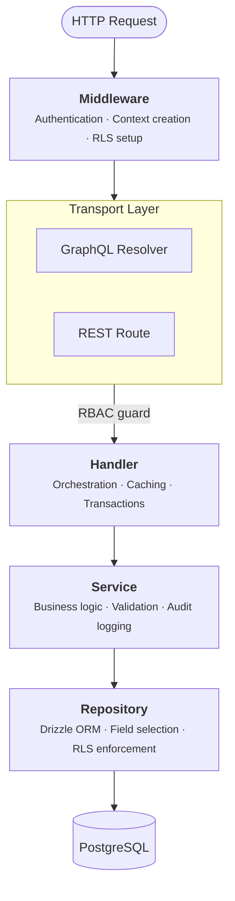
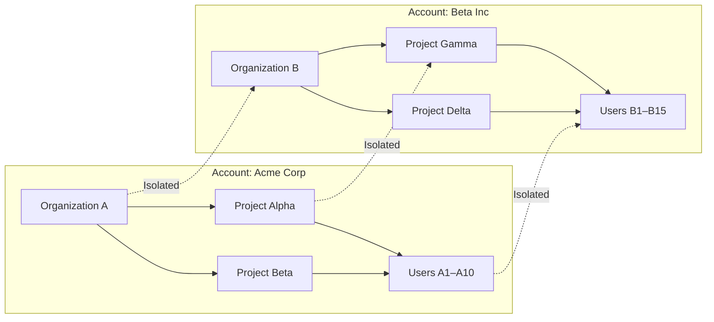

# Architecture Overview

Grant is a multi-tenant RBAC platform organized as a TypeScript monorepo. It follows hexagonal architecture (ports and adapters) with strict layer boundaries and dependency inversion across packages.

## System Overview

The platform ships two deployable applications and a set of shared packages:

| Component                      | Description                                                                                                    |
| ------------------------------ | -------------------------------------------------------------------------------------------------------------- |
| **Grant API** (`apps/api`)     | Express server exposing both a GraphQL API (Apollo Server) and a REST API with OpenAPI / Swagger documentation |
| **Web Dashboard** (`apps/web`) | Next.js 15 (App Router) admin interface with i18n and permission-aware UI                                      |
| **PostgreSQL**                 | Primary data store with Row-Level Security for tenant isolation                                                |
| **Redis**                      | Optional — caching, session storage, and job queues (BullMQ)                                                   |
| **Object Storage**             | Optional — file and image uploads via S3-compatible storage or local filesystem                                |

## Monorepo Packages

All shared code lives under `packages/@grantjs/`. The dependency graph is a strict DAG — no circular imports are allowed.

| Package                | Role                                                                                                                                                                                                                                                        |
| ---------------------- | ----------------------------------------------------------------------------------------------------------------------------------------------------------------------------------------------------------------------------------------------------------- |
| **@grantjs/schema**    | GraphQL schema definitions, operation documents, and generated TypeScript types. Single source of truth for API contracts — types are imported from here, never redefined.                                                                                  |
| **@grantjs/core**      | Domain ports (`ILogger`, `ICacheAdapter`, `IStorageAdapter`, `IEmailAdapter`, `IJobAdapter`), the exception hierarchy (`GrantException` → `NotFoundError`, `ValidationError`, …), and the RBAC engine (`Grant`, `PermissionChecker`, `ConditionEvaluator`). |
| **@grantjs/database**  | Drizzle ORM schemas, relationships, migrations, and seed scripts. Accepts an optional `ILogger` via config.                                                                                                                                                 |
| **@grantjs/constants** | Canonical permission, role, and group definitions used by the database seeder and the authorization layer.                                                                                                                                                  |
| **@grantjs/logger**    | Pino-based implementation of `ILoggerFactory` / `ILogger` from core.                                                                                                                                                                                        |
| **@grantjs/errors**    | `HttpException` and `mapDomainToHttp()` — maps domain exceptions to HTTP status codes for the transport layer.                                                                                                                                              |
| **@grantjs/cache**     | Memory and Redis cache adapters implementing `ICacheAdapter`.                                                                                                                                                                                               |
| **@grantjs/storage**   | Local filesystem and S3 adapters implementing `IFileStorageService`.                                                                                                                                                                                        |
| **@grantjs/email**     | SMTP, SES, Mailgun, Mailjet, and console adapters implementing `IEmailAdapter`.                                                                                                                                                                             |
| **@grantjs/jobs**      | node-cron and BullMQ adapters implementing `IJobAdapter`.                                                                                                                                                                                                   |
| **@grantjs/client**    | Browser SDK — React hooks and components for permission-based UI rendering.                                                                                                                                                                                 |
| **@grantjs/server**    | Server SDK — middleware guards for Express, Fastify, NestJS, and Next.js.                                                                                                                                                                                   |
| **@grantjs/cli**       | CLI tool for setup, authentication, and typings generation for `@grantjs/server`.                                                                                                                                                                           |

::: tip Dependency inversion rule
Adapter packages accept `ILogger` / `ILoggerFactory` via constructor injection. They never import `@grantjs/logger` directly.
:::

## API Request Lifecycle

Every request — GraphQL or REST — flows through the same layered pipeline:

### Layer responsibilities

| Layer            | Location                             | Allowed dependencies                                                        |
| ---------------- | ------------------------------------ | --------------------------------------------------------------------------- |
| **Transport**    | `graphql/resolvers/`, `rest/routes/` | Handlers only — never services or repositories                              |
| **Handlers**     | `handlers/`                          | Services only — never repositories                                          |
| **Services**     | `services/`                          | Repositories and adapter ports (cache, email, storage, jobs)                |
| **Repositories** | `repositories/`                      | Database schemas from `@grantjs/database` only — never services or handlers |

### Composition root

Dependency injection is wired in `middleware/context.middleware.ts`. On every request the middleware:

1. Creates repository, service, and handler instances
2. Sets up a per-request RLS transaction context (when enabled)
3. Builds the `Grant` RBAC engine instance via `GrantService`
4. Attaches the full context — `{ grant, user, handlers, resourceResolvers, origin, locale }` — to the request

Background jobs and startup tasks use a separate `lib/app-context.lib.ts` factory that builds the same object graph outside the HTTP lifecycle.

## Multi-Tenancy Model

Grant uses account-based multi-tenancy. Each account is a fully isolated tenant with its own organizations, projects, and users:

Isolation is enforced at two layers:

- **Application layer** — every query is scoped to the authenticated user's account via tenant-aware repositories
- **Database layer** — PostgreSQL Row-Level Security policies on all pivot tables ensure isolation even if application logic is bypassed

See [Multi-Tenancy](/architecture/multi-tenancy) for the full data model and scoping rules.

## Permission Evaluation

The RBAC engine evaluates in this order: authenticate → resolve roles → check permissions → evaluate scope conditions. Conditions support attribute-based rules (e.g. "only if the user owns the resource") on top of the role-based model. See [RBAC](/architecture/rbac) for the full permission model.

## Technology Stack

### Backend

| Technology        | Purpose                                  |
| ----------------- | ---------------------------------------- |
| **Node.js**       | Runtime                                  |
| **TypeScript**    | Type-safe development (strict mode)      |
| **Express**       | HTTP framework                           |
| **Apollo Server** | GraphQL engine                           |
| **Drizzle ORM**   | Type-safe database access and migrations |
| **PostgreSQL**    | Primary database with RLS                |
| **Redis**         | Caching, sessions, job queues            |
| **Pino**          | Structured JSON logging                  |
| **Zod**           | Runtime schema validation                |

### Frontend

| Technology                | Purpose                      |
| ------------------------- | ---------------------------- |
| **Next.js 15**            | React framework (App Router) |
| **React 19**              | UI library                   |
| **TypeScript**            | Type safety                  |
| **Apollo Client**         | GraphQL data layer           |
| **Tailwind CSS**          | Utility-first styling        |
| **next-intl**             | Internationalization         |
| **Zustand**               | Client state management      |
| **React Hook Form + Zod** | Form handling and validation |

### Infrastructure

| Technology                  | Purpose                                |
| --------------------------- | -------------------------------------- |
| **Docker / Docker Compose** | Containerization and local development |
| **GitHub Actions**          | CI/CD pipeline                         |

## Design Principles

1. **Type safety across the stack** — Types generated from the GraphQL schema (`@grantjs/schema`) are the single source of truth used by resolvers, handlers, services, repositories, and the web client.

2. **Hexagonal architecture** — Domain logic depends only on ports defined in `@grantjs/core`. Infrastructure adapters (database, cache, storage, email, jobs, logging) are injected at the composition root and can be swapped without changing business logic.

3. **Security by default** — Multi-tenant isolation via RLS, RBAC on every endpoint, bcrypt password hashing, JWT/JWKS signing with key rotation, and comprehensive audit logging.

4. **Strict layer boundaries** — Each package has a single responsibility and explicit imports. Handlers never touch repositories; repositories never touch services. The composition root (`context.middleware.ts`) is the only place that wires layers together.

---

**Next:** Learn about [Multi-Tenancy](/architecture/multi-tenancy) to understand how organizations and projects are isolated.
