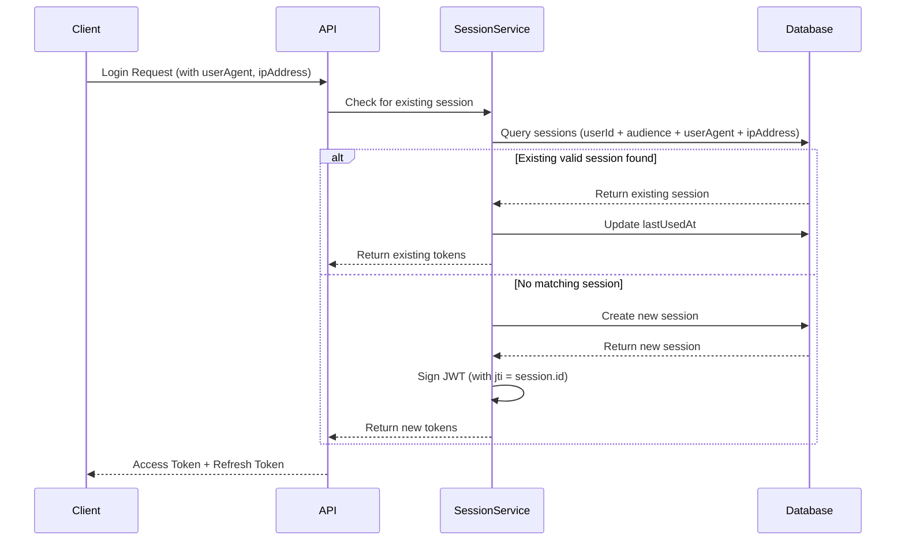

# Security & Session Management

Grant implements a comprehensive security model with JWT-based authentication, device-aware session management, and fine-grained access control.

## Authentication Architecture

### Authentication Methods

Users can authenticate using multiple methods, each stored independently in the `user_authentication_methods` table:

- **Email/Password** - Traditional email and password authentication with email verification
- **GitHub OAuth** - OAuth-based authentication using GitHub accounts
- **Future Providers** - Additional OAuth providers (Google, Microsoft, etc.) can be added via the adapter pattern

#### Primary Authentication Method

Each user must have exactly **one primary authentication method** (`isPrimary: true`):

- The first authentication method created during registration is automatically set as primary
- Users can change their primary method at any time
- The primary method cannot be deleted (users must set another method as primary first)
- Users cannot delete their last remaining authentication method

#### Authentication Method Management

Users can manage their authentication methods through the Security Settings page:

- **Connect Methods** - Add new authentication providers (GitHub OAuth, additional email addresses)
- **Disconnect Methods** - Remove authentication methods (except primary and last remaining)
- **Set Primary** - Change which authentication method is used as the primary
- **Change Password** - Update password for email authentication methods
- **Verification Status** - View verification status for each method

#### GitHub OAuth Flow

GitHub OAuth authentication follows the standard OAuth 2.0 authorization code flow:

1. **Initiation** - User clicks "Connect GitHub" → Redirected to GitHub authorization page
2. **Authorization** - User authorizes the application on GitHub
3. **Callback** - GitHub redirects back with authorization code
4. **Token Exchange** - Backend exchanges code for access token
5. **User Info** - Backend fetches user information from GitHub API
6. **Account Linking** - System creates or links authentication method to user account

The OAuth flow supports three actions:

- **Login** - Authenticate existing user
- **Register** - Create new account with GitHub
- **Connect** - Link GitHub to existing authenticated user account

#### Security Constraints

- **Duplicate Prevention** - Users cannot have multiple authentication methods of the same provider
- **Cross-User Protection** - A GitHub account cannot be linked to multiple user accounts
- **Last Method Protection** - Users must always have at least one authentication method
- **Primary Protection** - The primary authentication method cannot be deleted

### JWT Token Structure

Access tokens are JWT tokens containing:

```typescript
{
  sub: string; // User ID
  aud: string; // Audience (platform API URL, e.g., "https://api.grant.com")
  iss: string; // Issuer (platform API URL, same as audience)
  exp: number; // Expiration timestamp
  iat: number; // Issued at timestamp
  jti: string; // JWT ID (Session ID for user sessions, API Key ID for API keys)
  scope?: string; // Optional: Custom claim for tenant scope (e.g., "project:uuid" for API keys)
}
```

**Key Points:**

- **`aud` and `iss`**: Both are set to the platform API URL (`config.app.url`), identifying the platform itself as the token consumer and issuer (following RFC 7519 standard)
- **`jti`**: Contains the session ID for user sessions, or the API key ID for API key tokens, allowing the system to identify and revoke specific sessions or keys
- **`scope`**: Custom claim used in API key tokens to identify tenant context (e.g., `project:{project-id}`). For user sessions, scope is determined from operation context or stored in the session's `audience` field in the database

## Session Management

### Device-Aware Sessions

Sessions are **unique per device** based on a combination of:

- **User ID** - The authenticated user
- **Audience** - The account/organization/project scope (e.g., `account:uuid`, `organization:uuid`, `project:uuid`) - stored in the database `audience` field, not in the JWT `aud` claim
- **User Agent** - Browser/client identifier
- **IP Address** - Client IP address

This ensures that:

- Users can have multiple active sessions (one per device/browser)
- Each device maintains its own session independently
- Sessions can be individually revoked without affecting other devices
- Security is enhanced by tracking device-specific information

### Session Lifecycle



### Session Storage

Sessions are stored in the `user_sessions` table with the following structure:

```sql
CREATE TABLE user_sessions (
  id UUID PRIMARY KEY,
  user_id UUID NOT NULL,
  user_authentication_method_id UUID NOT NULL,
  token VARCHAR(255) UNIQUE NOT NULL,  -- Refresh token
  audience VARCHAR(255) NOT NULL,        -- Tenant scope (account/organization/project, e.g., "account:uuid")
  expires_at TIMESTAMP NOT NULL,
  last_used_at TIMESTAMP,
  user_agent VARCHAR(500),              -- Device identifier
  ip_address VARCHAR(45),                -- Client IP
  created_at TIMESTAMP NOT NULL,
  updated_at TIMESTAMP NOT NULL,
  deleted_at TIMESTAMP
);
```

### Session Identification

The current session is identified by extracting the `jti` claim from the JWT access token:

```typescript
// Frontend: Extract current session ID
const accessToken = getStoredAccessToken();
const decoded = jwtDecode(accessToken);
const currentSessionId = decoded.jti; // Session ID
```

### IP Address Extraction

The system properly extracts IP addresses considering proxy/load balancer scenarios:

1. **X-Forwarded-For** header (for proxies/load balancers) - takes first IP
2. **X-Real-IP** header (common in nginx)
3. **req.ip** (Express fallback, requires trust proxy)

```typescript
function getClientIp(req: Request): string | null {
  const forwardedFor = req.headers['x-forwarded-for'];
  if (forwardedFor) {
    return forwardedFor.split(',')[0].trim();
  }

  const realIp = req.headers['x-real-ip'];
  if (realIp) {
    return realIp;
  }

  return req.ip || null;
}
```

## Session Operations

### Creating Sessions

Sessions are created during:

1. **Login** - When a user authenticates
2. **Registration** - When a new account is created

The system checks for an existing session matching the device (`userAgent + ipAddress`) before creating a new one. If a matching valid session exists, it's reused and `lastUsedAt` is updated.

### Refreshing Sessions

Sessions can be refreshed using the refresh token. The refresh operation:

1. Validates the refresh token
2. Updates `lastUsedAt` timestamp
3. Issues new access and refresh tokens
4. Maintains the same session ID (`jti`)

### Revoking Sessions

Sessions can be revoked individually:

- **Current Session** - User is immediately logged out and redirected to login
- **Other Sessions** - Only that specific device is logged out

When revoking the current session, users see a warning dialog explaining they will be logged out immediately.

### Session Expiration

Sessions have two expiration timestamps:

- **Access Token** - Short-lived (typically 15 minutes)
- **Refresh Token** - Long-lived (typically 30 days)

Expired sessions are automatically filtered out when querying active sessions.

## JWKS and Asymmetric Signing

Grant supports **asymmetric JWT signing** (RS256) with keys stored in the database and exposed via a **JWKS** (JSON Web Key Set) endpoint. This allows verifiers to validate tokens using public keys only, supports **key rotation** without redeploys, and provides **per-project signing** for API key tokens so compromise of one project’s key does not affect others or platform sessions.

### Key Model

- **System (platform) keys** – Sign **session tokens** (login, refresh). One key set for the whole platform; scope is system (e.g. `tenant: system`, `id: systemUserId`). Key IDs use the prefix `system-` (e.g. `system-<uuid>`).
- **Per-project keys** – Sign **API key–exchanged tokens**. One active key per project (or org project); scope is `accountProject` or `organizationProject`. Keys are created **lazily** on first token exchange for that scope. Key IDs use the prefix `proj-` (e.g. `proj-<uuid>`).

Keys are stored in the `signing_keys` table (scope by `scope_tenant` + `scope_id`). Multiple keys per scope are allowed for rotation: one active, others rotated; the `kid` is globally unique. Old keys remain in JWKS until tokens signed with them expire.

### JWKS Endpoint

- **URL:** `GET /.well-known/jwks.json` (always exposed when JWT algorithm is RS256).
- **Response:** JSON object `{ "keys": [ ... ] }` — **active** public keys plus keys **rotated within the retention window** (see below). Verifiers use the JWT header `kid` to select the matching key; no per-project URL.
- **Auth:** None (public keys). Cache-Control is configurable (e.g. `JWT_JWKS_MAX_AGE_SECONDS`).

### Signing and Verification

- **Session tokens:** Signed with the **system** private key from the database (resolved via GrantService with cache; no env fallback), RS256, `kid` in header.
- **API key tokens:** Signed with the **project** private key for the exchange scope (resolved from scope; key created on first use), RS256, `kid` in header.
- **Verification:** `@grantjs/core` supports `jwksUrl` and key cache; the API passes it in context middleware. Tokens without `kid` fall back to symmetric verification with `JWT_SECRET` (HS256) for backward compatibility.

### Per-Project Key Lifecycle

- **Creation:** On first API key token exchange for a project scope; key is generated and stored.
- **Rotation:** Via GraphQL mutation or REST API; UI (Signing Keys page) allows viewing and rotating. New key becomes active; previous key is marked rotated and remains in JWKS until existing tokens expire.
- **Audit:** Create and rotate events are logged in `signing_key_audit_logs` (no key material in logs).

### Key Retention and Per-Request Signing

- **Do keys in JWKS grow indefinitely?** No. The JWKS endpoint returns only keys that might still verify a valid token: **active** keys plus keys **rotated after** a cutoff. The cutoff is `refreshTokenExpirationDays + 7` days (configurable via `JWT_REFRESH_TOKEN_EXPIRATION_DAYS`). Keys rotated earlier are omitted so the key set stays bounded.
- **When do we know no more tokens are signed with an old key?** Access tokens expire in minutes (`JWT_ACCESS_TOKEN_EXPIRATION_MINUTES`); refresh tokens in days (`JWT_REFRESH_TOKEN_EXPIRATION_DAYS`). After that period, no valid token can bear an old `kid`, so it is safe to stop exposing that key in JWKS (and the retention window does that).
- **Why did refresh previously sign with the old key?** The session signing key was resolved once at server startup. After rotation, the process still held the previous key in memory. Per DIP, core defines **GrantService.getSessionSigningKey()**; the API implements it with DB + cache (invalidated on system key rotation). Grant and TokenManager depend only on the GrantService abstraction. So after rotation, the next request gets the new key from cache miss or TTL. JWKS still includes the old key for the retention window so existing tokens continue to verify until they expire.

### Server-side verification and JWKS

- **Every authenticated request:** The API verifies the Bearer token in-process: context middleware → Grant.authenticate → TokenManager.verifyToken → GrantService.getVerificationKey(kid) → SigningKeyService → repository → database. Without caching, that would be one DB read per request. **Verification keys (public key by kid) are cached in GrantService.getVerificationKey** using the same cache namespace as the session signing key, key `verification:{kid}`, TTL from `JWT_SYSTEM_SIGNING_KEY_CACHE_TTL_SECONDS` (default 300s). No invalidation on rotation: old kids remain valid for verification until their tokens expire; new kids are cached on first use.
- **JWKS endpoint (`GET /.well-known/jwks.json`):** Serves public keys for **external verifiers** (e.g. other services, or client-side validation). The API does not use this HTTP endpoint to verify its own requests; it uses the in-process path above. The response has `Cache-Control: public, max-age=…` so browsers and CDNs can cache it; that is HTTP-level caching for consumers of the endpoint, not for grant-api itself.

### JWKS and multi-tenant scaling

Today a single `GET /.well-known/jwks.json` returns **all** keys (system + every project), so the response size grows with the number of tenants/projects and can become large.

**Industry standard:** Multi-tenant platforms typically use **issuer-scoped JWKS**:

- **Issuer (`iss`) is tenant- or scope-specific.** Examples: Auth0 `https://{tenant}.auth0.com/`, Azure AD `https://login.microsoftonline.com/{tenant-id}/v2.0`, AWS Cognito (user pool in issuer). The verifier uses `iss` from the token to know _which_ authority issued it.
- **JWKS is served at a URL derived from the issuer.** Convention is `{iss}/.well-known/jwks.json` (or OIDC discovery `{iss}/.well-known/openid-configuration` with `jwks_uri`). Each endpoint returns **only the keys for that issuer**, so response size is bounded (e.g. 1–2 active keys plus a few rotated per tenant).

**Options for Grant:**

1. **Issuer per scope + per-issuer JWKS (recommended for scale)**
   - Session tokens: `iss` = e.g. `https://api.example.com` or `https://api.example.com/system`.
   - API key tokens: `iss` = e.g. `https://api.example.com/org/{orgId}/project/{projectId}` (or a stable scope identifier).
   - Routes: `GET /.well-known/jwks.json` → system keys only. `GET /org/:orgId/project/:projectId/.well-known/jwks.json` (or similar) → that project’s keys only.
   - Verifier: read `iss` from token, fetch JWKS from `{iss}/.well-known/jwks.json`. Small, cacheable responses.

2. **Single issuer + by-kid lookup**
   - Keep one `iss`. Verifier gets `kid` from token and calls a dedicated endpoint (e.g. `GET /keys/:kid`) that returns the single key or a minimal JWKS for that kid. JWKS URL is not derived from `iss`; key resolution is by `kid` only. Non-standard but avoids one giant JWKS.

3. **Single issuer + retention only (current)**
   - One `/.well-known/jwks.json` with retention window. Acceptable when the number of active keys (system + projects with recent tokens) is small; does not scale to many tenants.

Adopting (1) implies: setting `iss` per scope when issuing tokens, and serving JWKS from scope-specific paths so verifiers use `iss` to choose the right JWKS URL.

### System Key Rotation (Optional)

A scheduled job can rotate the **system** signing key (e.g. monthly). Config: `JOBS_SYSTEM_SIGNING_KEY_ROTATION_ENABLED` (default `false`), `JOBS_SYSTEM_SIGNING_KEY_ROTATION_SCHEDULE` (cron). The job runs only when `JWT_ALGORITHM=RS256` and calls the same rotate flow as the UI; new keys use the `system-` kid prefix.

### Configuration

Relevant environment variables (see [Configuration](../getting-started/configuration.md) and [Environment](../deployment/environment.md)):

- `JWT_ALGORITHM` – e.g. `RS256` (default for asymmetric).
- `JWT_JWKS_MAX_AGE_SECONDS` – Cache-Control for JWKS response (when using RS256).
- `JWT_SYSTEM_SIGNING_KEY_CACHE_TTL_SECONDS` – TTL for the cached system signing key (default 300). Invalidated on rotation; safety bound for cache. Same TTL is used for verification keys (public key by kid) in GrantService.getVerificationKey; no invalidation on rotation.
- `JWT_PER_PROJECT_KEYS_ENABLED` – Use per-project keys for API key tokens (default true when using DB keys).

## Security Features

### Session Isolation

- Sessions are isolated per user and tenant scope (account/organization/project)
- Each device/browser combination gets its own session
- Revoking one session doesn't affect others
- The tenant scope is stored in the session's `audience` field in the database, while the JWT `aud` claim identifies the platform API URL

### Session Tracking

- **Device Information** - User agent string identifies browser/device
- **IP Address** - Tracks the origin of the session
- **Last Used** - Timestamp of last activity
- **Expiration** - Automatic expiration of inactive sessions

### Rate Limiting

Rate limiting protects against abuse, brute force, and noisy neighbors by capping requests per client.

**Implementation:**

- **Global limit** – Applies to all requests (REST and GraphQL) when enabled. Key: client IP. Limit and window are configurable (e.g. 100 requests per 15 minutes per IP).
- **Auth endpoint limit** – Stricter limit for sensitive auth routes: `POST /api/auth/login`, `POST /api/auth/refresh`, `POST /api/auth/cli-callback`, `POST /api/auth/token`. Single bucket per IP across these endpoints (e.g. 20 requests per 15 minutes per IP).
- **Per-tenant limit (optional)** – When enabled, authenticated requests that include a scope (e.g. organization or project) are also limited per tenant (`scope.tenant` + `scope.id`). This prevents one tenant from consuming the global quota and affecting others (noisy neighbor protection). If the request has no scope (e.g. unauthenticated), only the global and auth limits apply. Disabled by default; enable via `SECURITY_RATE_LIMIT_PER_TENANT_ENABLED`.
- **Skip paths** – `/health` is never rate limited so load balancers and health checks keep working.
- **Storage** – Uses the same cache as the rest of the app (in-memory or Redis via `cache.rateLimit`). With Redis, limits are shared across API instances; with memory, each instance has its own window.

**Client identification:** Same logic as session tracking: `X-Forwarded-For` (first IP), then `X-Real-IP`, then `req.ip` / socket.

**Trusted proxy and rate limiting:** The client IP used for rate-limit keys comes from the above order. When the API runs **behind a trusted reverse proxy or load balancer** (e.g. Nginx, Caddy, cloud LB), the proxy sets `X-Forwarded-For` or `X-Real-IP` to the real client IP, so rate limits apply per end-user. When the API is **not behind a trusted proxy** (e.g. direct exposure or an untrusted proxy), only `req.ip` or the socket address is used—so limits are keyed by the connecting host, not the original client. **Deploy the API only behind trusted proxies** so forwarded headers reflect real clients; otherwise rate limiting may be ineffective or keyed incorrectly. See [Self-hosting](../deployment/self-hosting.md) for reverse-proxy setup.

**Response when limit exceeded:** `429 Too Many Requests` with `Retry-After` (seconds until window reset) and body:

```json
{
  "success": false,
  "error": {
    "code": "rate_limit_exceeded",
    "message": "Too many requests. Please try again later."
  }
}
```

**Configuration:** See [Configuration](../getting-started/configuration.md) and [Environment](../deployment/environment.md). Relevant variables:

- `SECURITY_ENABLE_RATE_LIMIT` – Enable global rate limiting (default: true in production).
- `SECURITY_RATE_LIMIT_MAX`, `SECURITY_RATE_LIMIT_WINDOW_MINUTES` – Global limit and window.
- `SECURITY_RATE_LIMIT_AUTH_MAX`, `SECURITY_RATE_LIMIT_AUTH_WINDOW_MINUTES` – Auth endpoint limit and window.
- `SECURITY_RATE_LIMIT_PER_TENANT_ENABLED` – Enable per-tenant rate limiting (default: false). When true, authenticated requests with scope are limited per tenant in addition to the global limit.
- `SECURITY_RATE_LIMIT_PER_TENANT_MAX`, `SECURITY_RATE_LIMIT_PER_TENANT_WINDOW_MINUTES` – Per-tenant limit and window (e.g. 200 requests per 15 minutes per tenant).

### CSRF Protection

**Current Status:** Partially Protected

The platform uses multiple layers of CSRF protection:

1. **JWT in Authorization Headers** - All authenticated requests use `Authorization: Bearer <token>` headers, which are **not vulnerable to CSRF** because browsers don't automatically send custom headers in cross-site requests.

2. **SameSite Cookie Attribute** - Cookies use `sameSite: 'lax'` which provides partial protection by blocking cross-site POST/PUT/DELETE requests.

3. **Apollo Server CSRF Prevention** - GraphQL endpoints have built-in CSRF protection enabled via Apollo Server's `csrfPrevention` feature.

4. **CSRF Token Protection** - Full CSRF token implementation is planned.

**Why Additional CSRF Protection is Recommended:**

- Defense in depth (multiple security layers)
- Future-proofing for cookie-based authentication
- Industry best practice and compliance requirements
- Protection against edge cases

### Authentication Method Security

- **Email Verification** - Email authentication methods require verification via OTP before use
- **Password Hashing** - Passwords are hashed using bcrypt before storage
- **OTP Expiration** - Email verification OTPs expire after a configured time period
- **Provider Data Encryption** - Sensitive OAuth provider data (tokens, etc.) stored securely
- **Duplicate Prevention** - System prevents multiple methods of the same provider per user
- **Cross-User Validation** - Prevents linking OAuth accounts already connected to other users

## Email Verification Feature Gating

As a **security-first platform**, Grant enforces email verification for collaborative operations while allowing users to work freely in their personal space. This ensures identity verification for actions that affect multiple users.

### Security Model: Personal vs Organization Context

Different rules apply based on account context:

| Context                       | Mutations                   | Read Operations |
| ----------------------------- | --------------------------- | --------------- |
| **Personal Account/Projects** | ✅ Allowed (unverified)     | ✅ Allowed      |
| **Organization Context**      | ❌ Blocked (until verified) | ✅ Allowed      |
| **Account Settings**          | ❌ Blocked (until verified) | ✅ Allowed      |

**Rationale:**

- **Personal Space**: Users own their personal workspace - lower security risk
- **Organization Collaboration**: Multiple users involved - requires verified identity
- **Account Settings**: Profile changes require verified identity to prevent account takeover

### Verification States

Users can be in one of three verification states:

1. **Verified** (`isVerified: true`)
   - Full access to all features
   - No restrictions

2. **Unverified (Within Expiry)** (`isVerified: false`, token not expired)
   - Can verify with existing token
   - Personal context: Mutations allowed
   - Organization context: Mutations blocked

3. **Unverified (Expired)** (`isVerified: false`, token expired)
   - Must request new verification email
   - Personal context: Mutations allowed
   - Organization context: Mutations blocked

### Features Blocked in Organization Context

#### Create/Update/Delete Operations

- **Projects**: Create, edit, delete organization projects
- **Users**: Create, edit, delete users in organization projects
- **Roles**: Create, edit, delete roles in organization/project
- **Groups**: Create, edit, delete groups in organization/project
- **Permissions**: Create, edit, delete permissions in organization/project
- **Resources**: Create, edit, delete resources in organization/project
- **Tags**: Create, edit, delete tags in organization/project
- **API Keys**: Create, revoke, delete API keys in organization context

#### Member Management

- Invite members to organization
- Update member roles
- Remove members
- Resend/revoke invitations

#### Account Settings (All Contexts)

- Update profile (name, picture)
- Change password
- Delete account
- Create secondary accounts

### Features Always Allowed

- **All read operations** - View organizations, projects, users, roles, etc.
- **Navigation** - Dashboard access, sidebar navigation
- **Authentication** - Logout, email verification, resend verification
- **Account switching** - Switch between accounts (read-only operation)

### Token-Based Implementation

Email verification status is embedded in the JWT token for efficient enforcement:

```typescript
interface TokenClaims {
  sub: string; // User ID
  aud: string; // API URL
  iss: string; // Issuer
  exp: number; // Expiration
  iat: number; // Issued at
  jti: string; // JWT ID (session/API key ID)
  type: TokenType; // Session or ApiKey
  scope?: Scope; // Tenant scope
  isVerified?: boolean; // Email verification status (session tokens only)
}
```

**Key Design Decisions:**

1. **Session Tokens Only**: The `isVerified` claim only applies to session tokens. API keys are created when users are already verified (or in personal context) and have fixed scopes.

2. **API Keys Always Verified**: API key tokens are always treated as verified (`isVerified: true`) regardless of the claim, since they are programmatically generated and have restricted scopes.

3. **Zero Overhead for Common Cases**: Verified users and API key requests require no additional database lookups.

4. **Token Refresh on Verification**: When a user verifies their email, the next session refresh updates the `isVerified` claim.

### Backend Guards

#### REST Guard

```typescript
import { requireEmailVerificationRest } from '@/lib/authorization/email-verification-rest-guard';

router.post(
  '/projects',
  requireEmailVerificationRest({ allowPersonalContext: true }),
  authorizeRestRoute({ resource: ResourceSlug.Project, action: ResourceAction.Create }),
  async (req, res) => {
    /* ... */
  }
);
```

#### GraphQL Guard

```typescript
import { requireEmailVerificationGraphQL } from '@/lib/authorization/email-verification-graphql-guard';

const createProjectResolver = requireEmailVerificationGraphQL(
  { allowPersonalContext: true },
  authorizeGraphQLResolver(
    { resource: ResourceSlug.Project, action: ResourceAction.Create },
    async (parent, args, context) => {
      /* ... */
    }
  )
);
```

### Guard Configuration

| Operation Type       | Personal Context | Organization Context | Config                            |
| -------------------- | ---------------- | -------------------- | --------------------------------- |
| Create/Update/Delete | Allow            | Block                | `{ allowPersonalContext: true }`  |
| Member Management    | N/A              | Block                | `{ allowPersonalContext: false }` |
| Settings Updates     | Block            | Block                | `{ allowPersonalContext: false }` |
| Read/Query           | Allow            | Allow                | No guard needed                   |

### Error Responses

**REST (403 Forbidden):**

```json
{
  "error": "Email verification required",
  "code": "EMAIL_VERIFICATION_REQUIRED"
}
```

**GraphQL:**

```json
{
  "errors": [
    {
      "message": "Email verification required",
      "extensions": {
        "code": "EMAIL_VERIFICATION_REQUIRED",
        "translationKey": "errors.auth.emailVerificationRequired"
      }
    }
  ]
}
```

### Frontend Implementation

#### Hooks

Three hooks are available for frontend enforcement:

1. **`useRequiresEmailVerificationForMutation(scope)`** - Context-aware check (recommended)
   - Returns `true` if verification is required and not completed
   - Automatically allows personal context mutations
   - Blocks organization context mutations for unverified users

2. **`useEmailVerificationStatus()`** - Detailed status information
   - Returns: `status`, `isVerified`, `isExpired`, `canVerify`, `verificationExpiry`

3. **`useEmailVerified()`** - Simple boolean check
   - Returns `true` if verified, `false` otherwise

#### Usage Pattern

```tsx
import { useRequiresEmailVerificationForMutation } from '@/hooks/auth';

function CreateDialog() {
  const scope = useScopeFromParams();
  const canCreate = useGrant(ResourceSlug.Project, ResourceAction.Create, { scope });
  const requiresEmailVerification = useRequiresEmailVerificationForMutation(scope);

  // Block if permission check fails OR email verification is required
  if (!scope || !canCreate || requiresEmailVerification) {
    return null;
  }

  return <CreateDialogContent />;
}
```

### UI Components

#### Email Verification Banner

Displayed in the dashboard when `requiresEmailVerification` is true:

- Shows warning message with days remaining until token expiry
- "View Restrictions" button opens the features dialog
- "Resend Email" button to request new verification email
- Dismissible by user

#### Email Verification Features Dialog

A comprehensive dialog showing which features require verification:

- Categorized table of all platform features
- Shows availability by account type (Personal vs Organization)
- Visual indicators: ✓ (allowed) and 🔒 (blocked until verified)
- Explanatory note about the verification policy

### Performance

| Scenario                                   | DB Lookups       |
| ------------------------------------------ | ---------------- |
| API key request                            | 0                |
| Verified session                           | 0                |
| Unverified + `allowPersonalContext: false` | 0                |
| Unverified + `allowPersonalContext: true`  | 1 (scope lookup) |

Zero overhead for the common case (verified users and API keys)

### Security Best Practices

1. **HTTPS Only** - Tokens should only be transmitted over HTTPS
2. **HttpOnly Cookies** - Refresh tokens stored in HttpOnly cookies (when applicable)
3. **Token Rotation** - Refresh tokens are rotated on use
4. **Session Revocation** - Users can revoke suspicious sessions
5. **Audit Logging** - All session and authentication method operations are logged
6. **CSRF Protection** - CSRF tokens for state-changing operations (planned)
7. **OAuth State Validation** - OAuth flows use state parameters for CSRF protection
8. **Primary Method Enforcement** - System ensures exactly one primary authentication method per user

## User Security Management UI

Users can manage their security settings through the Security Settings page:

### Authentication Methods Management

The authentication methods section displays all available providers and their connection status:

- **Provider List** - Shows all available providers (Email, GitHub, etc.)
- **Connection Status** - Indicates whether each provider is connected
- **Primary Badge** - Highlights the primary authentication method
- **Verification Status** - Shows verified/unverified status for each method
- **Provider Actions** - Dropdown menu with available actions:
  - Connect (for unconnected providers)
  - Set as Primary (for non-primary connected methods)
  - Change Password (for email methods)
  - Disconnect (for non-primary, non-last methods)

#### Adding Email Authentication Methods

Users can add additional email/password authentication methods:

- Form includes email, password, and password confirmation
- Password strength indicator validates password requirements
- Verification email is automatically sent upon creation
- Email must be verified before use

#### OAuth Connection Flow

When connecting OAuth providers (e.g., GitHub):

- User clicks "Connect" → Redirected to provider authorization page
- After authorization → Redirected back to settings page
- Success/error indicators shown via URL query parameters
- UI automatically refreshes to show updated connection status

### Session Management

Users can manage their active sessions:

- **View Active Sessions** - List all active sessions with device info
- **Current Session Indicator** - Clearly marked current session
- **Session Details** - Device type, browser, IP address, last used
- **Revoke Sessions** - Individual session revocation with confirmation
- **Current Session Warning** - Special warning when revoking current session

#### Session Display

Each session shows:

- Device icon (mobile/tablet/desktop)
- Browser name (Chrome, Firefox, Safari, etc.)
- IP address
- Last used timestamp
- Expiration date
- Current session badge (if applicable)

## API Endpoints

### GraphQL

#### Authentication Methods

```graphql
# Query user authentication methods
query GetUserAuthenticationMethods($input: GetUserAuthenticationMethodsInput!) {
  userAuthenticationMethods(input: $input) {
    id
    userId
    provider
    providerId
    isVerified
    isPrimary
    lastUsedAt
    createdAt
    updatedAt
  }
}

# Create authentication method (e.g., add email)
mutation CreateUserAuthenticationMethod($input: CreateUserAuthenticationMethodInput!) {
  createUserAuthenticationMethod(input: $input) {
    id
    provider
    providerId
    isVerified
    isPrimary
  }
}

# Set primary authentication method
mutation SetPrimaryAuthenticationMethod($id: ID!) {
  setPrimaryAuthenticationMethod(id: $id) {
    id
    isPrimary
  }
}

# Delete authentication method
mutation DeleteUserAuthenticationMethod($input: DeleteUserAuthenticationMethodInput!) {
  deleteUserAuthenticationMethod(input: $input) {
    id
  }
}
```

#### User Sessions

```graphql
# Query user sessions
query GetUserSessions($input: GetUserSessionsInput!) {
  userSessions(input: $input) {
    userSessions {
      id
      audience
      expiresAt
      lastUsedAt
      userAgent
      ipAddress
      createdAt
    }
    totalCount
    hasNextPage
  }
}

# Revoke a session
mutation RevokeUserSession($input: RevokeUserSessionInput!) {
  revokeUserSession(input: $input)
}
```

### REST API

#### OAuth Endpoints

```http
# Initiate GitHub OAuth flow
GET /api/auth/github?action=connect&redirect=<redirect_url>

# GitHub OAuth callback (handled by GitHub)
GET /api/auth/github/callback?code=<code>&state=<state>
```

#### User Sessions

```http
# Get user sessions
GET /api/users/:id/sessions?page=1&limit=50

# Revoke a session
DELETE /api/users/:id/sessions/:sessionId
```

## Implementation Details

### Context Middleware

Request context includes device information:

```typescript
interface RequestContext {
  user: AuthenticatedUser | null;
  handlers: Handlers;
  origin: string;
  locale: SupportedLocale;
  userAgent: string | null; // Extracted from headers
  ipAddress: string | null; // Extracted with proxy support
}
```

### Login Handler

The login handler checks for existing sessions before creating new ones:

```typescript
// Check for existing session with same device
const matchingSession = userSessions.find(
  (session) =>
    session.expiresAt > new Date() &&
    session.userAgent === userAgent &&
    session.ipAddress === ipAddress
);

if (matchingSession) {
  // Reuse existing session
  return signSession(matchingSession);
}

// Create new session
return createSession({
  userId,
  audience,
  userAgent,
  ipAddress,
});
```

## Future Enhancements

Potential improvements to authentication and session management:

### Authentication Methods

1. **Additional OAuth Providers** - Google, Microsoft, Apple Sign-In, etc.
2. **Multi-Factor Authentication (MFA)** - TOTP, SMS, or hardware keys
3. **WebAuthn/Passkeys** - Passwordless authentication using biometrics
4. **Account Recovery** - Enhanced recovery flows for lost authentication methods

### Session Management

1. **CSRF Token Protection** - Full implementation of CSRF tokens for all state-changing operations
2. **Device Fingerprinting** - More sophisticated device identification using browser fingerprinting libraries
3. **Geolocation** - Track session location for security alerts
4. **Session Limits** - Configurable maximum concurrent sessions per user
5. **Automatic Revocation** - Revoke sessions based on suspicious activity
6. **Session Notifications** - Email alerts for new device logins and OAuth connections

## Related Documentation

- [Multi-Tenancy Architecture](./multi-tenancy.md) - Account-based isolation
- [RBAC/ACL System](./rbac-acl.md) - Permission and access control
- [Data Model](./data-model.md) - Database schema details
- [File Storage](./file-storage.md) - Secure file handling
