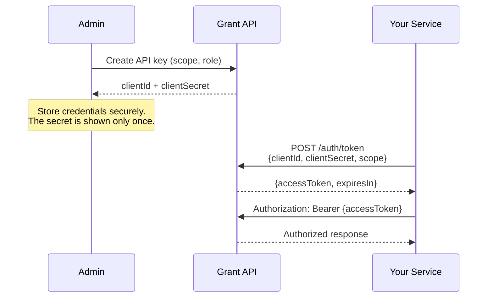

# API Keys

API keys let external services authenticate with Grant using client credentials. Each key is a `clientId` + `clientSecret` pair that can be exchanged for a short-lived JWT access token.

## Lifecycle



## Scoping

Every API key is created within a specific scope. The scope determines which project and tenant context the key operates in:

| Scope                   | Format of `scope.id`       | Use case                                           |
| ----------------------- | -------------------------- | -------------------------------------------------- |
| **ProjectUser**         | `projectId:userId`         | Key acts as a specific user within a project       |
| **AccountProject**      | `accountId:projectId`      | Key acts on behalf of a personal account's project |
| **OrganizationProject** | `organizationId:projectId` | Key acts on behalf of an organization's project    |

For `AccountProject` and `OrganizationProject` scopes, the key is also associated with a **role** that determines its permissions. If no role is specified at creation, the creating user's current role is used.

## Token Exchange

The primary integration point is the token exchange endpoint:

```bash
POST /auth/token
Content-Type: application/json

{
  "clientId": "xxxxxxxx-xxxx-xxxx-xxxx-xxxxxxxxxxxx",
  "clientSecret": "base64url-encoded-secret",
  "scope": {
    "tenant": "OrganizationProject",
    "id": "org-id:project-id"
  }
}
```

**Response:**

```json
{
  "accessToken": "eyJhbGciOiJSUzI1NiIsInR5cCI6IkpXVCIsImtpZCI6Ii4uLiJ9...",
  "expiresIn": 900
}
```

The returned token is a standard RS256 JWT signed with the project's JWKS signing key. It includes:

| Claim   | Value                                 |
| ------- | ------------------------------------- |
| `sub`   | User ID associated with the key       |
| `iss`   | JWKS issuer URL for the project scope |
| `aud`   | Grant instance URL                    |
| `jti`   | API key ID                            |
| `type`  | `ApiKey`                              |
| `scope` | The requested scope object            |
| `exp`   | Expiration timestamp                  |

External services can verify these tokens using the JWKS endpoint published at the issuer URL. See [Security > JWKS and Signing Keys](/architecture/security#jwks-and-signing-keys) for endpoint patterns.

**Project OAuth:** For user-in-the-loop flows (e.g. tenant SPAs), project apps can use **Project OAuth** instead of API keys: users sign in with a provider (GitHub, email magic link) and receive a project-scoped JWT. Tokens from that flow may have `type: projectApp` and a `scopes` claim when the app restricts permissions; see [Security > Project OAuth](/architecture/security#project-oauth-multi-provider).

## REST Endpoints

| Method   | Path                   | Permission      | Description                       |
| -------- | ---------------------- | --------------- | --------------------------------- |
| `GET`    | `/api-keys`            | `ApiKey:Query`  | List keys (paginated, searchable) |
| `POST`   | `/api-keys`            | `ApiKey:Create` | Create a new key                  |
| `POST`   | `/api-keys/:id/revoke` | `ApiKey:Revoke` | Revoke an active key              |
| `DELETE` | `/api-keys/:id`        | `ApiKey:Delete` | Soft- or hard-delete a key        |
| `POST`   | `/auth/token`          | —               | Exchange credentials for a JWT    |

The exchange endpoint (`/auth/token`) is not permission-guarded — it authenticates via the client credentials themselves.

## Security

- **Secret shown once** — the `clientSecret` is returned only at creation time. It is hashed with bcrypt before storage and cannot be retrieved again.
- **Revocation** — revoked keys are immediately rejected on exchange. Revocation records who revoked the key and when.
- **Expiration** — keys can have an optional `expiresAt` date. Expired keys are rejected on exchange.
- **Audit logging** — all key operations (create, revoke, delete, exchange) are recorded in the audit log with scope metadata.

---

**Related:**

- [Security > JWKS and Signing Keys](/architecture/security#jwks-and-signing-keys) — Token verification and key rotation
- [Resources](/core-concepts/resources) — API key resource actions
- [RBAC System](/architecture/rbac) — Role-based permission evaluation
