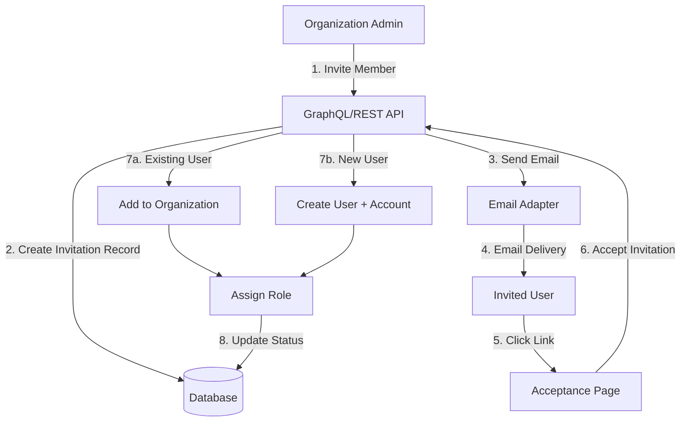
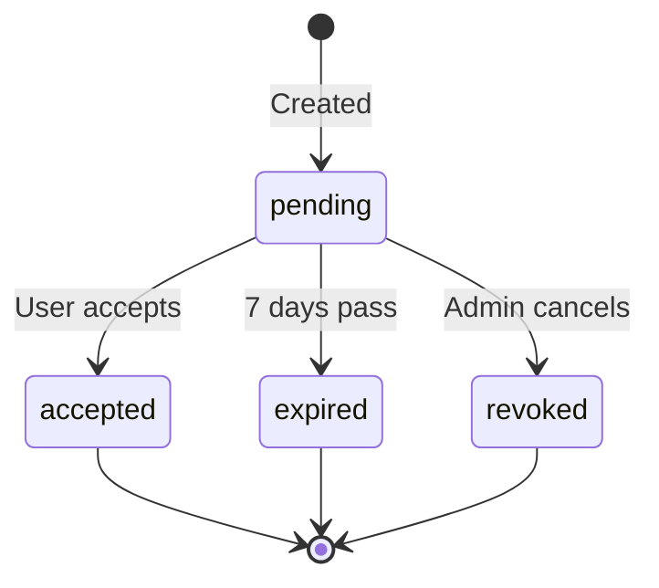

# Organization Members & Invitations

Grant Platform provides a robust email-based invitation system for adding members to organizations. This document explains how the invitation flow works, the role of organization roles, and best practices for member management.

## Overview

When building multi-tenant applications, securely onboarding users to organizations is critical. Grant's invitation system provides:

- **Email-based invitations** with secure, expiring tokens
- **Role pre-assignment** during invitation
- **Flexible acceptance flow** supporting both new and existing users
- **Audit logging** for compliance and security
- **Automatic role seeding** for new organizations

## Why Email Invitations?

Direct user creation in organization contexts has several drawbacks:

1. **Security Risk**: Creating users without their consent
2. **Authentication Gap**: No mechanism to verify email ownership
3. **Poor UX**: Users don't receive notifications or onboarding instructions
4. **Compliance Issues**: Violates data protection regulations

Email invitations solve these problems by:

- Requiring users to **actively accept** membership
- **Verifying email ownership** before granting access
- Providing a **clear onboarding path** with context
- Creating an **audit trail** for compliance

## Architecture



## Invitation Flow

### Step 1: Invitation Creation

An organization admin invites a new member:

```graphql
mutation InviteMember($input: InviteMemberInput!) {
  inviteMember(input: $input) {
    id
    email
    status
    role {
      name
    }
    expiresAt
  }
}
```

**Input:**

```json
{
  "organizationId": "org-123",
  "email": "developer@example.com",
  "roleId": "role-dev"
}
```

**What Happens:**

1. **Validation Checks**:
   - Role exists in organization
   - User is not already a member
   - No pending invitation exists for this email

2. **Invitation Record Created**:
   - Unique, secure token generated (32 bytes)
   - Expiration set to 7 days
   - Status: `pending`
   - Inviter tracked for audit

3. **Email Sent** (async):
   - Personalized with organization name and inviter
   - Includes invitation URL with token
   - Explains role being offered

### Step 2: Email Delivery

The invited user receives an email:

```
Subject: You've been invited to join Acme Corp

Hi there,

John Doe has invited you to join Acme Corp as a Developer.

[Accept Invitation]

This invitation expires in 7 days.
```

### Step 3: Invitation Acceptance

User clicks the link and lands on the acceptance page:

```
/invitations/{token}
```

**Frontend Flow:**

1. **Fetch Invitation Details**:

   ```graphql
   query GetInvitation($token: String!) {
     invitation(token: $token) {
       id
       email
       organization {
         name
       }
       role {
         name
         description
       }
       expiresAt
       status
     }
   }
   ```

2. **Check User Status**:
   - **Existing User**: Show "Accept" button
   - **New User**: Show registration form + "Accept"

3. **Accept Invitation**:
   ```graphql
   mutation AcceptInvitation($input: AcceptInvitationInput!) {
     acceptInvitation(input: $input) {
       requiresRegistration
       isNewUser
       user {
         id
         name
       }
       account {
         id
         name
       }
     }
   }
   ```

**Backend Logic:**

```typescript
// Pseudocode
async acceptInvitation(token, userData?) {
  // 1. Validate invitation
  const invitation = await getInvitationByToken(token);
  if (invitation.status !== 'pending' || isExpired(invitation)) {
    throw new Error('Invalid or expired invitation');
  }

  // 2. Check if user exists
  let user = await getUserByEmail(invitation.email);

  // 3. If new user, create resources
  if (!user) {
    if (!userData) {
      return { requiresRegistration: true };
    }
    user = await createUser(userData);
    await createAuthMethod(user.id, invitation.email, userData.password);
    await createAccount(user.id, userData.name);
  }

  // 4. Add to organization
  await addOrganizationUser(invitation.organizationId, user.id);

  // 5. Assign role
  await addUserRole(user.id, invitation.roleId);

  // 6. Update invitation status
  await updateInvitation(invitation.id, {
    status: 'accepted',
    acceptedAt: new Date(),
  });

  return { user, isNewUser: !user };
}
```

## Organization Roles

### Role Seeding

When a new organization is created, **four standard roles** are automatically seeded:

| Role     | Description                                          | Typical Use Case                  |
| -------- | ---------------------------------------------------- | --------------------------------- |
| `owner`  | Full control over organization and all resources     | Organization creator              |
| `admin`  | Administrative access to manage settings and members | Senior management, IT admins      |
| `dev`    | Developer access to manage projects and resources    | Development team, contributors    |
| `viewer` | Read-only access to organization resources           | Stakeholders, auditors, read-only |

**Why Seed Roles?**

1. **Consistency**: Every organization starts with the same foundational roles
2. **Predictability**: Developers can rely on these roles existing
3. **Best Practices**: Encourages proper RBAC from day one
4. **Extensibility**: Organizations can add custom roles later

**Automatic Owner Assignment:**

The user who creates an organization is automatically assigned the `owner` role:

```typescript
async createOrganization(name: string, userId: string) {
  return await transaction(async (tx) => {
    // 1. Create organization
    const org = await createOrganization({ name }, tx);

    // 2. Seed standard roles
    const roles = await seedOrganizationRoles(org.id, tx);

    // 3. Add creator to organization
    await addOrganizationUser(org.id, userId, tx);

    // 4. Assign owner role
    const ownerRole = roles.find(r => r.role.name === 'owner');
    await addUserRole(userId, ownerRole.role.id, tx);

    return org;
  });
}
```

### Role Uniqueness Per Organization

**Critical Design Decision**: Roles are **unique per organization**, not globally shared.

**Why?**

- A user may belong to **multiple organizations**
- Each organization defines its own role structure
- Role names may conflict across organizations (e.g., "Developer" means different things in different orgs)
- Permissions are scoped to organizations

**Example:**

```
User: alice@example.com

Organization A:
  - Role: "admin" (can manage members)

Organization B:
  - Role: "viewer" (read-only)

Organization C:
  - Role: "owner" (full control)
```

Alice has different roles in each organization, and the permissions are isolated.

## Invitation States

Invitations progress through several states:



### State Descriptions

| State      | Description                                  | Can Transition To          |
| ---------- | -------------------------------------------- | -------------------------- |
| `pending`  | Invitation sent, awaiting user action        | accepted, expired, revoked |
| `accepted` | User has accepted and joined organization    | (terminal)                 |
| `expired`  | Invitation expired after 7 days              | (terminal)                 |
| `revoked`  | Admin cancelled invitation before acceptance | (terminal)                 |

## Database Schema

```typescript
organizationInvitations {
  id: UUID (PK)
  organizationId: UUID (FK → organizations.id)
  email: VARCHAR(255)
  roleId: UUID (FK → roles.id)
  token: VARCHAR(255) UNIQUE
  status: VARCHAR(50) DEFAULT 'pending'
  expiresAt: TIMESTAMP
  invitedBy: UUID (FK → users.id)
  acceptedAt: TIMESTAMP?
  createdAt: TIMESTAMP
  updatedAt: TIMESTAMP
  deletedAt: TIMESTAMP?
}

// Indexes
- UNIQUE: (email, organizationId) WHERE deletedAt IS NULL
- UNIQUE: token WHERE deletedAt IS NULL
- INDEX: organizationId, email, status, deletedAt
```

**Key Constraints:**

- **Unique Token**: Each invitation has a unique, secure token
- **Unique Email per Organization**: No duplicate pending invitations
- **Soft Deletes**: Deleted invitations retained for audit
- **Foreign Keys**: Cascade deletes for organization cleanup

## Security Considerations

### Token Generation

```typescript
import crypto from 'crypto';

const token = crypto.randomBytes(32).toString('hex');
// Result: 64 character hex string (256 bits of entropy)
```

**Properties:**

- **Unpredictable**: Cryptographically secure randomness
- **Unique**: Collision probability ~0
- **Non-Guessable**: Cannot be brute-forced
- **Single-Use**: Consumed upon acceptance

### Expiration

Invitations expire after **7 days** to minimize security risk:

```typescript
const expiresAt = new Date(Date.now() + 7 * 24 * 60 * 60 * 1000);
```

**Rationale:**

- Long enough for users to respond
- Short enough to limit exposure if token leaked
- Configurable in future if needed

### Email Verification

By accepting an invitation via email:

1. User proves they **control the email address**
2. Organization can trust the user **owns that identity**
3. Authentication method is **verified** upon creation

## Audit Logging

All invitation actions are logged for compliance:

```typescript
organizationInvitationAuditLogs {
  id: UUID
  organizationInvitationId: UUID
  action: VARCHAR(50) // 'create', 'accept', 'revoke', 'expire'
  oldValues: JSON
  newValues: JSON
  metadata: JSON
  performedBy: UUID
  createdAt: TIMESTAMP
}
```

**Logged Actions:**

- **Create**: Who invited, when, what role
- **Accept**: Who accepted, when, new/existing user
- **Revoke**: Who revoked, when, reason (if provided)
- **Expire**: Automatic expiration timestamp

## API Endpoints

### GraphQL Mutations

```graphql
# Invite a member
mutation InviteMember($input: InviteMemberInput!) {
  inviteMember(input: $input) {
    id
    email
    status
    role {
      name
    }
    expiresAt
  }
}

# Accept an invitation
mutation AcceptInvitation($input: AcceptInvitationInput!) {
  acceptInvitation(input: $input) {
    requiresRegistration
    isNewUser
    user {
      id
      name
    }
    account {
      id
      name
      slug
    }
  }
}

# Revoke an invitation
mutation RevokeInvitation($id: ID!) {
  revokeInvitation(id: $id) {
    id
    status
  }
}
```

### GraphQL Queries

```graphql
# Get invitation by token (public, for acceptance page)
query GetInvitation($token: String!) {
  invitation(token: $token) {
    id
    email
    organization {
      name
    }
    role {
      name
      description
    }
    expiresAt
    status
  }
}

# List organization invitations (admin only)
query GetOrganizationInvitations($organizationId: ID!, $status: OrganizationInvitationStatus) {
  organizationInvitations(organizationId: $organizationId, status: $status) {
    invitations {
      id
      email
      role {
        name
      }
      status
      inviter {
        name
      }
      createdAt
    }
    totalCount
  }
}
```

### REST API

```bash
# Invite member
POST /api/organizations/:organizationId/invitations
Body: { "email": "user@example.com", "roleId": "role-123" }

# Accept invitation
POST /api/invitations/:token/accept
Body: { "userData": { "name": "...", "password": "..." } }

# List invitations
GET /api/organizations/:organizationId/invitations?status=pending

# Revoke invitation
DELETE /api/invitations/:id
```

## Frontend Integration

### Members Management Component

```tsx
import { useMembers, useMemberMutations } from '@/hooks/members';

function MembersPage({ organizationId }) {
  const { members, loading } = useMembers(organizationId);
  const { inviteMember, revokeInvitation } = useMemberMutations();

  // members = [{
  //   id, name, email, status ('active' | 'pending'), roleName, createdAt
  // }]

  return (
    <div>
      {members.map((member) => (
        <MemberRow
          key={member.id}
          member={member}
          onRevoke={member.status === 'pending' ? revokeInvitation : null}
        />
      ))}
    </div>
  );
}
```

### Invitation Dialog

```tsx
import { InviteMemberDialog } from '@/components/features/members';

function InviteButton({ organizationId }) {
  const [open, setOpen] = useState(false);

  return (
    <>
      <Button onClick={() => setOpen(true)}>Invite Member</Button>
      <InviteMemberDialog organizationId={organizationId} open={open} onOpenChange={setOpen} />
    </>
  );
}
```

## Best Practices

### 1. Role Selection

- **Principle of Least Privilege**: Start with `viewer` role by default
- **Explain Roles**: Show role descriptions in the invite dialog
- **Single Role**: Assign one primary role per invitation (can be changed later)

### 2. Invitation Management

- **Monitor Pending**: Regularly review pending invitations
- **Resend Capability**: Allow admins to resend expired invitations
- **Bulk Actions**: Support bulk revocation for cleanup

### 3. User Experience

- **Clear Communication**: Email should explain what accepting means
- **Responsive Design**: Acceptance page works on mobile
- **Progress Indicators**: Show loading states during acceptance

### 4. Security

- **HTTPS Only**: Invitation links must use HTTPS in production
- **Rate Limiting**: Prevent abuse of invitation sending
- **Permission Checks**: Verify admin has permission to invite

### 5. Compliance

- **Data Retention**: Keep audit logs per regulatory requirements
- **GDPR Compliance**: Allow users to decline invitations
- **Consent Tracking**: Log acceptance timestamps

## Common Scenarios

### Scenario 1: Inviting an Existing User

```typescript
// User jane@example.com already has a personal account
// Admin invites her to Organization A

1. Check: jane@example.com exists? Yes
2. Check: Already in Organization A? No
3. Check: Pending invitation? No
4. Create invitation with token
5. Send email to jane@example.com
6. Jane clicks link → sees "Accept" button
7. Jane accepts → added to org, assigned role
8. Jane can now switch between personal and org accounts
```

### Scenario 2: Inviting a New User

```typescript
// User bob@example.com has never used the platform

1. Check: bob@example.com exists? No
2. Create invitation with token
3. Send email to bob@example.com
4. Bob clicks link → sees registration form
5. Bob fills form (name, username, password) and accepts
6. System creates: user, auth method, account
7. System adds: org membership, role assignment
8. Bob is logged in and redirected to organization
```

### Scenario 3: Revoking an Invitation

```typescript
// Admin invited wrong email or person declined verbally

1. Admin views pending invitations
2. Admin clicks "Revoke" on invitation
3. System sets status to revoked
4. Invitation link no longer works
5. Audit log records who revoked and when
```

## Migration from Direct User Creation

If you previously created users directly:

**Before:**

```graphql
mutation CreateUser($input: CreateUserInput!) {
  createUser(input: $input) {
    id
    name
    email
  }
}
```

**After:**

```graphql
mutation InviteMember($input: InviteMemberInput!) {
  inviteMember(input: $input) {
    id
    email
    status
  }
}
```

**Migration Steps:**

1. Update frontend to use `InviteMemberDialog`
2. Replace `createUser` calls with `inviteMember`
3. Add invitation acceptance page at `/invitations/[token]`
4. Update member list to show both active and pending
5. Test invitation flow end-to-end

## Troubleshooting

### "User already part of the organization"

**Cause**: User is already a member
**Solution**: Check membership before inviting, or allow role changes

### "Invitation has expired"

**Cause**: More than 7 days have passed
**Solution**: Revoke old invitation and send a new one

### "Invalid or expired invitation"

**Cause**: Token is invalid, invitation was revoked, or status changed
**Solution**: Verify invitation status in database

### Email not received

**Cause**: Email delivery failure, spam folder, incorrect address
**Solution**: Check email adapter logs, verify SMTP/API credentials

## Performance Considerations

### Database Queries

- **Index Usage**: Ensure indexes on `(organizationId, status, deletedAt)`
- **Pagination**: For large organizations, paginate invitation lists
- **Soft Deletes**: Filter out deleted invitations in queries

### Email Sending

- **Async Processing**: Never block API response on email delivery
- **Retry Logic**: Implement retry for transient email failures
- **Queue System**: Consider job queue for high-volume invitations

### Caching

- **Invitation Lookup**: Cache invitation details by token (5-minute TTL)
- **Role Lists**: Cache organization roles for invite dialog
- **Invalidation**: Evict cache on invitation status change

## Related Documentation

- [Email Service & Adapters](/advanced-topics/email-service) - Technical implementation details
- [Multi-Tenancy](/architecture/multi-tenancy) - Understanding organization scoping
- [Audit Logging](/advanced-topics/audit-logging) - Compliance and tracking
- [Transaction Management](/advanced-topics/transactions) - Ensuring data consistency

---

**Next:** Learn about [Email Service & Adapters](/advanced-topics/email-service) for technical implementation details.
