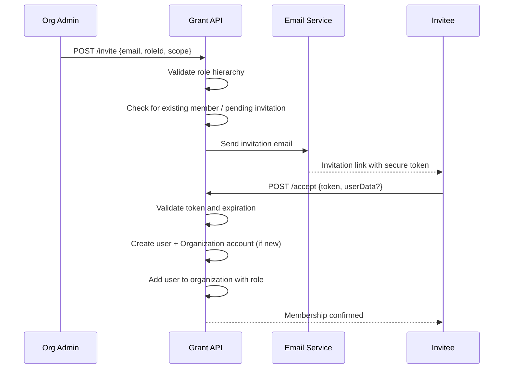

# Organization Members & Invitations

Organizations add members through an email invitation flow. The inviter selects a role, the invitee receives a link, and accepting the invitation creates their account and organization membership in one step.

## Invitation Lifecycle

## Key Behaviors

**Role hierarchy enforcement** — an inviter can only assign a role equal to or lower than their own. This prevents privilege escalation through invitations.

**Duplicate detection** — if the email already belongs to an organization member, or has a pending invitation, the request is rejected.

**Account creation on accept** — if the invitee is new to Grant, accepting the invitation creates their user record and an Organization-type account. Users can have at most two accounts: one Personal and one Organization.

**Token-based authorization** — the accept endpoint is not guarded by RBAC permissions since the invitee is not yet an organization member. Instead, the secure token itself serves as authorization.

## Invitation States

| Status     | Description                                  |
| ---------- | -------------------------------------------- |
| `pending`  | Invitation sent, waiting for acceptance      |
| `accepted` | Invitee accepted and joined the organization |
| `expired`  | Token expiration passed (default: 7 days)    |
| `revoked`  | Invitation revoked by an admin               |

Expired invitations can be renewed (generates a new token and expiration). Pending invitations can have their email resent.

## REST Endpoints

| Method   | Path                | Permission                           | Description                             |
| -------- | ------------------- | ------------------------------------ | --------------------------------------- |
| `POST`   | `/invite`           | `OrganizationInvitation:Create`      | Send an invitation email                |
| `POST`   | `/accept`           | _(token-based)_                      | Accept an invitation                    |
| `GET`    | `/:token`           | `OrganizationInvitation:Read`        | Look up invitation by token             |
| `GET`    | `/`                 | `OrganizationInvitation:Query`       | List invitations (filterable by status) |
| `POST`   | `/:id/resend-email` | `OrganizationInvitation:ResendEmail` | Resend the invitation email             |
| `POST`   | `/:id/renew`        | `OrganizationInvitation:Renew`       | Renew an expired invitation             |
| `DELETE` | `/:id`              | `OrganizationInvitation:Revoke`      | Revoke a pending invitation             |

All mutating endpoints (except accept) require the inviter's email to be verified.

## Permissions

Invitation management permissions are assigned to the `OrganizationOwner` and `OrganizationAdmin` roles by default:

| Group                          | Actions                                    |
| ------------------------------ | ------------------------------------------ |
| `OrganizationInvitationCommon` | `Query`                                    |
| `OrganizationInvitationOwner`  | `Create`, `Revoke`, `ResendEmail`, `Renew` |
| `OrganizationInvitationAdmin`  | `Create`, `Revoke`, `ResendEmail`, `Renew` |

## Member Management

Once a user has joined an organization, they appear in the organization members list. Members can be managed with the `OrganizationMember` resource:

| Action   | Permission                  | Description                                                |
| -------- | --------------------------- | ---------------------------------------------------------- |
| `Read`   | `OrganizationMember:Read`   | View member details                                        |
| `Update` | `OrganizationMember:Update` | Change a member's role                                     |
| `Remove` | `OrganizationMember:Remove` | Remove a member from the organization                      |
| `Query`  | `OrganizationMember:Query`  | List members (with optional status filter for invitations) |

---

**Related:**

- [RBAC System](/architecture/rbac) — Roles and permission evaluation
- [Resources](/core-concepts/resources) — OrganizationInvitation and OrganizationMember resource actions
- [Security](/architecture/security) — Email verification requirements
