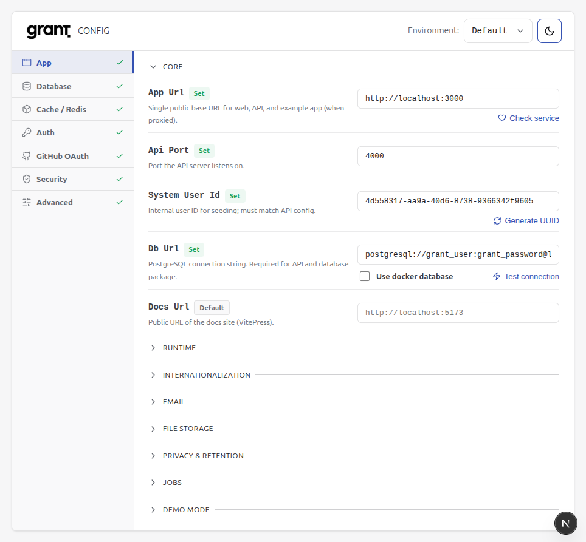
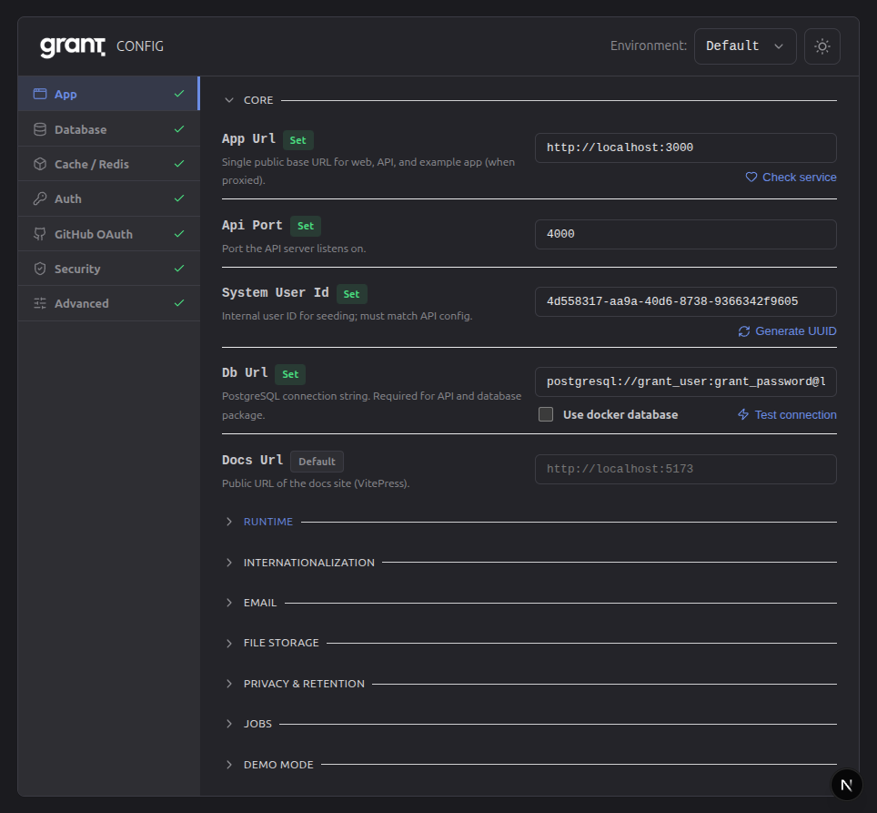

# Configuration

Grant is configured via environment variables. The **Config app** is the recommended way to view and edit them; it writes to a **single root env file** at a time (`.env`, `.env.demo`, or `.env.test`).

## Config app

If you already started development with `pnpm dev`, the Config app is already running at [http://localhost:3005](http://localhost:3005).

If you only want the Config app, start it from the repo root:

```bash
pnpm --filter grant-config dev
```

Then open [http://localhost:3005](http://localhost:3005).

- **Environment selector** (header): Choose **Default** (`.env`), **Demo** (`.env.demo`), or **Test** (`.env.test`). All vars and schema defaults are shown; unset vars show the default as placeholder.
- **Sidebar:** Categories (App, Database, Cache, Auth, GitHub OAuth, Security, Advanced) with Set/Default/Missing status. Hamburger menu on small screens.
- **Content:** Variables for the selected category in collapsible sections. Critical settings first; optional sections collapsed by default. Edit in place, generate passwords; optional **Use app URL** and **Use docker database** to derive `SECURITY_FRONTEND_URL` and `DB_URL` from `APP_URL` and Postgres vars.

<div class="config-app-screenshots">
  <figure class="config-app-fig config-app-light">
    
    <figcaption>Config app — light theme</figcaption>
  </figure>
  <figure class="config-app-fig config-app-dark">
    
    <figcaption>Config app — dark theme</figcaption>
  </figure>
</div>

::: tip
Root `.env` is created automatically when you run `pnpm dev` (predev script). To create or refresh without starting the app: `pnpm env:setup`. For deploy and E2E, use `.env.demo` and `.env.test` (copy from `.env.demo.example` / `.env.test.example`). You can also edit env files directly.
:::

## Env file precedence

The platform loads env files from the **monorepo root** in this order (later overrides earlier):

1. `.env`
2. `.env.local` (usually gitignored)
3. `.env.{NODE_ENV}` (e.g. `.env.development`, `.env.test`, `.env.production`)
4. `.env.{NODE_ENV}.local` (e.g. `.env.development.local`, usually gitignored)

Only `@grantjs/env` loads these files; no need for `dotenv-cli` in scripts. Apps and DB scripts use `getEnv()` from `@grantjs/env`. The Config app and deployment use **root** `.env`, `.env.demo`, and `.env.test` only; apps consume these via `@grantjs/env` (no per-app `.env` for platform config).

## Platform env rules

To avoid regressions, follow these rules:

1. **Only `@grantjs/env` loads `.env` files** — no `dotenv.config()` in apps or packages.
2. **Apps never call `dotenv` directly** — env is loaded when the env package is first imported.
3. **Apps never read `process.env` directly** — use typed config from `@/config` or `getEnv()` from `@grantjs/env`.
4. **All env access goes through `getEnv()`** (or the app’s derived config that uses it).

## What to set

| Priority     | Variable                | Purpose                            |
| ------------ | ----------------------- | ---------------------------------- |
| **Required** | `DB_URL`                | PostgreSQL connection string       |
| **Required** | `SECURITY_FRONTEND_URL` | Frontend URL for CORS (production) |
| Common       | `APP_URL`               | API base URL (JWT issuer)          |
| Common       | `CACHE_STRATEGY`        | `memory` or `redis`                |

Full list, descriptions, and defaults: Config app (all categories) or root **`.env.example`** (and `.env.demo.example` / `.env.test.example` for demo/E2E). Variables use prefixes (`DB_*`, `JWT_*`, `SECURITY_*`, etc.) for grouping.

### Authentication assurance (AAL)

| Variable                           | Default | Purpose                                                                                                                                                                                           |
| ---------------------------------- | ------- | ------------------------------------------------------------------------------------------------------------------------------------------------------------------------------------------------- |
| `AUTH_MIN_AAL_AT_LOGIN`            | `aal1`  | Minimum authentication assurance for **general** API access after login when the user has **MFA enrolled**. Use `aal2` to require MFA verification (step-up) before most routes.                  |
| `AUTH_MFA_STEP_UP_MAX_AGE_SECONDS` | `0`     | When `AUTH_MIN_AAL_AT_LOGIN` is `aal2`, session JWTs with AAL2 whose `mfa_auth_time` is older than this many seconds are treated as AAL1 for route policy (time-based MFA step-up). `0` disables. |

Session access tokens include `amr`, `acr`, and `auth_time` claims. Prefer `config.auth.minAalAtLogin` in code (derived from the above).

## Using config in code

The API reads env via a centralized, type-safe config:

```typescript
import { config } from '@/config';

config.app.port; // number
config.db.url; // string
config.cache.strategy; // 'memory' | 'redis'
```

Implementation: `apps/api/src/config/env.config.ts`. Validated on startup; invalid config throws before the server listens.

## Troubleshooting

| Issue                       | Check                                                                                         |
| --------------------------- | --------------------------------------------------------------------------------------------- |
| Env not loading             | `.env` at **repo root**, restart server                                                       |
| Validation error on startup | Message names the variable; fix in Config app or `.env`                                       |
| Redis unreachable           | `CACHE_STRATEGY=redis` → verify Redis running, `REDIS_HOST` / `REDIS_PORT` / `REDIS_PASSWORD` |
| CORS errors                 | Set `SECURITY_FRONTEND_URL` (and `SECURITY_ADDITIONAL_ORIGINS` if needed)                     |

## Related

- [Quick Start](/getting-started/quick-start) — Get running locally
- [Docker Deployment](/deployment/docker) — Infrastructure and env
- [Security](/architecture/security) — Auth, CORS, GitHub OAuth
- [Caching](/advanced-topics/caching) — Cache strategy and Redis

---

**Next:** [Integration Guide](/integration/guide) to protect your API with Grant.
