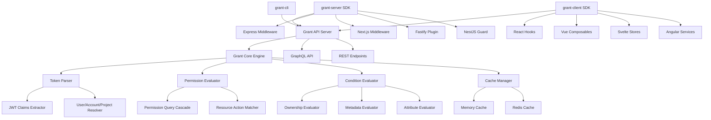

# Authorization Engine - Implementation Plan

> **Status**: Phase 1 ✅ Complete | Phase 2 ✅ In Progress (Express & Fastify complete) | Phase 3 ✅ Complete (grant-client) | Phase 4 ⏳ Pending (grant-cli)

## Overview

This document specifies the design and implementation of the **Authorization Engine** (also referred to as the **Grant Engine**) for the Grant. The authorization engine is the core system that evaluates user permissions based on JWT tokens and makes authorization decisions, enabling fine-grained access control across multi-tenant environments.

The authorization engine will be packaged as reusable SDKs for both server-side and client-side use, with a CLI tool for easy integration and authentication management.

**Note on Terminology**: While "ACL" (Access Control List) is sometimes used in the codebase, this system is more accurately described as an **Authorization Engine** because it:

- Makes dynamic authorization decisions (not just checking static lists)
- Evaluates conditions and cascades through role hierarchies
- Combines RBAC (Role-Based Access Control) with ABAC (Attribute-Based Access Control) elements
- Functions as a decision engine rather than a simple list lookup

## Problem Statement

The Grant currently has:

1. **JWT Token Generation**: Tokens are generated for platform users and API keys with claims (`sub`, `aud`, `iss`, `scope`, `jti`)
2. **Permission Evaluation**: Permissions are evaluated server-side in the API, but logic is tightly coupled to the API implementation
3. **No Reusable SDK**: External systems cannot easily integrate Grant's ACL without duplicating logic
4. **No Client-Side Support**: Frontend applications cannot conditionally render UI based on permissions
5. **No CLI Tool**: Developers must manually configure authentication and API keys

**Requirements:**

- **Server SDK**: Reusable authorization engine for Express, Next.js, Fastify, NestJS, Nuxt, etc.
- **Client SDK**: React, Next.js, Vue, Svelte, Angular hooks/components for conditional rendering
- **CLI Tool**: Authentication, account/project selection, API key management, easy integration
- **Token Parsing**: Secure JWT parsing and claims extraction
- **Permission Cascade**: Efficient querying of User → Role → Group → Permission → Resource → [Action, Condition]
- **Condition Evaluation**: Support for permission conditions (ownership, metadata match, attribute comparison)
- **Caching**: Efficient permission caching to minimize API calls
- **Type Safety**: Full TypeScript support with generated types

## Architecture Overview

### System Architecture

The authorization system follows a client-server architecture:

- **`grant-core`** (workspace-only): Internal engine used by grant-api for permission evaluation
- **`grant-api`** (workspace-only, deployed as service): API server that uses grant-core internally
- **`grant-server`** (published): Client SDK for server-side applications - makes HTTP requests to grant-api
- **`grant-client`** (published): Client SDK for browser applications - makes HTTP requests to grant-api
- **`grant-cli`** (published): CLI tool - makes HTTP requests to grant-api

### Core Components (grant-core - internal)



### Package Structure

The ACL engine will be split into multiple packages for separation of concerns:

#### Published Packages (npm/github)

1. **`@grantjs/schema`** - GraphQL schema and TypeScript types
   - GraphQL schema definitions
   - Generated TypeScript types (User, Role, Group, Permission, Resource, Scope, etc.)
   - GraphQL operations and resolvers
   - **Published**: Yes (npm, GitHub Packages)
   - **Note**: Also available as workspace package for local development

2. **`@grantjs/server`** - Server-side client SDK with framework integrations
   - Express middleware
   - Next.js middleware/API routes
   - Fastify plugin
   - NestJS guard
   - Nuxt module
   - **Published**: Yes (npm, GitHub Packages)
   - **Purpose**: Client SDK for server-side applications that call Grant API endpoints
   - **Architecture**: Exposes public interface that makes HTTP requests to grant-api

3. **`@grantjs/client`** - Browser client SDK for frontend frameworks
   - React hooks and components
   - Vue composables and components
   - Svelte stores and components
   - Angular services and directives
   - **Published**: Yes (npm, GitHub Packages)
   - **Purpose**: Client SDK for browser applications that call Grant API endpoints
   - **Architecture**: Exposes public interface that makes HTTP requests to grant-api

4. **`@grantjs/cli`** - CLI tool for authentication and setup
   - Authentication flow
   - Account/project selection
   - API key management
   - Project initialization
   - **Published**: Yes (npm, GitHub Packages)

#### Workspace-Only Packages

5. **`@grantjs/core`** - Core ACL engine (internal, server-side only)
   - Token parsing and validation
   - Permission evaluation logic
   - Condition evaluation engine
   - Cache management
   - **Published**: No (workspace-only)
   - **Purpose**: Internal engine used by grant-api to evaluate permissions
   - **Used by**: grant-api (workspace dependency)
   - **Dependencies**: Uses types from `@grantjs/schema`

6. **`@grantjs/api`** - Grant API server
   - GraphQL API server
   - REST API endpoints for authorization
   - Uses grant-core internally for permission evaluation
   - **Published**: No (workspace-only, deployed as service)
   - **Dependencies**: Uses grant-core internally

7. **`@grantjs/test-utils`** - Testing utilities
   - Mock ACL instances
   - Test fixtures
   - **Published**: No (workspace-only, but can be published for external testing)

### Package Dependencies

```
grant-schema (published)
  ├── @graphql-typed-document-node/core
  └── (generated types from GraphQL schema)

grant-core (workspace-only, used by grant-api)
  ├── @grantjs/schema (workspace) - Types: User, Role, Group, Permission, Resource, Scope, Tenant, etc.
  ├── zod
  └── jsonwebtoken

grant-api (workspace-only, deployed as service)
  ├── @grantjs/core (workspace) - Uses internally for permission evaluation
  ├── @grantjs/schema (workspace)
  └── (API server dependencies)

grant-server (published - client SDK for server-side apps)
  ├── @grantjs/schema (published) - For types only
  └── framework-specific dependencies (express, fastify, etc.)
  └── (Makes HTTP requests to grant-api endpoints)

grant-client (published - client SDK for browser apps)
  ├── @grantjs/schema (published) - For types only
  └── framework-specific dependencies (react, vue, etc.)
  └── (Makes HTTP requests to grant-api endpoints)

grant-cli (published)
  ├── @grantjs/schema (published) - For types only
  ├── commander
  ├── inquirer
  └── configstore
  └── (Makes HTTP requests to grant-api endpoints)

grant-test-utils (workspace-only, optionally published)
  ├── @grantjs/core (workspace)
  └── vitest
```

## Core Authorization Engine Components

### Complete Example: Policy Access Control Flow

To illustrate how all components work together, here's a complete example using the policy use case:

**Setup** (done in Grant UI/API):

1. **Create Resource**:

   ```json
   {
     "name": "Policy",
     "slug": "policy",
     "description": "Insurance contract",
     "actions": ["list", "read", "create", "update", "delete"],
     "isActive": true
   }
   ```

2. **Create Permission**:

   ```json
   {
     "name": "Get Policy Details",
     "description": "Retrieve an insurance contract details",
     "action": "read",
     "resourceId": "<resource-id>",
     "condition": {
       "in": {
         "resource.id": "{{user.metadata.policies}}"
       }
     }
   }
   ```

3. **Create User with Metadata**:
   ```json
   {
     "id": "user-123",
     "metadata": {
       "partnerId": "PARTNER-123",
       "policies": ["POLICY-456", "POLICY-789"]
     }
   }
   ```

**Request Flow** (in external system):

```
GET /api/v1/policies/POLICY-789
Authorization: Bearer <token>
```

**Authorization Middleware Execution**:

```typescript
// 1. Extract resource ID from URL
const policyId = req.params.policyId; // "POLICY-789"

// 2. Create resource resolver
const resourceResolver = async (id, slug) => {
  const policy = await db.policies.findOne({ where: { id } });
  return {
    id: policy.id,
    partnerId: policy.partnerId,
    status: policy.status,
  };
};

// 3. Build context
const context = {
  user: {
    id: 'user-123',
    metadata: { partnerId: 'PARTNER-123', policies: ['POLICY-456', 'POLICY-789'] },
  },
  resource: {
    id: 'POLICY-789',
    slug: 'policy',
  },
  resourceResolver,
};

// 4. Authorization engine:
//    a. Parses token → extracts userId, scope
//    b. Queries permissions → finds "Get Policy Details" permission
//    c. Resolves resource → fetches POLICY-789 data
//    d. Evaluates condition:
//       - Condition: { "in": { "resource.id": "{{user.metadata.policies}}" } }
//       - Field: resource.id = "POLICY-789"
//       - Operator: "in"
//       - Comparison value: user.metadata.policies = ["POLICY-456", "POLICY-789"]
//       - Result: "POLICY-789" in ["POLICY-456", "POLICY-789"] = true ✅
//    e. Returns: authorized = true

// 5. Request proceeds to handler
```

**If POLICY-999 was requested**:

```
// Condition evaluation:
// - resource.id = "POLICY-999"
// - user.metadata.policies = ["POLICY-456", "POLICY-789"]
// - "POLICY-999" in ["POLICY-456", "POLICY-789"] = false ❌
// Result: authorized = false, returns 403 Forbidden
```

## Core Authorization Engine Components

### 1. Token Parser

**Purpose**: Securely parse JWT tokens and extract claims

**Responsibilities**:

- Validate JWT signature
- Extract and validate claims (`sub`, `aud`, `iss`, `scope`, `jti`, `exp`, `iat`)
- Handle token expiration
- Support both platform user tokens and API key tokens
- **Determine token type**: If `scope` is present, it's an API key token (and `jti` is the API Key ID); if `scope` is not present, it's a user session token (and `jti` is the session ID)
- Extract user ID, account ID, organization ID, project ID from claims

**Interface**:

```typescript
import { Scope, Tenant } from '@grantjs/schema';

interface TokenParser {
  parse(token: string, secret: string): TokenClaims;
  validate(claims: TokenClaims): boolean;
  extractUser(claims: TokenClaims): UserIdentity;
  extractScope(claims: TokenClaims): Scope;
}

interface TokenClaims {
  sub: string; // User ID
  aud: string; // API URL (RFC 7519)
  iss: string; // Issuer URL
  exp: number; // Expiration timestamp
  iat: number; // Issued at timestamp
  jti?: string; // JWT ID (API key ID if scope is present, session ID if scope is not present)
  scope?: string; // Tenant scope (e.g., "project:project-id")
  // Token type is determined by presence of scope:
  // - If scope is present: API key token (jti = API Key ID)
  // - If scope is not present: User session token (jti = session ID)
}

interface UserIdentity {
  userId: string;
  accountId?: string;
  organizationId?: string;
  projectId?: string;
}

// Scope type from @grantjs/schema:
// type Scope = {
//   tenant: Tenant; // 'account' | 'organization' | 'projectUser' | 'accountProject' | 'organizationProject'
//   id: string;
// }
```

**Token Type Determination**:

The token type is determined by the presence of the `scope` claim:

- **API Key Token**: If `scope` is present in the token
  - `jti` contains the API Key ID
  - Used by external systems for authorization on their own endpoints
  - Scope is embedded in the token and determines the permission context
  - The authorization engine uses this scope to query permissions for the specified tenant (account/organization/project)

- **User Session Token**: If `scope` is not present in the token
  - `jti` contains the session ID
  - Used for Grant API operations
  - Scope is passed dynamically on each API call (not embedded in token)
  - Allows users to switch between accounts/organizations/projects per request

**Implementation**:

```typescript
// packages/@grantjs/core/src/core/token-parser.ts
import jwt from 'jsonwebtoken';
import { TokenClaims, UserIdentity, Scope } from '../types';

export class TokenParser {
  parse(token: string, secret: string): TokenClaims {
    const decoded = jwt.verify(token, secret) as jwt.JwtPayload;

    return {
      sub: decoded.sub as string,
      aud: decoded.aud as string,
      iss: decoded.iss as string,
      exp: decoded.exp as number,
      iat: decoded.iat as number,
      jti: decoded.jti as string | undefined,
      scope: decoded.scope as string | undefined,
      // Token type is determined by presence of scope (see TokenClaims interface)
    };
  }

  validate(claims: TokenClaims): boolean {
    // Check expiration
    if (claims.exp && Date.now() >= claims.exp * 1000) {
      return false;
    }

    // Validate required claims
    if (!claims.sub || !claims.aud || !claims.iss) {
      return false;
    }

    return true;
  }

  extractUser(claims: TokenClaims): UserIdentity {
    return {
      userId: claims.sub,
      // Extract account/organization/project from scope if present
      ...this.parseScope(claims.scope),
    };
  }

  extractScope(claims: TokenClaims): Scope {
    if (claims.scope) {
      return this.parseScopeString(claims.scope);
    }

    // Fallback: infer from context or return default
    return { tenant: 'account', id: '' };
  }

  private parseScope(scope?: string): Partial<UserIdentity> {
    if (!scope) return {};

    const parsed = this.parseScopeString(scope);
    return {
      projectId: parsed.tenant === 'project' ? parsed.id : undefined,
      organizationId: parsed.tenant === 'organization' ? parsed.id : undefined,
      accountId: parsed.tenant === 'account' ? parsed.id : undefined,
    };
  }

  private parseScopeString(scope: string): Scope {
    // Parse "project:project-id" format
    const [tenant, id] = scope.split(':');
    return {
      tenant: tenant as Scope['tenant'],
      id: id || '',
    };
  }
}
```

### 2. Permission Query Cascade

**Purpose**: Efficiently query user permissions following the cascade: User → Role → Group → Permission → Resource → [Action, Condition]

**Schema Relationships** (from `@grantjs/schema`):

- **User** has `roles: [Role!]` - All roles assigned to the user in the given scope
- **Role** has `groups: [Group!]` - All groups assigned to the role
- **Group** has `permissions: [Permission!]` - All permissions assigned to the group
- **Permission** has:
  - `resource: Resource` - Embedded resource entity (includes `resource.slug`, `resource.actions`)
  - `condition: JSON` - Condition expression for the permission
  - `action: String!` - Action string (e.g., "create", "read", "update")

**Responsibilities**:

- Query user roles in scope (account/organization/project) via `user.roles`
- Query groups assigned to roles via `role.groups`
- Query permissions assigned to groups via `group.permissions`
- Access embedded resource from `permission.resource` (includes `resource.slug` and `resource.actions`)
- Cache results for performance
- Support resource-based permissions (via `permission.resource.slug`)

**Interface**:

```typescript
import { User, Role, Group, Permission, Resource, Scope } from '@grantjs/schema';

interface PermissionQueryEngine {
  getUserPermissions(userId: string, scope: Scope, options?: QueryOptions): Promise<Permission[]>;

  hasPermission(
    userId: string,
    scope: Scope,
    resource: string | Resource,
    action: string
  ): Promise<boolean>;

  getRoles(userId: string, scope: Scope): Promise<Role[]>;

  getGroups(userId: string, scope: Scope): Promise<Group[]>;
}

// Permission type from @grantjs/schema:
// type Permission = {
//   id: string;
//   name: string;
//   action: string; // e.g., "create", "read", "update"
//   resourceId?: string; // Resource ID (if resource-based)
//   resource?: Resource; // Embedded resource entity (includes resource.slug, resource.actions)
//   condition?: JSON; // Condition expression (JSONB)
//   // ... other fields
// }

// Extended Permission type with context for condition evaluation
interface PermissionWithContext extends Permission {
  // Context for metadata loading (populated during permission query)
  roleId?: string; // Role that grants this permission (for role.metadata access)
  roleName?: string;
  groupId?: string; // Group that grants this permission (for group.metadata access)
  groupName?: string;
}

// Resource type from @grantjs/schema:
// type Resource = {
//   id: string;
//   name: string;
//   slug: string; // Used for matching permissions to resources
//   actions: [String!]! // Available actions for this resource
//   isActive: boolean;
//   // ... other fields
// }

interface QueryOptions {
  includeConditions?: boolean;
  includeResources?: boolean;
  cache?: boolean;
}
```

**Implementation Strategy**:

The implementation should leverage the schema relationships:

- Access `user.roles` to get all roles for a user in a given scope
- Access `role.groups` to get all groups for each role
- Access `group.permissions` to get all permissions for each group
- Access `permission.resource` to get the embedded resource (includes `resource.slug` and `resource.actions`)
- Access `permission.condition` for condition evaluation

1. **GraphQL Query Approach** (Recommended, using schema types):

   ```graphql
   query GetUserPermissions($userId: ID!, $scope: Scope!) {
     user(id: $userId) {
       roles(scope: $scope) {
         id
         name
         metadata
         groups {
           id
           name
           metadata
           permissions {
             id
             name
             action
             condition
             resource {
               id
               slug
               actions
             }
           }
         }
       }
     }
   }
   ```

2. **SQL Query Approach** (Alternative, if direct database access is needed):

   ```sql
   SELECT DISTINCT
     p.id,
     p.name,
     p.action,
     p.resource_id,
     p.condition,
     r.id as resource_id,
     r.name as resource_name,
     r.slug as resource_slug,
     role.id as role_id,
     role.name as role_name,
     role.metadata as role_metadata,
     g.id as group_id,
     g.name as group_name,
     g.metadata as group_metadata
   FROM user_roles ur
   JOIN roles role ON ur.role_id = role.id
   JOIN role_groups rg ON role.id = rg.role_id
   JOIN groups g ON rg.group_id = g.id
   JOIN group_permissions gp ON g.id = gp.group_id
   JOIN permissions p ON gp.permission_id = p.id
   LEFT JOIN resources r ON p.resource_id = r.id
   WHERE ur.user_id = $1
     AND ur.scope_tenant = $2
     AND ur.scope_id = $3
     AND p.deleted_at IS NULL
     AND r.deleted_at IS NULL
   ```

3. **Cached Cascade Approach** (For Performance):
   - Cache user roles by scope (from `user.roles`)
   - Cache role groups (from `role.groups`)
   - Cache group permissions (from `group.permissions`)
   - Cache embedded resources (from `permission.resource`)
   - Invalidate cache on role/group/permission changes

### 3. Condition Schema Validator

**Purpose**: Validate condition expressions using zod schema to ensure they conform to the ConditionExpression format

**Responsibilities**:

- Define zod schema for `ConditionExpression` type
- Validate comparison operators (equals, string-equals, in, not-in, etc.)
- Validate logical operators (and, or, not)
- Validate field paths (e.g., `user.metadata.policies`, `resource.id`)
- Validate field values (string, number, boolean, array, field references)
- Validate field references (both template syntax `{{user.id}}` and explicit `{ $ref: "user.id" }`)
- Export schema for use by grant-api to validate `permission.condition` field

**Interface**:

```typescript
// packages/@grantjs/core/src/core/condition-schema.ts
import { z } from 'zod';

// Comparison operators
const comparisonOperatorSchema = z.enum([
  'equals',
  'string-equals',
  'not-equals',
  'string-not-equals',
  'in',
  'string-in',
  'not-in',
  'string-not-in',
  'contains',
  'starts-with',
  'ends-with',
  'numeric-equals',
  'numeric-greater-than',
  'numeric-less-than',
  'numeric-greater-than-equals',
  'numeric-less-than-equals',
]);

// Field value: string, number, boolean, array, or field reference
const fieldValueSchema: z.ZodType<FieldValue> = z.union([
  z.string(), // Static string or template reference "{{user.id}}"
  z.number(), // Static number
  z.boolean(), // Static boolean
  z.array(z.union([z.string(), z.number(), z.boolean()])), // Static array or array with field references
  z.object({ $ref: z.string() }), // Explicit field reference { $ref: "user.metadata.policies" }
]);

// Comparison condition: { operator: { fieldPath: value } }
const comparisonConditionSchema = z.record(
  comparisonOperatorSchema,
  z.record(z.string(), fieldValueSchema) // fieldPath -> value
);

// Logical condition: { and: [...] } | { or: [...] } | { not: ... }
const logicalConditionSchema = z.union([
  z.object({ and: z.array(z.lazy(() => conditionExpressionSchema)) }),
  z.object({ or: z.array(z.lazy(() => conditionExpressionSchema)) }),
  z.object({ not: z.lazy(() => conditionExpressionSchema) }),
]);

// Condition expression: comparison or logical
const conditionExpressionSchema: z.ZodType<ConditionExpression> = z.union([
  comparisonConditionSchema,
  logicalConditionSchema,
]);

// Export the schema for use by grant-api
export const permissionConditionSchema = conditionExpressionSchema.nullable().optional();
```

**Usage in grant-api**:

```typescript
// packages/@grantjs/api/src/services/permissions.schemas.ts
import { permissionConditionSchema } from '@grantjs/core';

export const createPermissionParamsSchema = z.object({
  name: nonEmptyNameSchema,
  description: descriptionSchema,
  action: nonEmptyActionSchema,
  resourceId: idSchema.nullable().optional(),
  condition: permissionConditionSchema, // Validated against condition expression format
});
```

### 4. Condition Evaluator

**Purpose**: Evaluate permission conditions using execution context with support for async resource resolution and metadata references

**Responsibilities**:

- Parse condition expressions (validated by condition schema)
- Evaluate ownership conditions
- Evaluate metadata match conditions
- Evaluate attribute comparison conditions
- Support logical operators (AND, OR, NOT)
- Resolve template values (e.g., `{{user.id}}`)
- **Support async resource resolution** (fetch resource data from external systems)
- **Reference user, role, and group metadata** in conditions
- **Extract resource IDs from request context** (URL params, body, query)

**Key Use Case Example**:

External system has endpoint `GET /api/v1/policies/:policyId`. The authorization middleware needs to:

1. Extract `policyId` from URL params (`:policyId = "POLICY-789"`)
2. Resolve the policy resource asynchronously (fetch from external system database)
3. Evaluate condition using:
   - User metadata (e.g., `user.metadata.policies = ["POLICY-456"]`)
   - Role metadata (e.g., `role.metadata.partnerId = "PARTNER-123"`)
   - Group metadata (e.g., `group.metadata.region = "us-east"`)
   - Resolved resource data (e.g., `resource.id = "POLICY-789"`, `resource.partnerId = "PARTNER-123"`)

**Example Condition**:

```json
{
  "in": {
    "resource.id": "{{user.metadata.policies}}"
  }
}
```

This condition allows users to only access policies listed in their `user.metadata.policies` array. The format follows AWS IAM policy conditions: operator as key (`in`), field path as nested key (`resource.id`), and comparison value as nested value (`{{user.metadata.policies}}`).

**Interface**:

```typescript
interface ConditionEvaluator {
  evaluate(condition: ConditionExpression, context: ExecutionContext): Promise<boolean>; // Async to support resource resolution
}

/**
 * Condition Expression Format (AWS IAM-Inspired)
 *
 * Structure: { Operator: { FieldPath: Value } }
 *
 * Examples:
 * - { "in": { "resource.id": "{{user.metadata.policies}}" } }
 * - { "string-equals": { "user.metadata.partnerId": "{{resource.partnerId}}" } }
 * - { "or": [ { "in": {...} }, { "string-equals": {...} } ] }
 */
type ConditionExpression =
  | ComparisonCondition // Operator with field comparison
  | LogicalCondition; // AND, OR, NOT

/**
 * Comparison Condition: Operator as key, field path as nested key, value as nested value
 */
type ComparisonCondition = {
  [Operator in ComparisonOperator]: {
    [fieldPath: string]: FieldValue; // Field path -> comparison value
  };
};

/**
 * Logical Condition: Combine multiple conditions
 */
type LogicalCondition =
  | { and: ConditionExpression[] }
  | { or: ConditionExpression[] }
  | { not: ConditionExpression };

/**
 * Comparison Operators (kebab-case)
 */
type ComparisonOperator =
  | 'equals'
  | 'string-equals'
  | 'not-equals'
  | 'string-not-equals'
  | 'in'
  | 'string-in'
  | 'not-in'
  | 'string-not-in'
  | 'contains'
  | 'starts-with'
  | 'ends-with'
  | 'numeric-equals'
  | 'numeric-greater-than'
  | 'numeric-less-than'
  | 'numeric-greater-than-equals'
  | 'numeric-less-than-equals';

/**
 * Field Value: Can be static value or field reference
 */
type FieldValue =
  | string // Static string or field reference "{{user.id}}"
  | number // Static number
  | boolean // Static boolean
  | string[] // Static array or array with field references
  | FieldReference; // Explicit field reference object

/**
 * Field Reference: Explicit reference to another field
 */
interface FieldReference {
  $ref: string; // Field path (e.g., "user.metadata.policies")
}

interface ExecutionContext {
  // User type from @grantjs/schema (subset of fields used in conditions)
  user: {
    id: string;
    metadata?: Record<string, any>; // User.metadata from schema (e.g., { "partnerId": "PARTNER-123", "policies": ["POLICY-456"] })
  };
  // Role type from @grantjs/schema (subset of fields used in conditions)
  role?: {
    id: string;
    name: string;
    metadata?: Record<string, any>; // Role.metadata from schema
  };
  // Group type from @grantjs/schema (subset of fields used in conditions)
  group?: {
    id: string;
    name: string;
    metadata?: Record<string, any>; // Group.metadata from schema
  };
  resource?: {
    id: string; // Resource instance ID (e.g., "POLICY-789" from URL params)
    slug?: string; // Resource slug from permission.resource.slug (for matching)
    [key: string]: any; // Resource data from external system (resolved asynchronously)
  };
  resourceResolver?: ResourceResolver; // Async function to resolve resource data
  scope: Scope; // Scope type from @grantjs/schema
}

interface ResourceResolver {
  (resourceId: string, resourceSlug: string): Promise<Record<string, any>>;
}
```

**Field Path Syntax**:

The condition evaluator supports referencing:

- **User fields**: `user.id`, `user.metadata.partnerId`, `user.metadata.policies`
- **Role fields**: `role.id`, `role.name`, `role.metadata.partnerId`
- **Group fields**: `group.id`, `group.name`, `group.metadata.region`
- **Resource fields**: `resource.id`, `resource.partnerId`, `resource.status` (from resolved resource data)
- **Request context**: `request.params.policyId`, `request.body.orderId` (extracted by middleware)

**Supported Condition Format**:

The condition format follows AWS IAM policy structure: **operator as key**, **field path as nested key**, **comparison value as nested value**.

**Key Benefits**:

- ✅ More declarative and readable
- ✅ Familiar to developers who know AWS IAM
- ✅ Eliminates verbose `leftField`/`rightField` structure
- ✅ Operator is immediately visible
- ✅ Supports multiple field comparisons in one condition (implicit AND)

**Examples**:

1. **Array Membership**: Check if resource ID is in user's metadata array

   ```json
   {
     "in": {
       "resource.id": "{{user.metadata.policies}}"
     }
   }
   ```

2. **Field Comparison**: Check if user metadata matches resource attribute

   ```json
   {
     "string-equals": {
       "user.metadata.partnerId": "{{resource.partnerId}}"
     }
   }
   ```

3. **Ownership**: Check if resource belongs to user

   ```json
   {
     "string-equals": {
       "resource.createdBy": "{{user.id}}"
     }
   }
   ```

4. **Static Value Match**: Check if user metadata matches static value

   ```json
   {
     "in": {
       "user.metadata.region": ["us-east", "us-west"]
     }
   }
   ```

5. **Complex Conditions**: Combine multiple conditions with logical operators

   ```json
   {
     "or": [
       {
         "in": {
           "resource.id": "{{user.metadata.policies}}"
         }
       },
       {
         "string-equals": {
           "user.metadata.partnerId": "{{resource.partnerId}}"
         }
       }
     ]
   }
   ```

**Implementation**:

```typescript
// packages/@grantjs/core/src/core/condition-evaluator.ts
export class ConditionEvaluator {
  /**
   * Evaluate condition with async resource resolution support
   */
  async evaluate(condition: ConditionExpression, context: ExecutionContext): Promise<boolean> {
    // Resolve resource data if resource ID is present but resource data is not
    if (context.resource?.id && !context.resource?.resolved && context.resourceResolver) {
      const resourceSlug = this.extractResourceSlug(context);
      const resourceData = await context.resourceResolver(context.resource.id, resourceSlug);
      context.resource = {
        ...context.resource,
        ...resourceData,
        resolved: true,
      };
    }

    return this.evaluateCondition(condition, context);
  }

  private async evaluateCondition(
    condition: ConditionExpression,
    context: ExecutionContext
  ): Promise<boolean> {
    // Check for logical operators first
    if ('and' in condition) {
      const results = await Promise.all(
        condition.and.map((c) => this.evaluateCondition(c, context))
      );
      return results.every((result) => result);
    }

    if ('or' in condition) {
      const results = await Promise.all(
        condition.or.map((c) => this.evaluateCondition(c, context))
      );
      return results.some((result) => result);
    }

    if ('not' in condition) {
      const result = await this.evaluateCondition(condition.not, context);
      return !result;
    }

    // Handle comparison conditions
    // Condition format: { operator: { fieldPath: value } }
    const operator = Object.keys(condition)[0] as ComparisonOperator;
    const fieldComparisons = condition[operator] as Record<string, FieldValue>;

    // Evaluate each field comparison in the condition
    // All comparisons must pass (implicit AND)
    for (const [fieldPath, comparisonValue] of Object.entries(fieldComparisons)) {
      const fieldValue = this.getFieldValue(fieldPath, context);
      const resolvedValue = this.resolveValue(comparisonValue, context);

      if (!this.compare(fieldValue, operator, resolvedValue)) {
        return false; // One comparison failed
      }
    }

    return true; // All comparisons passed
  }

  /**
   * Get field value from context using dot notation
   * Supports: user.metadata.*, role.metadata.*, group.metadata.*, resource.*
   */
  private getFieldValue(fieldPath: string, context: ExecutionContext): any {
    const parts = fieldPath.split('.');
    let value: any = context;

    for (const part of parts) {
      value = value?.[part];
      if (value === undefined) return undefined;
    }

    return value;
  }

  /**
   * Resolve field value: handles static values and field references
   *
   * Examples:
   * - "{{user.id}}" → resolves to user.id from context
   * - "{{user.metadata.policies}}" → resolves to user.metadata.policies array
   * - ["POLICY-1", "{{user.metadata.policies}}"] → resolves array with field reference
   * - { $ref: "user.metadata.policies" } → explicit field reference
   */
  private resolveValue(value: FieldValue, context: ExecutionContext): any {
    // Handle explicit field reference object
    if (typeof value === 'object' && value !== null && '$ref' in value) {
      return this.getFieldValue(value.$ref, context);
    }

    // Handle string template references {{field.path}}
    if (typeof value === 'string' && value.startsWith('{{') && value.endsWith('}}')) {
      const path = value.slice(2, -2).trim();
      return this.getFieldValue(path, context);
    }

    // Handle array with potential field references
    if (Array.isArray(value)) {
      return value.map((item) => this.resolveValue(item, context));
    }

    // Static value (string, number, boolean)
    return value;
  }

  /**
   * Extract resource slug from context (used for resource resolution)
   */
  private extractResourceSlug(context: ExecutionContext): string {
    return context.resource?.slug || '';
  }

  /**
   * Compare values using the specified operator
   */
  private compare(left: any, operator: ComparisonOperator, right: any): boolean {
    switch (operator) {
      case 'equals':
      case 'string-equals':
        return String(left) === String(right);
      case 'not-equals':
      case 'string-not-equals':
        return String(left) !== String(right);
      case 'in':
      case 'string-in':
        return Array.isArray(right) && right.includes(left);
      case 'not-in':
      case 'string-not-in':
        return Array.isArray(right) && !right.includes(left);
      case 'contains':
        return Array.isArray(left) && left.includes(right);
      case 'starts-with':
        return String(left).startsWith(String(right));
      case 'ends-with':
        return String(left).endsWith(String(right));
      case 'numeric-equals':
        return Number(left) === Number(right);
      case 'numeric-greater-than':
        return Number(left) > Number(right);
      case 'numeric-less-than':
        return Number(left) < Number(right);
      case 'numeric-greater-than-equals':
        return Number(left) >= Number(right);
      case 'numeric-less-than-equals':
        return Number(left) <= Number(right);
      default:
        return false;
    }
  }
}
```

**Example: Policy Access Control**

```typescript
// External system middleware
async function authorizePolicyRequest(req, res, next) {
  // 1. Extract resource ID from URL params
  const policyId = req.params.policyId; // "POLICY-789"

  // 2. Create resource resolver (fetches policy from external system)
  const resourceResolver: ResourceResolver = async (id, slug) => {
    // Fetch policy from external system database
    const policy = await db.policies.findOne({ where: { id } });
    return {
      id: policy.id,
      partnerId: policy.partnerId,
      status: policy.status,
      // ... other policy fields
    };
  };

  // 3. Build execution context
  const context: ExecutionContext = {
    user: {
      id: req.user.id,
      metadata: req.user.metadata || {}, // From Grant: { "partnerId": "PARTNER-123", "policies": ["POLICY-456"] }
    },
    resource: {
      id: policyId, // Will be resolved by resourceResolver
      slug: 'policy',
    },
    resourceResolver, // Async resolver function
    scope: { tenant: 'project', id: req.projectId },
  };

  // 4. Check authorization
  const grant = new Grant(config);
  const result = await grant.isAuthorized(
    req.headers.authorization,
    'policy', // Resource slug
    'read', // Action
    context.scope,
    context
  );

  if (!result.authorized) {
    return res.status(403).json({ error: 'Forbidden' });
  }

  next();
}
```

**Condition Examples for Policy Use Case**:

```json
// Example 1: User can only read policies in their policies array
{
  "in": {
    "resource.id": "{{user.metadata.policies}}"
  }
}

// Example 2: User can only read policies from their partnerId
{
  "string-equals": {
    "user.metadata.partnerId": "{{resource.partnerId}}"
  }
}

// Example 3: User can read policies in their array OR from their partnerId
{
  "or": [
    {
      "in": {
        "resource.id": "{{user.metadata.policies}}"
      }
    },
    {
      "string-equals": {
        "user.metadata.partnerId": "{{resource.partnerId}}"
      }
    }
  ]
}

// Example 4: User can read policies in their array AND from their partnerId
{
  "and": [
    {
      "in": {
        "resource.id": "{{user.metadata.policies}}"
      }
    },
    {
      "string-equals": {
        "user.metadata.partnerId": "{{resource.partnerId}}"
      }
    }
  ]
}

// Example 5: User can read policies in their array AND not archived
{
  "and": [
    {
      "in": {
        "resource.id": "{{user.metadata.policies}}"
      }
    },
    {
      "not": {
        "string-equals": {
          "resource.status": "archived"
        }
      }
    }
  ]
}

// Example 6: User can read policies from their partnerId OR in their policies array
// (same as Example 3, different order)
{
  "or": [
    {
      "string-equals": {
        "user.metadata.partnerId": "{{resource.partnerId}}"
      }
    },
    {
      "in": {
        "resource.id": "{{user.metadata.policies}}"
      }
    }
  ]
}
```

### 5. Permission Checker

**Purpose**: Check if a user has permission for a specific resource and action with condition evaluation

**Responsibilities**:

- Match permissions by resource and action
- **Evaluate conditions asynchronously** (with resource resolution)
- Return detailed authorization result
- **Load user, role, and group metadata** for condition evaluation

**Interface**:

```typescript
import { Permission, Resource, Scope } from '@grantjs/schema';

interface PermissionChecker {
  check(
    userId: string,
    scope: Scope,
    resource: string | Resource,
    action: string,
    context?: ExecutionContext
  ): Promise<AuthorizationResult>;
}

interface AuthorizationResult {
  authorized: boolean;
  reason?: string;
  matchedPermission?: Permission; // Permission type from @grantjs/schema
  matchedCondition?: ConditionExpression;
  evaluatedContext?: ExecutionContext; // Full context used for evaluation (includes resolved resource)
}
```

**Evaluation Flow**:

1. Query user permissions for resource + action
2. For each permission with a condition:
   - Load user metadata (if not in context)
   - Load role metadata (if permission has role context)
   - Load group metadata (if permission has group context)
   - Resolve resource data (if `resourceResolver` provided)
   - Evaluate condition with full context
3. Return authorization result with first matching permission

**Implementation**:

```typescript
export class PermissionChecker {
  constructor(
    private permissionQueryEngine: PermissionQueryEngine,
    private conditionEvaluator: ConditionEvaluator,
    private userService: UserService, // To load user metadata
    private roleService: RoleService, // To load role metadata
    private groupService: GroupService // To load group metadata
  ) {}

  async check(
    userId: string,
    scope: Scope,
    resource: string | Resource,
    action: string,
    context?: ExecutionContext
  ): Promise<AuthorizationResult> {
    // 1. Get user permissions for resource + action
    const permissions = await this.permissionQueryEngine.getUserPermissions(userId, scope, {
      includeConditions: true,
      includeResources: true,
    });

    const resourceSlug = typeof resource === 'string' ? resource : resource.slug;
    const matchingPermissions = permissions.filter(
      (p) => p.resource?.slug === resourceSlug && p.action === action
    );

    if (matchingPermissions.length === 0) {
      return {
        authorized: false,
        reason: 'No matching permission found',
      };
    }

    // 2. Evaluate conditions (if any)
    for (const permission of matchingPermissions) {
      if (!permission.condition) {
        // No condition = always authorized
        return {
          authorized: true,
          reason: 'Permission granted (no condition)',
          matchedPermission: permission,
        };
      }

      // Build full execution context with metadata
      const fullContext = await this.buildExecutionContext(userId, permission, context || {});

      // Evaluate condition
      const conditionMet = await this.conditionEvaluator.evaluate(
        permission.condition,
        fullContext
      );

      if (conditionMet) {
        return {
          authorized: true,
          reason: 'Permission granted (condition met)',
          matchedPermission: permission,
          matchedCondition: permission.condition,
          evaluatedContext: fullContext,
        };
      }
    }

    // No conditions met
    return {
      authorized: false,
      reason: 'Permission found but condition not met',
      matchedPermission: matchingPermissions[0],
    };
  }

  private async buildExecutionContext(
    userId: string,
    permission: Permission,
    providedContext: ExecutionContext
  ): Promise<ExecutionContext> {
    // Load user metadata if not provided
    const user = providedContext.user || (await this.userService.getUser(userId));
    const userMetadata = user.metadata || {};

    // Load role metadata (if permission came from a specific role)
    let roleMetadata = {};
    if (permission.roleId) {
      const role = await this.roleService.getRole(permission.roleId);
      roleMetadata = role.metadata || {};
    }

    // Load group metadata (if permission came from a specific group)
    let groupMetadata = {};
    if (permission.groupId) {
      const group = await this.groupService.getGroup(permission.groupId);
      groupMetadata = group.metadata || {};
    }

    return {
      ...providedContext,
      user: {
        id: user.id,
        metadata: userMetadata,
      },
      role: permission.roleId
        ? {
            id: permission.roleId,
            name: permission.roleName || '',
            metadata: roleMetadata,
          }
        : undefined,
      group: permission.groupId
        ? {
            id: permission.groupId,
            name: permission.groupName || '',
            metadata: groupMetadata,
          }
        : undefined,
      scope: providedContext.scope,
      resource: providedContext.resource,
      resourceResolver: providedContext.resourceResolver,
    };
  }
}
```

### 6. Cache Manager

**Purpose**: Efficient caching of permissions and related data

**Responsibilities**:

- Cache user permissions by scope
- Cache roles and groups
- Cache resources
- Support multiple cache backends (memory, Redis, localStorage)
- Invalidate cache on permission changes
- TTL management

**Interface**:

```typescript
interface CacheManager {
  get<T>(key: string): Promise<T | null>;
  set<T>(key: string, value: T, ttl?: number): Promise<void>;
  delete(key: string): Promise<void>;
  clear(pattern?: string): Promise<void>;
}

interface CacheOptions {
  backend: 'memory' | 'redis' | 'localStorage';
  ttl?: number; // Default TTL in seconds
  prefix?: string; // Key prefix
}
```

## Server SDK Components

**Note**: `grant-server` is a **client SDK** that makes HTTP requests to Grant API endpoints. It does not directly use `grant-core`. The `Grant` class in `grant-core` is used internally by `grant-api`.

### 1. Grant Client Class (grant-server)

**Purpose**: Main entry point for server-side client SDK - makes HTTP requests to Grant API

**Interface** (grant-server - client SDK):

```typescript
import { Permission, Role, Group, Resource, Scope } from '@grantjs/schema';

class GrantClient {
  constructor(config: GrantClientConfig);

  // Permission checks (makes HTTP requests to grant-api)
  hasPermission(
    token: string,
    resource: string | Resource,
    action: string,
    scope?: Scope,
    context?: ExecutionContext
  ): Promise<boolean>;

  hasRole(token: string, roleName: string, scope?: Scope): Promise<boolean>;

  hasGroup(token: string, groupName: string, scope?: Scope): Promise<boolean>;

  // Utility methods (makes HTTP requests to grant-api)
  isAuthorized(
    token: string,
    resource: string | Resource,
    action: string,
    context?: ExecutionContext
  ): Promise<AuthorizationResult>;

  hasOrganization(token: string, organizationId: string): Promise<boolean>;

  hasProject(token: string, projectId: string): Promise<boolean>;

  // Permission queries (makes HTTP requests to grant-api)
  getUserPermissions(token: string, scope?: Scope): Promise<Permission[]>;

  getRoles(token: string, scope?: Scope): Promise<Role[]>;

  getGroups(token: string, scope?: Scope): Promise<Group[]>;
}

interface GrantClientConfig {
  apiUrl: string; // Grant API URL (e.g., "https://api.grant.com")
  fetch?: typeof fetch; // Custom fetch implementation
  cache?: CacheOptions; // Client-side caching
}
```

**Note**: The `Grant` class in `grant-core` (used by `grant-api`) has a similar interface but is instantiated with `new Grant(config)` and used internally by the API server.

### 2. Express Middleware ✅ COMPLETE

```typescript
// packages/@grantjs/server/src/express/middleware.ts
import { isGranted } from '@grantjs/server/express';
import { GrantClient } from '@grantjs/server';

const grant = new GrantClient({ apiUrl: 'https://api.grant.com' });

// Basic usage
app.get(
  '/organizations',
  isGranted(grant, {
    resource: 'Organization',
    action: 'Query',
  }),
  async (req, res) => {
    res.json({ organizations: [] });
  }
);

// With resource resolver for condition evaluation
app.patch(
  '/projects/:id',
  isGranted(grant, {
    resource: 'Project',
    action: 'Update',
    resourceResolver: async ({ resourceSlug, scope, request }) => {
      const projectId = (request.params as { id: string }).id;
      const project = await getProjectById(projectId, scope);
      return project ? { id: project.id, ownerId: project.ownerId } : null;
    },
  }),
  async (req, res) => {
    res.json({ success: true });
  }
);
```

**Status**: ✅ Complete - `isGranted()` middleware factory, token/scope extraction, resource resolvers, error handling, full test coverage (8 tests).
const policy = await db.policies.findOne({ where: { id: policyId } });
return {
id: policy.id,
partnerId: policy.partnerId,
status: policy.status,
// ... other fields needed for condition evaluation
};
},
context: (req) => ({
scope: { tenant: 'project', id: req.projectId },
}),
}),
async (req, res) => {
// Request is authorized, proceed with handler
const policy = await db.policies.findOne({ where: { id: req.params.policyId } });
res.json(policy);
}
);

````

### 3. Next.js Middleware

```typescript
// packages/@grantjs/server/src/nextjs/middleware.ts (Future)
import { NextRequest, NextResponse } from 'next/server';
import { GrantClient } from '@grantjs/server';

export function nextAuthorizationMiddleware(options: {
  resource: string | ((req: NextRequest) => string);
  action: string | ((req: NextRequest) => string);
  scope?: Scope | ((req: NextRequest) => Scope);
}) {
  return async (req: NextRequest) => {
    const token = extractToken(req);
    const grant = new GrantClient(config); // From config

    const resource =
      typeof options.resource === 'function' ? options.resource(req) : options.resource;

    const action = typeof options.action === 'function' ? options.action(req) : options.action;

    const result = await grant.isAuthorized(token, resource, action);

    if (!result.authorized) {
      return NextResponse.json({ error: 'Forbidden', reason: result.reason }, { status: 403 });
    }

    return NextResponse.next();
  };
}
````

### 4. Fastify Plugin ✅ COMPLETE

```typescript
// packages/@grantjs/server/src/fastify/plugin.ts
import { FastifyPluginAsync } from 'fastify';
import { grantPlugin, isGranted } from '@grantjs/server/fastify';
import { GrantClient } from '@grantjs/server';

// Register plugin
await fastify.register(grantPlugin, {
  apiUrl: 'https://api.grant.com',
});

// Use preHandler hook
fastify.get(
  '/organizations',
  {
    preHandler: isGranted(fastify.grant, {
      resource: 'Organization',
      action: 'Query',
    }),
  },
  async (request, reply) => {
    return { organizations: [] };
  }
);
```

**Status**: ✅ Complete - Plugin decorates `fastify.grant` with GrantClient, `isGranted` preHandler hook for route protection, full test coverage (8 tests).

### 5. NestJS Guard

```typescript
// packages/@grantjs/server/src/nestjs/guard.ts (Future)
import { Injectable, CanActivate, ExecutionContext } from '@nestjs/common';
import { GrantClient } from '@grantjs/server';

@Injectable()
export class GrantAuthorizationGuard implements CanActivate {
  constructor(private readonly grant: GrantClient) {}

  async canActivate(context: ExecutionContext): Promise<boolean> {
    const request = context.switchToHttp().getRequest();
    const token = extractToken(request);

    // Extract resource and action from decorator metadata
    const resource = this.reflector.get<string>('resource', context.getHandler());
    const action = this.reflector.get<string>('action', context.getHandler());

    const result = await this.grant.isAuthorized(token, resource, action);
    return result.authorized;
  }
}
```

## Client SDK Components

**Note**: `grant-client` is a **client SDK** that makes HTTP requests to Grant API endpoints. It does not directly use `grant-core`.

### 1. React Hooks

```typescript
// packages/@grantjs/client/src/react/usePermission.ts
import { useQuery } from '@tanstack/react-query';
import { useGrantClient } from './useGrantClient';

export function usePermission(resource: string, action: string, scope?: Scope) {
  const grant = useGrantClient(); // Returns GrantClient instance

  return useQuery({
    queryKey: ['permission', resource, action, scope],
    queryFn: () => grant.hasPermission(resource, action, scope),
    staleTime: 5 * 60 * 1000, // 5 minutes
  });
}

export function useHasPermission(resource: string, action: string, scope?: Scope): boolean {
  const { data } = usePermission(resource, action, scope);
  return data ?? false;
}
```

### 2. React Components

```typescript
// packages/@grantjs/client/src/react/PermissionGate.tsx
import { useHasPermission } from './usePermission';

interface PermissionGateProps {
  resource: string;
  action: string;
  scope?: Scope;
  fallback?: React.ReactNode;
  children: React.ReactNode;
}

export function PermissionGate({
  resource,
  action,
  scope,
  fallback = null,
  children,
}: PermissionGateProps) {
  const hasPermission = useHasPermission(resource, action, scope);

  return hasPermission ? <>{children}</> : <>{fallback}</>;
}
```

### 3. Vue Composables

```typescript
// packages/@grantjs/client/src/vue/usePermission.ts
import { ref, computed } from 'vue';
import { useGrantClient } from './useGrantClient';

export function usePermission(resource: string, action: string, scope?: Scope) {
  const grant = useGrantClient(); // Returns GrantClient instance
  const hasPermission = ref<boolean | null>(null);

  grant.hasPermission(resource, action, scope).then((result) => {
    hasPermission.value = result;
  });

  return computed(() => hasPermission.value ?? false);
}
```

### 4. Vue Components

```vue
<!-- packages/@grantjs/client/src/vue/PermissionGate.vue -->
<template>
  <slot v-if="hasPermission" />
  <slot v-else name="fallback" />
</template>

<script setup lang="ts">
import { usePermission } from './usePermission';

const props = defineProps<{
  resource: string;
  action: string;
  scope?: Scope;
}>();

const hasPermission = usePermission(props.resource, props.action, props.scope);
</script>
```

## CLI Tool Components

### 1. Authentication Flow

```typescript
// packages/@grantjs/cli/src/commands/auth.ts
import { Command } from 'commander';
import inquirer from 'inquirer';
import { AuthService } from '../services/auth';

export const authCommand = new Command('auth')
  .description('Authenticate with Grant')
  .action(async () => {
    const { email, password } = await inquirer.prompt([
      { type: 'input', name: 'email', message: 'Email:' },
      { type: 'password', name: 'password', message: 'Password:' },
    ]);

    const authService = new AuthService();
    const token = await authService.login(email, password);

    // Store token securely
    await authService.saveToken(token);

    console.log('✅ Authenticated successfully');
  });
```

### 2. Account/Project Selection

```typescript
// packages/@grantjs/cli/src/commands/select.ts
export const selectCommand = new Command('select')
  .description('Select account, organization, or project')
  .action(async () => {
    const authService = new AuthService();
    const accounts = await authService.getAccounts();

    const { accountId } = await inquirer.prompt([
      {
        type: 'list',
        name: 'accountId',
        message: 'Select account:',
        choices: accounts.map((a) => ({ name: a.name, value: a.id })),
      },
    ]);

    await authService.setActiveAccount(accountId);
    console.log(`✅ Selected account: ${accountId}`);
  });
```

### 3. API Key Management

```typescript
// packages/@grantjs/cli/src/commands/api-key.ts
export const apiKeyCommand = new Command('api-key')
  .description('Manage API keys')
  .command('create')
  .action(async () => {
    const { projectId, userId, name } = await inquirer.prompt([
      { type: 'input', name: 'projectId', message: 'Project ID:' },
      { type: 'input', name: 'userId', message: 'User ID:' },
      { type: 'input', name: 'name', message: 'API Key Name:' },
    ]);

    const apiKeyService = new ApiKeyService();
    const { clientId, clientSecret } = await apiKeyService.create({
      projectId,
      userId,
      name,
    });

    console.log('✅ API Key created:');
    console.log(`Client ID: ${clientId}`);
    console.log(`Client Secret: ${clientSecret}`);
    console.log('⚠️  Save this secret securely - it will not be shown again');
  });
```

### 4. Project Initialization

```typescript
// packages/@grantjs/cli/src/commands/init.ts
export const initCommand = new Command('init')
  .description('Initialize Grant ACL in your project')
  .action(async () => {
    const { framework, packageManager } = await inquirer.prompt([
      {
        type: 'list',
        name: 'framework',
        message: 'Select framework:',
        choices: ['express', 'nextjs', 'fastify', 'nestjs'],
      },
      {
        type: 'list',
        name: 'packageManager',
        message: 'Select package manager:',
        choices: ['npm', 'yarn', 'pnpm'],
      },
    ]);

    // Generate configuration file
    await generateConfigFile(framework);

    // Install dependencies
    await installDependencies(packageManager, framework);

    console.log('✅ Grant ACL initialized');
  });
```

## Implementation Phases

### Phase 1: Core Authorization Engine ✅ COMPLETE

**Goal**: Implement core authorization engine with token parsing, permission querying, and condition evaluation

**Prerequisites**:

- ✅ Ensure `@grantjs/schema` package is published and up-to-date
- ✅ All types (User, Role, Group, Permission, Resource, Scope, Tenant) are available from grant-schema
- ✅ Schema relationships are defined: `user.roles`, `role.groups`, `group.permissions`, `permission.resource`

**Tasks**:

- [x] **Token Parser** ✅
  - [x] Implement JWT parsing and validation
  - [x] Extract claims (sub, aud, iss, scope, jti, type)
  - [x] Extract user identity and scope
  - [x] Handle token expiration
  - [x] Support both user session and API key tokens
  - [x] Validate token type (Session vs ApiKey)
  - [x] Extract from Bearer token and cookies
  - [x] **Comprehensive test coverage** (29 tests) ✅

- [x] **Permission Query Engine** ✅
  - [x] Implement cascade query using schema relationships via GrantService interface:
    - Access `user.roles` to get roles for user in scope
    - Access `role.groups` to get groups for each role
    - Access `group.permissions` to get permissions for each group
    - Access `permission.resource` to get embedded resource (includes `resource.slug`, `resource.actions`)
    - Access `permission.condition` for condition evaluation
  - [x] Support resource-based permissions (via `permission.resource.slug`)
  - [x] Implement caching layer (using grant-api's existing cache infrastructure)
  - [x] Optimize queries for performance
  - [x] **Note**: Permission querying is implemented via `GrantService` interface, with actual queries handled by grant-api

- [x] **Condition Schema Validation** ✅
  - [x] Create zod schema for condition expression validation
  - [x] Validate comparison operators (Equals, StringEquals, In, etc.) - using union of single-key objects
  - [x] Validate logical operators (And, Or, Not) with proper error messages
  - [x] Validate field paths and field references ({{user.id}}, etc.)
  - [x] Validate field values (string, number, boolean, array, field reference)
  - [x] Export schema from grant-core for use by grant-api
  - [x] Allow empty objects {} as valid (treated as no condition)
  - [x] Reject invalid JSON markers
  - [x] Update deprecated Zod v4 APIs (passthrough -> loose, ZodIssueCode -> string literals)
  - [x] **Comprehensive test coverage** (52 tests) ✅

- [x] **Condition Evaluator** ✅
  - [x] Implement condition expression parser
  - [x] Implement ownership condition evaluation
  - [x] Implement metadata match condition evaluation
  - [x] Implement attribute comparison condition evaluation
  - [x] Support logical operators (And, Or, Not) - fixed case sensitivity
  - [x] Resolve template values ({{user.id}})
  - [x] Support field references ($ref syntax)
  - [x] **Comprehensive test coverage** (49 tests) ✅

- [x] **Permission Checker** ✅
  - [x] Implement permission matching logic
  - [x] Integrate condition evaluation
  - [x] Return detailed authorization results
  - [x] Handle empty condition objects (treat as no condition)
  - [x] Evaluate role/group combinations for condition evaluation
  - [x] **Comprehensive test coverage** (13 tests) ✅

- [x] **Grant Class** ✅
  - [x] Main authorization engine orchestrating all components
  - [x] Token authentication and validation
  - [x] Authorization checks with scope override support
  - [x] Support for session tokens (dynamic scope) and API key tokens (fixed scope)
  - [x] **Comprehensive test coverage** (18 tests) ✅

- [x] **Cache Manager** ✅
  - [x] ~~Implement memory cache backend~~ (Removed - using grant-api's cache adapter)
  - [x] ~~Implement Redis cache backend (optional)~~ (Removed - using grant-api's cache adapter)
  - [x] Implement cache invalidation (via scope-handler utilities)
  - [x] TTL management (handled by grant-api's cache)

- [x] **Integration with grant-api** ✅
  - [x] Scaffold GraphQL schema (inputs, types, queries)
  - [x] Generate types from GraphQL schema
  - [x] Add repository methods (`authorization.repository.ts`)
  - [x] Add service methods (`authorization.service.ts`)
  - [x] Add handler methods (`authorization.handler.ts`) with transaction support
  - [x] Implement caching in handlers
  - [x] Add utility methods to scope-handler for cache invalidation
  - [x] Update handlers to invalidate authorization cache keys
  - [x] Add GraphQL resolvers
  - [x] Add REST routes and controllers
  - [x] Update OpenAPI Swagger specs
  - [x] **Use proper condition schema from grant-core** ✅
    - [x] Replace jsonSchema with permissionConditionSchema in API schemas
    - [x] Add condition field to REST API request schemas with OpenAPI docs
  - [x] **Standardize authenticated routes into unified `/me` endpoint** ✅
    - [x] Consolidate all self-management operations under `/api/me` REST router
    - [x] Move self-management handlers from users/accounts to `me.handler`
    - [x] Create dedicated `me.schemas` for all `/me` endpoint schemas
    - [x] Update OpenAPI specs to reflect new `/me` endpoint structure
    - [x] Separate authenticated user operations from scoped admin operations
    - [x] Improve API clarity and security by distinguishing self-management vs admin operations

- [x] **UI Integration** ✅
  - [x] Fix duplicate validation error messages
  - [x] Improve validation timing (only on blur/submit, not on change)
  - [x] Fix JSON editor theming when field is marked as invalid
  - [x] Remove debug logs

**Files Created**:

- ✅ `packages/@grantjs/core/src/core/token-parser.ts`
- ✅ `packages/@grantjs/core/src/core/token-parser.test.ts` (29 tests)
- ✅ `packages/@grantjs/core/src/core/condition-schema.ts` (zod schema for condition validation)
- ✅ `packages/@grantjs/core/src/core/condition-schema.test.ts` (52 tests)
- ✅ `packages/@grantjs/core/src/core/condition-evaluator.ts`
- ✅ `packages/@grantjs/core/src/core/condition-evaluator.test.ts` (49 tests)
- ✅ `packages/@grantjs/core/src/core/permission-checker.ts`
- ✅ `packages/@grantjs/core/src/core/permission-checker.test.ts` (13 tests)
- ✅ `packages/@grantjs/core/src/core/grant.ts` (main Grant class - used internally by grant-api)
- ✅ `packages/@grantjs/core/src/core/grant.test.ts` (18 tests)
- ✅ `packages/@grantjs/core/src/types/index.ts` (additional types not in grant-schema)
- ✅ `packages/@grantjs/core/package.json` (configured with dependencies)
- ✅ `apps/api/src/repositories/authorization.repository.ts`
- ✅ `apps/api/src/services/authorization.service.ts`
- ✅ `apps/api/src/handlers/authorization.handler.ts`
- ✅ `apps/api/src/graphql/resolvers/authorization/queries/*.resolver.ts`
- ✅ `apps/api/src/rest/routes/authorization.routes.ts`
- ✅ `apps/api/src/rest/controllers/authorization.controller.ts`
- ✅ `apps/api/src/rest/schemas/authorization.schemas.ts`
- ✅ `apps/api/src/rest/openapi/authorization.openapi.ts`

**Test Coverage Summary**:

- ✅ **161 tests passing** across 5 test files
- ✅ Token Parser: 29 tests
- ✅ Condition Schema: 52 tests
- ✅ Condition Evaluator: 49 tests
- ✅ Permission Checker: 13 tests
- ✅ Grant Class: 18 tests

**Recent Improvements (2026-01-20)**:

- ✅ Fixed condition schema validation to properly handle single-key operator objects
- ✅ Fixed condition evaluator to use proper LogicalOperator enum values (case sensitivity)
- ✅ Fixed permission checker to handle empty condition objects
- ✅ Improved UI validation (removed duplicates, better timing, fixed theming)
- ✅ Replaced API condition validation with proper schema from grant-core
- ✅ Added comprehensive test coverage (161 tests across 5 test files)
- ✅ Updated deprecated Zod v4 APIs

**Note**:

- All core types (User, Role, Group, Permission, Resource, Scope, Tenant) are imported from `@grantjs/schema` to maintain a single source of truth.
- The `Grant` class in grant-core is instantiated with `new Grant(config)` and used internally by grant-api.
- Permission querying is handled via the `GrantService` interface, with actual queries implemented in grant-api.
- grant-core is **not published** - it's workspace-only and used by grant-api.
- Cache management is handled by grant-api's existing `IEntityCacheAdapter` infrastructure (Redis and in-memory support).
- Authorization queries are exposed via GraphQL (`authPermissions`, `authRoles`, `authGroups`, `isAuthorized`) and REST endpoints.

### Phase 2: Server SDK ✅ IN PROGRESS

**Goal**: Create server SDK (`@grantjs/server`) with framework integrations

**Status**: ✅ Express middleware complete | ✅ Fastify plugin complete | ⏳ Next.js, NestJS pending

**Architecture**: This is a **client SDK** that makes HTTP requests to Grant API endpoints. It does NOT use grant-core directly (grant-core is internal to grant-api). The package is **generic** and works with any permission model - it uses plain strings for resource/action instead of grant-api-specific enums.

**Completed Tasks**:

- [x] **Package Structure**
  - [x] Initialized `packages/@grantjs/server` package
  - [x] Set up package.json with dependencies
  - [x] Configured build and publishing (Vite, dual ESM/CJS output)

- [x] **Core Grant Client Class**
  - [x] Implemented `GrantClient` class that makes HTTP requests to grant-api
  - [x] Implemented `isGranted()`, `isAuthorized()` methods
  - [x] Automatic token refresh on 401 errors
  - [x] Token extraction from Authorization header and cookies
  - [x] Custom token resolver support
  - [x] Error handling and retry logic
  - [x] No caching (server-side caching handled by grant-api)
  - [x] Generic design - uses plain strings for resource/action (not grant-api-specific enums)

- [x] **Express Middleware**
  - [x] Created `isGranted()` middleware factory
  - [x] Token extraction from request (header/cookies/custom)
  - [x] Scope extraction from headers, query params, or body
  - [x] Custom scope resolver support
  - [x] Resource resolver support for condition evaluation
  - [x] Error handling (401, 400, 403, 404)
  - [x] Attaches authorization result to request
  - [x] Organized in `src/express/` folder structure

- [x] **Fastify Plugin**
  - [x] Created `grantPlugin` that decorates `fastify.grant` with GrantClient
  - [x] Created `isGranted()` preHandler hook factory
  - [x] Token extraction from request (header/cookies/custom)
  - [x] Scope extraction from headers, query params, or body
  - [x] Custom scope resolver support
  - [x] Resource resolver support for condition evaluation
  - [x] Error handling (401, 400, 403, 404)
  - [x] Attaches authorization result to request
  - [x] TypeScript module augmentation for `fastify.grant`
  - [x] Organized in `src/fastify/` folder structure

- [x] **Error Classes**
  - [x] `AuthenticationError` (401)
  - [x] `AuthorizationError` (403)
  - [x] `BadRequestError` (400)
  - [x] `NotFoundError` (404)
  - [x] `GrantServerError` (base class)

- [x] **Utilities**
  - [x] Token extraction utilities
  - [x] Scope extraction utilities
  - [x] Cookie parsing

- [x] **Tests**
  - [x] GrantClient tests (10 tests)
  - [x] Express middleware tests (8 tests)
  - [x] Fastify plugin tests (8 tests)
  - [x] Total: 26 tests
  - [x] Test coverage: 67.75% statements (Express + GrantClient)

**Remaining Tasks**:

- [ ] **Next.js Integration**
  - [ ] Create Next.js middleware
  - [ ] Create API route wrapper
  - [ ] Support App Router and Pages Router

- [ ] **NestJS Guard**
  - [ ] Create NestJS guard
  - [ ] Support decorators for resource/action
  - [ ] Integration with NestJS DI

- [ ] **Nuxt Module** (Optional)
  - [ ] Create Nuxt module
  - [ ] Server-side middleware support

**Files Created**:

- `packages/@grantjs/server/src/index.ts` - Core exports
- `packages/@grantjs/server/src/grant-client.ts` - GrantClient class
- `packages/@grantjs/server/src/express/index.ts` - Express exports
- `packages/@grantjs/server/src/express/middleware.ts` - Express middleware
- `packages/@grantjs/server/src/fastify/index.ts` - Fastify exports
- `packages/@grantjs/server/src/fastify/plugin.ts` - Fastify plugin and preHandler
- `packages/@grantjs/server/src/utils/token-extractor.ts` - Token extraction utilities
- `packages/@grantjs/server/src/utils/scope-extractor.ts` - Scope extraction utilities
- `packages/@grantjs/server/src/errors.ts` - Custom error classes
- `packages/@grantjs/server/src/types.ts` - Type definitions
- `packages/@grantjs/server/src/__tests__/grant-client.test.ts` - GrantClient tests
- `packages/@grantjs/server/src/__tests__/middleware/express.test.ts` - Express tests
- `packages/@grantjs/server/src/__tests__/fastify/plugin.test.ts` - Fastify tests
- `packages/@grantjs/server/src/__tests__/setup.ts` - Test setup
- `packages/@grantjs/server/package.json` - Package configuration
- `packages/@grantjs/server/README.md` - Documentation
- `packages/@grantjs/server/LICENSE` - MIT License
- `packages/@grantjs/server/vite.config.ts` - Build configuration
- `packages/@grantjs/server/tsconfig.json` - TypeScript configuration
- `packages/@grantjs/server/tsconfig.build.json` - Build TypeScript configuration

### Phase 3: Client SDK ✅ COMPLETE

**Goal**: Create client SDK (`@grantjs/client`) for frontend frameworks

**Status**: ✅ Complete - Package is production-ready with comprehensive test coverage

**Architecture**: This is a **client SDK** that makes HTTP requests to Grant API endpoints. It does NOT use grant-core directly (grant-core is internal to grant-api).

**Completed Tasks**:

- [x] **Package Structure**
  - [x] Initialized `packages/@grantjs/client` package
  - [x] Set up package.json with dependencies
  - [x] Configured build and publishing (Vite, dual ESM/CJS output)
  - [x] Added Changesets for version management

- [x] **Core Grant Client Class**
  - [x] Implemented `GrantClient` class that makes HTTP requests to grant-api
  - [x] Implemented `can()`, `hasPermission()`, `isAuthorized()` methods
  - [x] Automatic token refresh on 401 errors
  - [x] Built-in caching with configurable TTL (default: 5 minutes)
  - [x] Error handling and retry logic
  - [x] Cookie-based and token-based authentication support

- [x] **React Integration**
  - [x] Created React hooks (`usePermission`, `useHasPermission`, `useCanWithLoading`)
  - [x] Created React component (`PermissionGate`)
  - [x] React Context provider (`GrantProvider`)
  - [x] Full TypeScript type definitions
  - [x] Comprehensive test coverage (61 tests, 93.5% coverage)

- [ ] **Vue Integration** (Future)
  - [ ] Create Vue composables (`usePermission`, `useHasPermission`)
  - [ ] Create Vue components (`PermissionGate`)
  - [ ] Support Vue 3 Composition API

- [ ] **Svelte Integration** (Future - Optional)
  - [ ] Create Svelte stores
  - [ ] Create Svelte components

- [ ] **Angular Integration** (Future - Optional)
  - [ ] Create Angular services
  - [ ] Create Angular directives

**Key Features Implemented**:

- ✅ Single authorization endpoint (`/api/auth/is-authorized`) - API simplicity
- ✅ Automatic token refresh with retry logic
- ✅ Configurable caching (TTL-based, scope-aware)
- ✅ Multi-tenant scope support
- ✅ React hooks for declarative permission checks
- ✅ React component for conditional rendering
- ✅ Full TypeScript support
- ✅ Comprehensive documentation (README, RELEASE guide)
- ✅ MIT License
- ✅ Production-ready (tests, linting, type-checking)

**Files Created**:

- `packages/@grantjs/client/src/index.ts`
- `packages/@grantjs/client/src/grant-client.ts`
- `packages/@grantjs/client/src/react/index.ts`
- `packages/@grantjs/client/src/react/context.tsx`
- `packages/@grantjs/client/src/react/hooks/usePermission.ts`
- `packages/@grantjs/client/src/react/components/PermissionGate.tsx`
- `packages/@grantjs/client/package.json`
- `packages/@grantjs/client/README.md`
- `packages/@grantjs/client/RELEASE.md`
- `packages/@grantjs/client/LICENSE`

### Phase 4: CLI Tool ⏳ PENDING

**Goal**: Create CLI tool (`@grantjs/cli`) for authentication and project setup

**Status**: Not started - Package does not exist yet

**Architecture**: This will be a **CLI tool** that makes HTTP requests to Grant API endpoints. It does NOT use grant-core directly (grant-core is internal to grant-api).

**Tasks**:

- [ ] **Create Package Structure**
  - [ ] Initialize `packages/@grantjs/cli` package
  - [ ] Set up package.json with dependencies (commander, inquirer, configstore)
  - [ ] Configure build and publishing

- [ ] **Authentication**
  - [ ] Implement login flow
  - [ ] Secure token storage
  - [ ] Token refresh

- [ ] **Account/Project Selection**
  - [ ] List accounts
  - [ ] List organizations
  - [ ] List projects
  - [ ] Set active account/project

- [ ] **API Key Management**
  - [ ] Create API keys
  - [ ] List API keys
  - [ ] Revoke API keys
  - [ ] Exchange API keys for tokens

- [ ] **Project Initialization**
  - [ ] Generate config files
  - [ ] Install dependencies
  - [ ] Create example code

**Files to Create**:

- `packages/@grantjs/cli/src/index.ts`
- `packages/@grantjs/cli/src/commands/auth.ts`
- `packages/@grantjs/cli/src/commands/select.ts`
- `packages/@grantjs/cli/src/commands/api-key.ts`
- `packages/@grantjs/cli/src/commands/init.ts`
- `packages/@grantjs/cli/src/services/auth.ts`
- `packages/@grantjs/cli/src/services/api-key.ts`
- `packages/@grantjs/cli/package.json`

### Phase 5: Testing ✅ PARTIALLY COMPLETE

**Goal**: Comprehensive testing of authorization engine

**Status**: Core components fully tested ✅ | SDKs and CLI testing pending ⏳

**Completed**:

- [x] **Unit tests for core components** ✅
  - [x] Token Parser: 29 tests ✅
  - [x] Condition Schema: 52 tests ✅
  - [x] Condition Evaluator: 49 tests ✅
  - [x] Permission Checker: 13 tests ✅
  - [x] Grant Class: 18 tests ✅
  - [x] **Total: 161 tests passing** ✅

**Pending** (for future phases):

- [ ] Integration tests for server SDK (grant-server)
- [ ] Integration tests for client SDK (grant-client)
- [ ] E2E tests for CLI tool (grant-cli)
- [ ] Performance tests
- [ ] Security tests

### Phase 6: Documentation ⏳ PENDING

**Goal**: Comprehensive documentation

**Tasks**:

- [ ] API documentation
- [ ] Usage guides for each framework
- [ ] CLI documentation
- [ ] Examples and tutorials
- [ ] Migration guides

## Package Publishing Strategy

### Architecture Overview

The authorization system uses a client-server architecture:

- **`grant-core`**: Internal engine (workspace-only) used by `grant-api` for permission evaluation
- **`grant-api`**: API server (workspace-only, deployed as service) that uses `grant-core` internally
- **`grant-server`**: Client SDK for server-side applications - exposes public interface that makes HTTP requests to `grant-api` endpoints
- **`grant-client`**: Client SDK for browser applications - exposes public interface that makes HTTP requests to `grant-api` endpoints
- **`grant-cli`**: CLI tool - makes HTTP requests to `grant-api` endpoints

**Key Point**: `grant-core` is **not published** because it's only used internally by `grant-api`. External applications use `grant-server` or `grant-client` SDKs, which are client packages that call the Grant API.

### Published Packages

1. **`@grantjs/schema`**
   - **Registry**: npm, GitHub Packages
   - **Scope**: Public
   - **Versioning**: Semantic versioning
   - **Dependencies**: `@graphql-typed-document-node/core`
   - **Purpose**: Single source of truth for all types (User, Role, Group, Permission, Resource, Scope, Tenant, etc.)
   - **Note**: Also available as workspace package for local development

2. **`@grantjs/server`**
   - **Registry**: npm, GitHub Packages
   - **Scope**: Public
   - **Versioning**: Semantic versioning
   - **Dependencies**: `@grantjs/schema` (for types) + framework-specific dependencies
   - **Purpose**: Client SDK for server-side applications (Express, Next.js, Fastify, NestJS, etc.)
   - **Architecture**: Exposes public interface that makes HTTP requests to Grant API endpoints

3. **`@grantjs/client`**
   - **Registry**: npm, GitHub Packages
   - **Scope**: Public
   - **Versioning**: Semantic versioning
   - **Dependencies**: `@grantjs/schema` (for types) + framework-specific dependencies
   - **Purpose**: Client SDK for browser applications (React, Vue, Svelte, Angular, etc.)
   - **Architecture**: Exposes public interface that makes HTTP requests to Grant API endpoints

4. **`@grantjs/cli`**
   - **Registry**: npm, GitHub Packages
   - **Scope**: Public
   - **Versioning**: Semantic versioning
   - **Dependencies**: `@grantjs/schema` (for types) + CLI tools
   - **Purpose**: CLI tool for authentication, project setup, and API key management
   - **Architecture**: Makes HTTP requests to Grant API endpoints

### Workspace-Only Packages

5. **`@grantjs/test-utils`**
   - **Registry**: Optional (can be published for external testing)
   - **Purpose**: Testing utilities and mocks
   - **Used by**: Test suites

## Integration with Existing Features

### API Key Support

The authorization engine must support tokens from:

- **User Sessions**: Regular platform user tokens
  - **Token Characteristics**: No `scope` claim in token; `jti` contains session ID
  - **Usage**: Used for Grant API operations across all user accounts (personal, organization)
  - **Scope Handling**: Scope is passed on each API call (this is how the web app works)
  - **Context**: User can switch between accounts/organizations/projects per request

- **Project User API Keys**: External system API keys (Phase 1 ✅)
  - **Token Characteristics**: `scope` claim is present in token (e.g., `"project:project-id"`); `jti` contains API Key ID
  - **Usage**: Used by external system integrations to validate actions on endpoints outside the Grant
  - **Scope Handling**: Scope is embedded in the token claim to determine user permissions under a specific scope
  - **Authorization**: Matches against configured permissions for that endpoint based on resource, action, and condition
  - **Context**: Scope is fixed at token creation time

- **Project API Keys**: Project-level API keys (Future)
- **Organization API Keys**: Organization-level API keys (Future)
- **Account API Keys**: Account-level API keys (Future)

### Resource Access Control

The authorization engine integrates with:

- **Resource-Based Permissions**: Permissions linked to resources via `resourceId` and embedded `permission.resource`
- **Condition Evaluation**: Context-based condition evaluation

## Security Considerations

### 1. Token Security

- Validate JWT signature with secret
- Check token expiration
- Validate required claims
- Support token revocation (via `jti` claim)

### 2. Permission Evaluation

- Server-side only (never trust client-side checks)
- Cache permissions securely
- Invalidate cache on permission changes
- Rate limit permission queries

### 3. API Key Security

- Support API key revocation
- Check API key expiration
- Validate API key status on every request
- Track API key usage

### 4. Condition Evaluation

- Sanitize execution context
- Validate condition expressions
- Prevent code injection in conditions
- Limit condition complexity

## Performance Considerations

### 1. Caching Strategy

- Cache user permissions by scope (TTL: 5 minutes)
- Cache roles and groups (TTL: 10 minutes)
- Cache resources (TTL: 15 minutes)
- Invalidate cache on permission changes

### 2. Query Optimization

- Use single query for permission cascade
- Batch permission checks when possible
- Use database indexes efficiently
- Consider read replicas for permission queries

### 3. Client-Side Optimization

- Cache permissions in memory/localStorage
- Use React Query/Vue Query for automatic caching
- Debounce permission checks
- Prefetch permissions for common resources

## Dependencies

### Core Dependencies

- `jsonwebtoken` - JWT parsing and validation
- `zod` - Schema validation
- `node-fetch` or native `fetch` - API requests

### Framework-Specific Dependencies

- **Express**: `express` types
- **Next.js**: `next` types
- **Fastify**: `fastify` types
- **NestJS**: `@nestjs/common` types
- **React**: `react`, `@tanstack/react-query`
- **Vue**: `vue`, `@vueuse/core`

### CLI Dependencies

- `commander` - CLI framework
- `inquirer` - Interactive prompts
- `configstore` - Config storage
- `chalk` - Terminal colors

## Risks & Mitigations

1. **Performance**: Permission queries could be slow with many roles/groups
   - **Mitigation**: Implement caching, optimize queries, use indexes

2. **Token Security**: JWT tokens could be compromised
   - **Mitigation**: Short expiration, revocation support, secure storage

3. **Condition Evaluation**: Complex conditions could be slow or insecure
   - **Mitigation**: Limit condition complexity, sanitize context, validate expressions

4. **Cache Invalidation**: Stale permissions could grant unauthorized access
   - **Mitigation**: Short TTL, event-based invalidation, versioned cache keys

5. **Framework Compatibility**: Different frameworks have different patterns
   - **Mitigation**: Framework-specific packages, clear documentation, examples

## Open Questions

1. **Cache Backend**: Should Redis be required or optional?
2. **Token Refresh**: Should client SDK handle token refresh automatically?
3. **Offline Support**: Should client SDK work offline with cached permissions?
4. **Permission Preloading**: Should we support preloading permissions for common resources?
5. **Condition Complexity**: What's the maximum complexity for conditions?
6. **API Key Types**: How to handle different API key types (project, organization, account) in ACL engine?

## Summary

This implementation plan provides a comprehensive approach to building the authorization engine for the Grant:

### Current Status

**Phase 1: Core Authorization Engine** ✅ **COMPLETE**

- All core components implemented and tested
- 161 tests passing across 5 test files
- Condition schema validation fixed and improved
- API integration using proper schema from grant-core
- UI validation improvements

**Remaining Work**:

- **Phase 2**: Server SDK (`@grantjs/server`) - ✅ IN PROGRESS (Express & Fastify complete, Next.js & NestJS pending)
- **Phase 3**: Client SDK (`@grantjs/client`) - ✅ COMPLETE
- **Phase 4**: CLI Tool (`@grantjs/cli`) - ⏳ PENDING

### Key Features

1. **Core Engine** ✅: Token parsing, permission querying, condition evaluation (fully implemented and tested)
2. **Server SDK** ✅: Express & Fastify complete (26 tests) | Next.js, NestJS - **Future**
3. **Client SDK** ✅: React integration complete (61 tests, 93.5% coverage), Vue/Svelte/Angular - **Future**
4. **CLI Tool** ⏳: Authentication, project setup, API key management - **Not started**
5. **Package Structure**: Separated concerns with published and workspace packages
6. **Security**: Token validation, permission caching, condition sanitization
7. **Performance**: Efficient queries, caching, optimization

### Architecture Benefits

- **Reusable**: Core engine can be used in any Node.js/frontend application
- **Framework-Agnostic**: Framework-specific packages for easy integration
- **Type-Safe**: Full TypeScript support with generated types
- **Performant**: Caching and optimized queries
- **Secure**: Token validation, condition sanitization, permission checks
- **Developer-Friendly**: CLI tool for easy setup and management (planned)
- **Well-Tested**: Comprehensive test coverage for core components (161 tests)

### Next Steps for MVP

**Completed**:

- ✅ Core authorization engine (Phase 1)
- ✅ Client SDK for React (Phase 3)

**Remaining for MVP**:

- ⏳ **Server SDK** (`@grantjs/server`): Express & Fastify complete ✅ | Next.js, NestJS pending
- ⏳ **CLI Tool** (`@grantjs/cli`): Authentication, project setup, API key management (optional for MVP)

**Future Enhancements**:

- Vue, Svelte, Angular integrations for client SDK
- Additional framework integrations for server SDK
- Advanced features (offline support, permission preloading)

The phased approach has successfully delivered the core engine, React client SDK, and Express/Fastify server integrations. The next priorities are Next.js and NestJS integrations for the server SDK, followed by the CLI tool.
