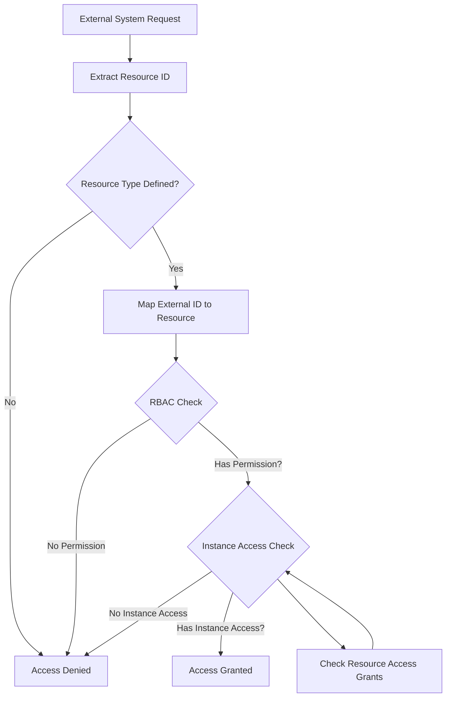
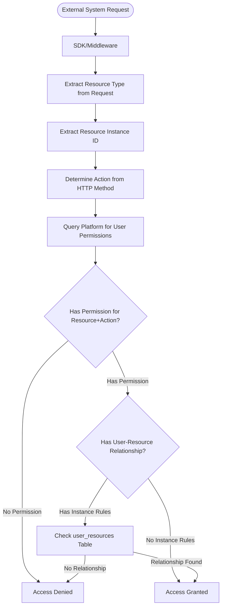

# Resource Access Control - Implementation Plan

## Overview

This document specifies the design and implementation of **Resource Access Control** for the Grant Platform. This system enables external systems to define their own resources (e.g., invoices, payment orders, policies, partners, customers) and manage fine-grained RBAC for those resources, while the Grant Platform remains agnostic about the actual resource data.

## Problem Statement

The Grant Platform currently implements a **Role-Based Access Control (RBAC)** system with the following structure:

```
User → Role → Group → Permission
```

**Current Permission Model:**

- Permissions are defined with an `action` field (e.g., `"user:read"`, `"project:create"`)
- The resource type is **encoded in the action string** (e.g., `"user:read"` means "read" action on "user" resource)
- Permissions are scoped to projects/organizations (tenant-level)
- Permissions grant access to **all resources of a type** within a scope

**Limitations:**

1. **No Explicit Resource Entity**: Resources are implicit in permission actions, not first-class entities
2. **No External Resource Support**: Cannot define resources that external systems manage (invoices, orders, policies, etc.)
3. **No Resource Instance Control**: A user with `"user:read"` can read **all users** - no way to restrict to specific instances
4. **Tight Coupling**: Permission actions must be predefined in the platform, limiting flexibility for external systems
5. **No Resource Mapping**: No way to map external system resource identifiers to platform resources

**Use Cases Requiring Resource Access Control:**

1. **External System Resources**
   - External systems need to define their own resources (invoices, payment orders, policies, partners, customers)
   - Each external system has different resource types and structures
   - Resources should be defined per project (each project = one external system)

2. **Instance-Level Access Control**
   - "User A can only read Invoice B"
   - "User X can only modify Payment Orders they created"
   - "User Y can only access Customers in their region"

3. **Resource Mapping**
   - Map external system resource IDs (from route params, payload fields) to platform resources
   - Support different mapping strategies (route params, JSON paths, query params)
   - Keep platform agnostic about actual resource data

4. **Flexible Permission Model**
   - Permissions should be linked to resources, not hardcoded in action strings
   - Support standard actions (read, write, delete, manage) that apply to any resource
   - Allow custom actions per resource type if needed

**Use Cases Requiring Resource Access Control:**

1. **Instance-Level Restrictions**
   - Restrict access to specific users, roles, groups, or permissions
   - Limit project access to specific projects
   - Control access to specific tags

2. **Attribute-Based Access**
   - Access based on resource ownership (e.g., "users can only edit their own resources")
   - Access based on resource tags (e.g., "users can only access resources with tag 'public'")
   - Access based on resource relationships (e.g., "users can only access resources in their organization")

3. **Conditional Access**
   - Time-based access (e.g., "access only during business hours")
   - Location-based access (e.g., "access only from specific IP ranges")
   - Status-based access (e.g., "access only to active resources")

4. **Hierarchical Access**
   - Access to parent resources grants access to child resources
   - Access to organization grants access to all projects within it

## Current Architecture Analysis

### Database Schema

**Existing Tables:**

- `users` - Core user entity
- `projects` - Project entities (isolated environments for external systems)
- `organizations` - Organization entities
- `roles` - Role entities
- `groups` - Group entities
- `permissions` - Permission entities (with `action` field only)
- `tags` - Tag entities
- `user_roles` - User role assignments
- `role_groups` - Role group assignments
- `group_permissions` - Group permission assignments
- `project_users` - Project user assignments
- `organization_users` - Organization user assignments

**Permission Evaluation Flow:**

```
User → UserRole → Role → RoleGroup → Group → GroupPermission → Permission
```

**Current Permission Structure:**

- `permissions.action`: String format like `"user:read"`, `"project:create"`
- Resource type is **encoded in the action string** (e.g., `"user:read"` = resource "user" + action "read")
- No explicit `resource_id` field in permissions table
- No `resources` table to define resource types
- No resource instance-level access control

### Current Permission Evaluation

**Process:**

1. Extract user from JWT token
2. Determine tenant scope (account/organization/project) from JWT `aud` claim or operation context
3. Get user's roles in the tenant scope
4. Get groups assigned to those roles
5. Get permissions assigned to those groups
6. Check if any permission matches the operation's `{resource}:{action}` pattern
7. Grant access if match found

**Example:**

```typescript
// Operation: Read user with ID "user-123"
const operation = {
  resource: 'user',
  action: 'read',
  resourceId: 'user-123', // Currently ignored
  scope: { id: 'project-456', tenant: 'project' },
};

// Current evaluation:
// 1. Check if user has permission with action "user:read" in project-456
// 2. If yes, grant access (regardless of which user is being read)
```

### Missing Components

1. **Resources Table** - No table to define resource types (invoices, orders, policies, etc.)
2. **Permission-Resource Link** - No explicit link between permissions and resources
3. **Resource Mapping** - No way to map external system resource IDs to platform resources
4. **Resource Instance Access Control** - No mechanism to control access to specific resource instances
5. **External System Integration** - No standardized way for external systems to define and manage their resources

## Proposed Solution

### Architecture Overview

We propose a **Resource-First RBAC** model where:

1. **Resources are First-Class Entities**: External systems define their resource types (invoices, orders, etc.) in the platform
2. **Permissions Link to Resources**: Permissions are explicitly linked to resources (not encoded in action strings)
3. **Resource Mapping**: Resources define how to extract resource IDs from external system requests (route params, payload fields)
4. **Instance-Level Access Control**: Support for controlling access to specific resource instances
5. **Platform Agnostic**: The platform never stores actual resource data - only metadata and access control rules



**Key Architectural Decisions:**

1. **Resource-First Design**: Resources are defined before permissions, enabling external systems to model their domain
2. **Decoupled from Data**: Platform never stores actual resource data - only metadata and access rules
3. **SDK/Middleware Handles Mapping**: Resource ID extraction happens in external system's middleware, not in platform
4. **Simple Relationship Storage**: Platform stores user-resource relationships via `user_resources` pivot table
5. **Backward Compatible**: Existing permission model (action strings) can coexist with new resource-based model
6. **Project-Scoped Resources**: Resources are defined per project (each project = one external system)

### Core Concepts

#### 1. Resources Table

Resources define the resource types that external systems manage. Each resource:

- Is scoped to a project (each project = one external system)
- Has a name and description
- Defines how to extract resource IDs from external requests
- Can have custom actions (beyond standard read/write/delete/manage)

**Example Resources:**

- `invoices` - Invoice resource for a billing system
- `payment_orders` - Payment order resource for a payment system
- `policies` - Insurance policy resource
- `partners` - Partner/customer resource
- `customers` - Customer resource

#### 2. Permission-Resource Relationship

Permissions are linked to resources via a foreign key or pivot table:

- `permissions.resource_id` - Links permission to a resource
- `permissions.action` - Action (read, write, delete, manage, or custom)
- This replaces the current `"resource:action"` string format

**Migration Path:**

- Existing permissions with `"user:read"` format can be migrated to resource-based model
- Support both formats during transition period
- Eventually deprecate action string format

#### 3. Resource Mapping

Resources define how to extract resource IDs from external system requests:

- **Route Parameter Mapping**: `resourceIdMapping: "params.id"` → Extract from `req.params.id`
- **Payload Mapping**: `resourceIdMapping: "body.invoiceId"` → Extract from `req.body.invoiceId`
- **Query Parameter Mapping**: `resourceIdMapping: "query.orderId"` → Extract from `req.query.orderId`
- **JSON Path Mapping**: `resourceIdMapping: "body.data.customer.id"` → Extract from nested JSON

#### 4. Resource Instance Access Control

Once a resource ID is extracted, check if the user has access to that specific instance:

- **Explicit Grants**: Direct mappings (user → resource instance)
- **Attribute-Based Rules**: Rules based on resource attributes (ownership, tags, relationships)
- **Default Behavior**: If no instance-level rules, RBAC permission is sufficient

## Database Schema Design

### Phase 1: Resources and Permission-Resource Linking

#### Core Table: `resources`

```sql
CREATE TABLE "resources" (
  "id" uuid PRIMARY KEY DEFAULT gen_random_uuid() NOT NULL,
  "project_id" uuid NOT NULL REFERENCES projects(id) ON DELETE CASCADE,
  "name" varchar(255) NOT NULL, -- e.g., "invoices", "payment_orders", "policies"
  "slug" varchar(255) NOT NULL, -- URL-friendly identifier
  "description" varchar(1000), -- Optional description
  "standard_actions" varchar(255)[] DEFAULT ARRAY['read', 'write', 'delete', 'manage'], -- Standard actions available
  "custom_actions" varchar(255)[], -- Custom actions specific to this resource
  "is_active" boolean DEFAULT true NOT NULL,
  "created_by" uuid REFERENCES users(id) NOT NULL,
  "created_at" timestamp DEFAULT now() NOT NULL,
  "updated_at" timestamp DEFAULT now() NOT NULL,
  "deleted_at" timestamp,
  CONSTRAINT "resources_project_slug_unique"
    UNIQUE("project_id", "slug")
    WHERE deleted_at IS NULL
);

CREATE INDEX "resources_project_id_idx" ON "resources"("project_id");
CREATE INDEX "resources_slug_idx" ON "resources"("slug");
CREATE INDEX "resources_deleted_at_idx" ON "resources"("deleted_at");
CREATE INDEX "resources_is_active_idx" ON "resources"("is_active");
```

**Key Design Decisions:**

- **Project-Scoped**: Resources belong to projects (each project = one external system)
- **No Mapping Storage**: Resource ID extraction is handled by SDK/middleware, not stored in platform
- **Standard Actions**: Default actions (read, write, delete, manage) available for all resources
- **Custom Actions**: Resource-specific actions (e.g., "approve" for invoices, "cancel" for orders)
- **Slug Uniqueness**: Resource slugs must be unique within a project
- **Simplified**: Platform focuses on storing relationships, not request parsing logic

#### Updated Table: `permissions`

**Option A: Add `resource_id` column (Recommended)**

```sql
ALTER TABLE "permissions"
  ADD COLUMN "resource_id" uuid REFERENCES resources(id) ON DELETE SET NULL;

CREATE INDEX "permissions_resource_id_idx" ON "permissions"("resource_id");
```

**Option B: Create Pivot Table (More Flexible)**

```sql
CREATE TABLE "permission_resources" (
  "id" uuid PRIMARY KEY DEFAULT gen_random_uuid() NOT NULL,
  "permission_id" uuid NOT NULL REFERENCES permissions(id) ON DELETE CASCADE,
  "resource_id" uuid NOT NULL REFERENCES resources(id) ON DELETE CASCADE,
  "created_at" timestamp DEFAULT now() NOT NULL,
  "deleted_at" timestamp,
  CONSTRAINT "permission_resources_unique"
    UNIQUE("permission_id", "resource_id")
    WHERE deleted_at IS NULL
);

CREATE INDEX "permission_resources_permission_id_idx" ON "permission_resources"("permission_id");
CREATE INDEX "permission_resources_resource_id_idx" ON "permission_resources"("resource_id");
```

**Recommendation**: Use Option A (add column) for simplicity, but Option B allows one permission to apply to multiple resources.

**Migration Strategy for Existing Permissions:**

1. Parse existing `action` strings (e.g., `"user:read"` → resource: "user", action: "read")
2. Create resource entries for parsed resource types (if they don't exist)
3. Link permissions to resources
4. Keep `action` field for backward compatibility during transition
5. Eventually deprecate action string format

### Phase 2: User-Resource Relationships

#### Core Table: `user_resources`

```sql
CREATE TABLE "user_resources" (
  "id" uuid PRIMARY KEY DEFAULT gen_random_uuid() NOT NULL,
  "user_id" uuid NOT NULL REFERENCES users(id) ON DELETE CASCADE,
  "resource_id" uuid NOT NULL REFERENCES resources(id) ON DELETE CASCADE,
  "resource_value" varchar(500) NOT NULL, -- External system's resource instance ID (e.g., "invoice-123")
  "project_id" uuid NOT NULL REFERENCES projects(id) ON DELETE CASCADE, -- Always scoped to project
  "granted_by" uuid REFERENCES users(id) NOT NULL,
  "granted_at" timestamp DEFAULT now() NOT NULL,
  "expires_at" timestamp, -- Optional expiration
  "is_revoked" boolean DEFAULT false NOT NULL,
  "revoked_at" timestamp,
  "revoked_by" uuid REFERENCES users(id),
  "created_at" timestamp DEFAULT now() NOT NULL,
  "updated_at" timestamp DEFAULT now() NOT NULL,
  "deleted_at" timestamp,
  CONSTRAINT "user_resources_unique"
    UNIQUE("user_id", "resource_id", "resource_value", "project_id")
    WHERE deleted_at IS NULL AND is_revoked = false
);

CREATE INDEX "user_resources_user_id_idx"
  ON "user_resources"("user_id");
CREATE INDEX "user_resources_resource_id_idx"
  ON "user_resources"("resource_id");
CREATE INDEX "user_resources_resource_value_idx"
  ON "user_resources"("resource_value");
CREATE INDEX "user_resources_project_idx"
  ON "user_resources"("project_id");
CREATE INDEX "user_resources_user_resource_idx"
  ON "user_resources"("user_id", "resource_id");
CREATE INDEX "user_resources_deleted_at_idx"
  ON "user_resources"("deleted_at");
CREATE INDEX "user_resources_is_revoked_idx"
  ON "user_resources"("is_revoked");
CREATE INDEX "user_resources_expires_at_idx"
  ON "user_resources"("expires_at");
```

**Key Design Decisions:**

- **Simple Pivot Table**: Direct user → resource → value relationship
- **Resource Value**: Stores the external system's resource instance identifier (string, not UUID)
- **Project-Scoped**: Always scoped to project (resources are project-scoped)
- **Expiration**: Optional expiration for time-limited access
- **Revocation**: Separate revocation flag for immediate access removal
- **Soft Delete**: Support soft deletion for audit trail
- **Unique Constraint**: Prevent duplicate relationships (same user, resource, value, project)
- **No Action Storage**: Actions are checked via permissions (user → role → group → permission → resource)

**Note**: This table stores **which resource instances** a user can access. The **actions** (read, write, delete) are determined by the user's permissions (via roles/groups), not stored in this table.

#### Audit Log Table: `user_resource_audit_logs`

```sql
CREATE TABLE "user_resource_audit_logs" (
  "id" uuid PRIMARY KEY DEFAULT gen_random_uuid() NOT NULL,
  "user_resource_id" uuid NOT NULL REFERENCES user_resources(id),
  "action" varchar(50) NOT NULL, -- 'create', 'update', 'revoke', 'delete'
  "old_values" jsonb,
  "new_values" jsonb,
  "metadata" jsonb,
  "performed_by" uuid NOT NULL REFERENCES users(id),
  "created_at" timestamp DEFAULT now() NOT NULL
);

CREATE INDEX "user_resource_audit_logs_user_resource_id_idx"
  ON "user_resource_audit_logs"("user_resource_id");
CREATE INDEX "user_resource_audit_logs_action_idx"
  ON "user_resource_audit_logs"("action");
CREATE INDEX "user_resource_audit_logs_performed_by_idx"
  ON "user_resource_audit_logs"("performed_by");
```

#### Audit Log Table: `resource_access_grant_audit_logs`

```sql
CREATE TABLE "resource_access_grant_audit_logs" (
  "id" uuid PRIMARY KEY DEFAULT gen_random_uuid() NOT NULL,
  "grant_id" uuid NOT NULL REFERENCES resource_access_grants(id),
  "action" varchar(50) NOT NULL, -- 'create', 'update', 'revoke', 'delete'
  "old_values" jsonb,
  "new_values" jsonb,
  "metadata" jsonb,
  "performed_by" uuid NOT NULL REFERENCES users(id),
  "created_at" timestamp DEFAULT now() NOT NULL
);

CREATE INDEX "resource_access_grant_audit_logs_grant_id_idx"
  ON "resource_access_grant_audit_logs"("grant_id");
CREATE INDEX "resource_access_grant_audit_logs_action_idx"
  ON "resource_access_grant_audit_logs"("action");
CREATE INDEX "resource_access_grant_audit_logs_performed_by_idx"
  ON "resource_access_grant_audit_logs"("performed_by");
```

### Phase 2: Attribute-Based Access Rules (Future Enhancement)

#### Core Table: `resource_access_rules`

```sql
CREATE TABLE "resource_access_rules" (
  "id" uuid PRIMARY KEY DEFAULT gen_random_uuid() NOT NULL,
  "name" varchar(255) NOT NULL,
  "description" varchar(1000),
  "rule_type" varchar(50) NOT NULL, -- 'ownership', 'attribute', 'relationship', 'condition'
  "resource_type" varchar(50) NOT NULL, -- 'user', 'project', 'role', etc.
  "condition_expression" jsonb NOT NULL, -- JSON expression defining the rule
  "permission_actions" varchar(255)[] NOT NULL, -- Actions this rule applies to
  "scope_id" uuid NOT NULL,
  "scope_tenant" varchar(50) NOT NULL,
  "priority" integer DEFAULT 100 NOT NULL, -- Higher priority = evaluated first
  "is_active" boolean DEFAULT true NOT NULL,
  "created_by" uuid REFERENCES users(id) NOT NULL,
  "created_at" timestamp DEFAULT now() NOT NULL,
  "updated_at" timestamp DEFAULT now() NOT NULL,
  "deleted_at" timestamp
);

CREATE INDEX "resource_access_rules_resource_type_idx"
  ON "resource_access_rules"("resource_type");
CREATE INDEX "resource_access_rules_scope_idx"
  ON "resource_access_rules"("scope_id", "scope_tenant");
CREATE INDEX "resource_access_rules_priority_idx"
  ON "resource_access_rules"("priority" DESC);
CREATE INDEX "resource_access_rules_is_active_idx"
  ON "resource_access_rules"("is_active");
```

**Rule Types:**

1. **Ownership Rules**: `resource.created_by = current_user.id`
2. **Attribute Rules**: `resource.tag_ids @> ['public']`
3. **Relationship Rules**: `resource.organization_id = current_user.organization_id`
4. **Condition Rules**: Complex JSON expressions (e.g., time-based, location-based)

## Access Evaluation Flow

### Resource-Based Permission Evaluation

**Note**: This flow happens in the **SDK/Middleware**, not in the platform. The platform provides permission queries.



### Evaluation Algorithm (SDK/Middleware)

**Platform API** (what the SDK calls):

```typescript
// Platform provides these query endpoints:

// 1. Get user's permissions for a resource
GET /api/projects/:projectId/users/:userId/permissions?resourceId=:resourceId

Response: {
  permissions: [
    {
      id: "perm-123",
      resourceId: "resource-invoice-uuid",
      action: "read",
      // ... other permission fields
    },
    {
      id: "perm-456",
      resourceId: "resource-invoice-uuid",
      action: "write",
    }
  ]
}

// 2. Check if user has access to specific resource instance
GET /api/projects/:projectId/users/:userId/resources/:resourceId/access?resourceValue=:resourceValue

Response: {
  hasAccess: true,
  userResource: {
    id: "user-resource-123",
    userId: "user-123",
    resourceId: "resource-invoice-uuid",
    resourceValue: "invoice-456",
    projectId: "project-789"
  }
}
```

**SDK/Middleware Implementation**:

```typescript
// External system's middleware (using Grant Platform SDK)
async function authorizeRequest(req, res, next) {
  // Step 1: Extract resource type from request (configured per endpoint in middleware)
  const resourceSlug = getResourceFromRoute(req.path); // e.g., "invoices" from "/api/invoices/:id"

  // Step 2: Extract resource instance ID (configured per endpoint)
  const resourceValue = extractResourceId(req); // e.g., from params.id, body.orderId, etc.

  // Step 3: Determine action from HTTP method
  const action = determineAction(req.method); // GET → "read", POST → "write", etc.

  // Step 4: Get user from access token
  const user = await getUserFromToken(req.headers.authorization);

  // Step 5: Query platform for user's permissions for this resource
  const permissions = await grantPlatform.getUserPermissions({
    projectId: process.env.GRANT_PROJECT_ID,
    userId: user.id,
    resourceSlug: resourceSlug,
  });

  // Step 6: Check if user has permission for this action
  const hasPermission = permissions.some((p) => p.action === action);
  if (!hasPermission) {
    return res.status(403).json({ error: 'Permission denied' });
  }

  // Step 7: Check if instance-level access control is needed
  // (Only if user_resources table has entries for this resource)
  const hasInstanceControl = await grantPlatform.hasInstanceControl({
    projectId: process.env.GRANT_PROJECT_ID,
    resourceSlug: resourceSlug,
  });

  if (hasInstanceControl) {
    // Step 8: Check user-resource relationship
    const hasAccess = await grantPlatform.checkUserResourceAccess({
      projectId: process.env.GRANT_PROJECT_ID,
      userId: user.id,
      resourceSlug: resourceSlug,
      resourceValue: resourceValue,
    });

    if (!hasAccess) {
      return res.status(403).json({ error: 'Resource access denied' });
    }
  }

  // Step 9: Allow request to proceed
  next();
}

// Helper: Extract resource ID (configured per endpoint in middleware)
function extractResourceId(req): string | null {
  // This is configured per endpoint in the middleware
  // Example configurations:
  // - Route param: req.params.id
  // - Payload: req.body.invoiceId
  // - Query: req.query.customerId
  // - JSON path: req.body.data.policy.id

  // Implementation depends on endpoint configuration
  return req.params.id || req.body.invoiceId || req.query.customerId || null;
}

// Helper: Determine action from HTTP method
function determineAction(method: string): string {
  const methodActionMap: Record<string, string> = {
    GET: 'read',
    POST: 'write',
    PUT: 'write',
    PATCH: 'write',
    DELETE: 'delete',
  };

  return methodActionMap[method] || 'read';
}
```

## API Design

### GraphQL Schema

#### Queries

```graphql
# Get resources for a project
query GetResources($projectId: ID!) {
  resources(projectId: $projectId) {
    id
    name
    slug
    description
    resourceIdMapping
    resourceIdMappingType
    standardActions
    customActions
    isActive
    createdAt
    updatedAt
  }
}

# Get resource access grants for a user/resource
query GetResourceAccessGrants($input: ResourceAccessGrantsInput!) {
  resourceAccessGrants(input: $input) {
    id
    granteeType
    grantee {
      ... on User {
        id
        name
      }
      ... on Role {
        id
        name
      }
      ... on Group {
        id
        name
      }
    }
    resource {
      id
      name
      slug
    }
    externalResourceInstanceId
    permissionAction
    project {
      id
      name
    }
    grantedBy {
      id
      name
    }
    grantedAt
    expiresAt
    isRevoked
    createdAt
  }
}

# Check if user has access to a specific resource instance
query CheckResourceAccess($input: CheckResourceAccessInput!) {
  checkResourceAccess(input: $input) {
    hasAccess
    reason
    resource {
      id
      name
      slug
    }
    externalResourceInstanceId
    grants {
      id
      granteeType
      permissionAction
    }
    rules {
      id
      name
      ruleType
    }
  }
}

input ResourceAccessGrantsInput {
  granteeType: GranteeType
  granteeId: ID
  resourceId: ID
  externalResourceInstanceId: String
  projectId: ID!
}

input CheckResourceAccessInput {
  resourceId: ID!
  externalResourceInstanceId: String!
  action: String!
  projectId: ID!
}

enum GranteeType {
  USER
  ROLE
  GROUP
}
```

#### Mutations

```graphql
# Create a resource
mutation CreateResource($input: CreateResourceInput!) {
  createResource(input: $input) {
    id
    name
    slug
    description
    resourceIdMapping
    resourceIdMappingType
    standardActions
    customActions
    project {
      id
      name
    }
    createdAt
  }
}

# Update a resource
mutation UpdateResource($input: UpdateResourceInput!) {
  updateResource(input: $input) {
    id
    name
    slug
    description
    resourceIdMapping
    resourceIdMappingType
    standardActions
    customActions
    updatedAt
  }
}

# Create user-resource relationship
mutation CreateUserResource($input: CreateUserResourceInput!) {
  createUserResource(input: $input) {
    id
    user {
      id
      name
    }
    resource {
      id
      name
      slug
    }
    resourceValue
    project {
      id
      name
    }
    grantedAt
    expiresAt
  }
}

# Revoke user-resource relationship
mutation RevokeUserResource($input: RevokeUserResourceInput!) {
  revokeUserResource(input: $input) {
    id
    isRevoked
    revokedAt
  }
}

# Delete user-resource relationship
mutation DeleteUserResource($input: DeleteUserResourceInput!) {
  deleteUserResource(input: $input) {
    id
    deletedAt
  }
}

input CreateResourceInput {
  projectId: ID!
  name: String!
  slug: String
  description: String
  standardActions: [String!] # Default: ['read', 'write', 'delete', 'manage']
  customActions: [String!]
}

input UpdateResourceInput {
  resourceId: ID!
  name: String
  slug: String
  description: String
  standardActions: [String!]
  customActions: [String!]
  isActive: Boolean
}

input CreateUserResourceInput {
  userId: ID!
  resourceId: ID!
  resourceValue: String! # External system's resource instance ID
  projectId: ID!
  expiresAt: Date
}

input RevokeResourceAccessInput {
  grantId: ID!
}

input DeleteResourceAccessGrantInput {
  grantId: ID!
}
```

### REST API

#### Endpoints

```
# Resources Management
GET /api/projects/:projectId/resources
GET /api/projects/:projectId/resources/:id
POST /api/projects/:projectId/resources
Body: {
  "name": "invoices",
  "slug": "invoices",
  "description": "Invoice resource for billing system",
  "resourceIdMapping": "params.id",
  "resourceIdMappingType": "route_param",
  "standardActions": ["read", "write", "delete", "manage"],
  "customActions": ["approve", "reject"]
}
PATCH /api/projects/:projectId/resources/:id
DELETE /api/projects/:projectId/resources/:id

# User-Resource Relationships
GET /api/projects/:projectId/user-resources?userId={id}&resourceId={id}&resourceValue={value}

GET /api/projects/:projectId/user-resources/:id

POST /api/projects/:projectId/user-resources
Body: {
  "userId": "user-123",
  "resourceId": "resource-invoice-uuid",
  "resourceValue": "invoice-456",
  "expiresAt": "2024-12-31T23:59:59Z"
}

PATCH /api/projects/:projectId/user-resources/:id
Body: {
  "expiresAt": "2025-12-31T23:59:59Z"
}

POST /api/projects/:projectId/user-resources/:id/revoke

DELETE /api/projects/:projectId/user-resources/:id

# Permission Queries (for SDK/middleware)
GET /api/projects/:projectId/users/:userId/permissions?resourceSlug={slug}

Response: {
  "permissions": [
    {
      "id": "perm-123",
      "resourceId": "resource-invoice-uuid",
      "resource": {
        "id": "resource-invoice-uuid",
        "name": "invoices",
        "slug": "invoices"
      },
      "action": "read"
    }
  ]
}

# Check User-Resource Access (for SDK/middleware)
GET /api/projects/:projectId/users/:userId/resources/:resourceSlug/access?resourceValue={value}

Response: {
  "hasAccess": true,
  "userResource": {
    "id": "user-resource-123",
    "userId": "user-123",
    "resourceId": "resource-invoice-uuid",
    "resourceValue": "invoice-456",
    "projectId": "project-789"
  }
}

# Check if instance control is enabled for a resource
GET /api/projects/:projectId/resources/:resourceSlug/instance-control

Response: {
  "hasInstanceControl": true
}
```

### External System Integration Example

**Scenario**: External billing system wants to use Grant Platform for RBAC on invoices.

**Step 1: Define Resource**

```typescript
// External system admin creates resource via API
POST /api/projects/proj-123/resources
{
  "name": "invoices",
  "slug": "invoices",
  "description": "Invoice resource for billing system",
  "resourceIdMapping": "params.id", // Extract from route: GET /api/invoices/:id
  "resourceIdMappingType": "route_param",
  "standardActions": ["read", "write", "delete", "manage"],
  "customActions": ["approve", "reject", "send"]
}
```

**Step 2: Create Permissions Linked to Resource**

```typescript
// Create permission for reading invoices
POST /api/projects/proj-123/permissions
{
  "name": "Read Invoices",
  "action": "read",
  "resourceId": "resource-invoice-uuid", // Link to resource
  "description": "Allows reading invoice data"
}

// Create permission for approving invoices
POST /api/projects/proj-123/permissions
{
  "name": "Approve Invoices",
  "action": "approve", // Custom action
  "resourceId": "resource-invoice-uuid",
  "description": "Allows approving invoices"
}
```

**Step 3: Grant Instance-Level Access**

```typescript
// Grant user access to specific invoice
POST /api/projects/proj-123/resource-access-grants
{
  "granteeType": "user",
  "granteeId": "user-123",
  "resourceId": "resource-invoice-uuid",
  "externalResourceInstanceId": "invoice-456", // External system's invoice ID
  "permissionAction": "read"
}
```

**Step 4: External System Authorization Check**

```typescript
// External system middleware
async function authorizeRequest(req, res, next) {
  // 1. Identify resource from request path
  const resource = await identifyResource(req.path, projectId);
  if (!resource) {
    return res.status(403).json({ error: 'Resource not defined' });
  }

  // 2. Extract resource instance ID using mapping
  const externalResourceInstanceId = extractResourceId(
    req,
    resource.resourceIdMapping,
    resource.resourceIdMappingType
  );

  // 3. Determine action from HTTP method
  const action = determineAction(req.method, resource);

  // 4. Check access via Grant Platform API
  const accessCheck = await grantPlatform.checkAccess({
    resourceId: resource.id,
    externalResourceInstanceId,
    action,
    projectId,
  });

  if (!accessCheck.hasAccess) {
    return res.status(403).json({
      error: 'Access denied',
      reason: accessCheck.reason,
    });
  }

  // 5. Allow request to proceed
  next();
}
```

**Benefits:**

- ✅ Platform never stores actual invoice data
- ✅ External system maintains full control of their data
- ✅ Flexible resource definition per project
- ✅ Support for custom actions (approve, reject, etc.)
- ✅ Instance-level access control

## Implementation Phases

### Phase 1: Resources Table & Permission-Resource Linking

**Goal**: Establish foundation for resource-first RBAC

**Tasks:**

- [ ] Create `resources` table schema
- [ ] Add `resource_id` column to `permissions` table (or create pivot table)
- [ ] Create Drizzle schema files
- [ ] Create migration files
- [ ] Migrate existing permissions to resource-based model
- [ ] Define TypeScript types and interfaces
- [ ] Create repository layer for resources

**Files to Create:**

- `packages/@logusgraphics/grant-database/src/schemas/resources.schema.ts`
- `packages/@logusgraphics/grant-database/src/migrations/XXXX_resources.sql`
- `apps/api/src/repositories/resources.repository.ts`

### Phase 2: Service Layer for Resources

**Goal**: Implement business logic for resource management

**Tasks:**

- [ ] Create `ResourceService`
- [ ] Implement resource CRUD operations
- [ ] Implement resource validation
- [ ] Add audit logging
- [ ] Update permission service to work with resources
- [ ] Create `UserResourceService` for managing user-resource relationships

**Files to Create:**

- `apps/api/src/services/resources.service.ts`
- `apps/api/src/services/resources.schemas.ts`
- `apps/api/src/lib/resource-id-extractor.ts` (helper for extracting resource IDs)

### Phase 3: Resource Instance Access Control

**Goal**: Implement instance-level access control

**Tasks:**

- [ ] Create `user_resources` table schema
- [ ] Create `user_resource_audit_logs` table schema
- [ ] Create `UserResourceRepository`
- [ ] Create `UserResourceService`
- [ ] Implement user-resource relationship creation with validation
- [ ] Implement relationship revocation
- [ ] Implement access check queries (for SDK)
- [ ] Add audit logging
- [ ] Implement expiration handling

**Files to Create:**

- `packages/@logusgraphics/grant-database/src/schemas/user-resources.schema.ts`
- `packages/@logusgraphics/grant-database/src/migrations/XXXX_user_resources.sql`
- `apps/api/src/repositories/user-resources.repository.ts`
- `apps/api/src/services/user-resources.service.ts`
- `apps/api/src/services/user-resources.schemas.ts`

### Phase 4: Access Evaluation Integration

**Goal**: Integrate resource-based access evaluation into permission flow

**Tasks:**

- [ ] Create permission query endpoints for SDK
- [ ] Create user-resource access check endpoints for SDK
- [ ] Implement instance control detection (check if user_resources has entries)
- [ ] Integrate with existing permission service
- [ ] Add caching for permission queries
- [ ] Optimize queries for performance

**Files to Create/Modify:**

- `apps/api/src/services/permissions.service.ts` (add resource-based queries)
- `apps/api/src/services/user-resources.service.ts` (add access check methods)
- `apps/api/src/rest/routes/permissions.routes.ts` (add resource-based endpoints)
- `apps/api/src/rest/routes/user-resources.routes.ts` (add access check endpoints)

### Phase 5: GraphQL Schema & Handlers

**Goal**: Expose resources and resource access control via GraphQL

**Tasks:**

- [ ] Create GraphQL schema types for resources
- [ ] Create GraphQL schema types for user-resources
- [ ] Create GraphQL queries (resources, user-resources, access check)
- [ ] Create GraphQL mutations (create/update resource, create/revoke user-resource)
- [ ] Create GraphQL resolvers
- [ ] Create handler layer

**Files to Create:**

- `packages/@logusgraphics/grant-schema/src/schema/resources/`
- `packages/@logusgraphics/grant-schema/src/schema/user-resources/`
- `apps/api/src/graphql/resolvers/resources/`
- `apps/api/src/graphql/resolvers/user-resources/`
- `apps/api/src/handlers/resources.handler.ts`
- `apps/api/src/handlers/user-resources.handler.ts`

### Phase 6: REST API

**Goal**: Expose resources and resource access control via REST

**Tasks:**

- [ ] Create REST routes for resources
- [ ] Create REST routes for user-resources
- [ ] Create REST routes for permission queries (SDK endpoints)
- [ ] Create REST controllers
- [ ] Create request/response schemas
- [ ] Add OpenAPI documentation
- [ ] Add validation middleware

**Files to Create:**

- `apps/api/src/rest/routes/resources.routes.ts`
- `apps/api/src/rest/routes/user-resources.routes.ts`
- `apps/api/src/rest/controllers/resources.controller.ts`
- `apps/api/src/rest/controllers/user-resources.controller.ts`
- `apps/api/src/rest/schemas/resources.schemas.ts`
- `apps/api/src/rest/schemas/user-resources.schemas.ts`
- `apps/api/src/rest/openapi/resources.openapi.ts`
- `apps/api/src/rest/openapi/user-resources.openapi.ts`

### Phase 7: Web Integration

**Goal**: Add UI for managing resources and resource access grants

**Tasks:**

- [ ] Create React hooks for resources
- [ ] Create React hooks for user-resources
- [ ] Create GraphQL operation files
- [ ] Create UI components for resource management
- [ ] Create UI components for user-resource relationship management
- [ ] Add resource management to project settings
- [ ] Add user-resource management to resource detail pages
- [ ] Add access indicators to resource lists

**Files to Create:**

- `apps/web/hooks/resources/`
- `apps/web/hooks/user-resources/`
- `packages/@logusgraphics/grant-schema/src/operations/resources/`
- `packages/@logusgraphics/grant-schema/src/operations/user-resources/`
- `apps/web/components/features/resources/`
- `apps/web/components/features/user-resources/`

### Phase 8: Testing

**Goal**: Comprehensive testing of resource access control

**Tasks:**

- [ ] Unit tests for repositories
- [ ] Unit tests for services
- [ ] Integration tests for access evaluation
- [ ] Integration tests for API endpoints
- [ ] Security tests (unauthorized access attempts)
- [ ] Performance tests (large numbers of grants)

### Phase 9: Documentation

**Goal**: Document resource access control system

**Tasks:**

- [ ] API documentation
- [ ] Usage guide
- [ ] Security best practices
- [ ] Example use cases
- [ ] Migration guide

## Security Considerations

### 1. Grant Creation Authorization

- Only users with appropriate permissions can create grants
- Grant creator must have permission to grant the specified action
- Grant creator must have access to the scope (project/organization)

### 2. Grant Revocation

- Grant creator or scope admin can revoke grants
- Revocation is immediate (no grace period)
- Revoked grants are logged for audit

### 3. Access Evaluation Security

- Access evaluation must be performed server-side
- Client-side checks are for UX only, not security
- All access checks must be logged for audit

### 4. Performance & Caching

- Cache access evaluation results (with appropriate TTL)
- Invalidate cache on grant creation/revocation
- Use database indexes for efficient queries
- Consider rate limiting for access check endpoints

### 5. Audit Trail

- Log all grant operations (create, revoke, delete)
- Log all access evaluation attempts
- Track who granted access and when
- Track who revoked access and when

## Performance Considerations

### 1. Query Optimization

- Use composite indexes on frequently queried columns
- Batch access checks when possible
- Use database views for complex queries

### 2. Caching Strategy

- Cache grants by grantee (user/role/group)
- Cache grants by resource
- Cache access evaluation results
- Invalidate cache on grant changes

### 3. Scalability

- Consider partitioning grants table by scope
- Consider read replicas for access evaluation queries
- Monitor query performance and optimize as needed

## Future Enhancements

### Phase 2: Attribute-Based Access Rules

- Implement `resource_access_rules` table
- Create rule evaluation engine
- Support ownership-based rules
- Support attribute-based rules
- Support relationship-based rules
- Support conditional rules (time, location, etc.)

### Phase 3: Advanced Features

- **Inheritance**: Grants on parent resources inherit to child resources
- **Negative Grants**: Explicit deny rules (higher priority than allow)
- **Temporary Grants**: Time-limited access with automatic expiration
- **Bulk Operations**: Grant/revoke access to multiple resources at once
- **Access Templates**: Predefined grant patterns for common scenarios
- **Access Analytics**: Dashboard showing access patterns and usage

## Open Questions

1. **Grant Inheritance**: Should grants on organizations automatically apply to projects within them?
2. **Negative Grants**: Should we support explicit deny rules (in addition to allow rules)?
3. **Default Behavior**: When RAC is enabled but no grants exist, should access be denied or allowed (based on RBAC)?
4. **Grant Limits**: Should there be limits on the number of grants per user/resource?
5. **Grant Expiration**: Should expired grants be automatically cleaned up, or kept for audit?
6. **Performance**: How many grants can we support before performance degrades? What's the scaling strategy?

## Dependencies

- Existing RBAC system (permissions, roles, groups)
- Existing multi-tenancy system (projects, organizations)
- Existing audit logging system
- Existing caching infrastructure
- Existing authentication/authorization middleware

## Risks & Mitigations

1. **Performance Impact**: Large numbers of grants could slow down access evaluation
   - **Mitigation**: Implement caching, optimize queries, consider partitioning

2. **Complexity**: Adding RAC increases system complexity
   - **Mitigation**: Start with simple explicit grants, add complexity gradually

3. **Backward Compatibility**: Existing RBAC-only systems need to continue working
   - **Mitigation**: Make RAC opt-in, default to RBAC-only behavior

4. **Grant Management Overhead**: Managing many grants could be tedious
   - **Mitigation**: Provide bulk operations, templates, and attribute-based rules (Phase 2)

5. **Security**: Incorrect access evaluation could grant unauthorized access
   - **Mitigation**: Comprehensive testing, security audits, server-side-only evaluation

---

## Summary

This implementation plan provides a comprehensive approach to adding Resource Access Control to the Grant Platform, enabling external systems to define their own resources and manage fine-grained RBAC:

### Key Features

1. **Resource-First Architecture**: Resources are first-class entities that external systems define (invoices, orders, policies, etc.)
2. **Platform Agnostic**: Platform never stores actual resource data - only metadata and access control rules
3. **SDK/Middleware Handles Mapping**: Resource ID extraction configured per endpoint in external system's middleware
4. **Simple Relationship Storage**: Platform stores user-resource relationships via `user_resources` pivot table (user_id, resource_id, resource_value)
5. **Permission-Resource Linking**: Permissions are explicitly linked to resources (replacing action string format)
6. **Instance-Level Access Control**: Support for controlling access to specific resource instances
7. **Backward Compatible**: Existing permission model can coexist during transition

### Architecture Benefits

- **Decoupled**: External systems maintain full control of their data and request parsing logic
- **Flexible**: Each project (external system) can define their own resource types and mapping strategies
- **Simple Platform**: Platform focuses on relationships, not request parsing complexity
- **Scalable**: Supports large numbers of resources and user-resource relationships
- **Secure**: Comprehensive authorization checks and audit logging
- **Standardized**: Consistent API for all external systems
- **SDK-Friendly**: Mapping logic in SDK allows per-endpoint configuration flexibility

### Implementation Phases

**Phase 1**: Resources table and permission-resource linking

- Define resources per project
- Link permissions to resources
- Support resource ID mapping

**Phase 2**: Resource instance access control

- Explicit grants for specific resource instances
- Instance-level access evaluation

**Phase 3**: Attribute-based rules (future)

- Ownership-based rules
- Attribute-based rules
- Relationship-based rules

The phased approach allows for incremental implementation, starting with resource definition and basic access control, then expanding to instance-level and attribute-based rules for advanced use cases.
