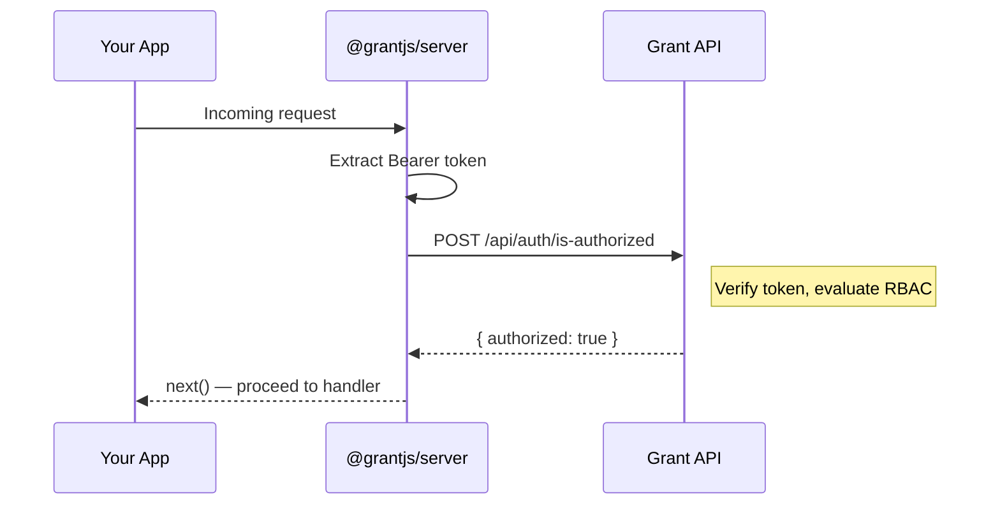

# Integration Guide

This tutorial walks you from a running Grant instance to a fully protected API endpoint. By the end you will have created a resource with permissions, issued an API key, exchanged it for a JWT, and wired `@grantjs/server` middleware to guard your Express routes.

::: info Prerequisites

- Grant running locally — see [Quick Start](/getting-started/quick-start)
- An authenticated session (log in via the web dashboard or `POST /api/auth/login`)
- A personal account (created automatically at registration)
- `curl` and a terminal
  :::

Throughout this guide, replace placeholder UUIDs with the actual IDs returned by each step. Variables are shown as `$ORG_ID`, `$PROJECT_ID`, etc.

## Step 1 — Create an Organization

Organizations are optional — you can scope everything to your personal account instead. If you want multi-user collaboration, create one:

```bash
curl -s -X POST http://localhost:4000/api/organizations \
  -H "Content-Type: application/json" \
  -H "Authorization: Bearer $ACCESS_TOKEN" \
  -d '{
    "name": "Acme Corp",
    "scope": { "tenant": "account", "id": "'$ACCOUNT_ID'" }
  }'
```

Save the returned `id` as `$ORG_ID`.

## Step 2 — Create a Project

Projects are isolated environments that hold resources, roles, and API keys. Create one scoped to your organization (or personal account):

```bash
curl -s -X POST http://localhost:4000/api/projects \
  -H "Content-Type: application/json" \
  -H "Authorization: Bearer $ACCESS_TOKEN" \
  -d '{
    "name": "My App",
    "scope": { "tenant": "organization", "id": "'$ORG_ID'" }
  }'
```

Save the returned `id` as `$PROJECT_ID`.

## Step 3 — Create a Resource

A resource declares what entity your application protects and which actions are available. Create a `Document` resource to match the [Server SDK examples](https://github.com/logusgraphics/grant/tree/main/packages/%40grantjs/server/examples):

```bash
curl -s -X POST http://localhost:4000/api/resources \
  -H "Content-Type: application/json" \
  -H "Authorization: Bearer $ACCESS_TOKEN" \
  -d '{
    "name": "Document",
    "slug": "document",
    "actions": ["Create", "Read", "Update", "Delete", "Query"],
    "scope": { "tenant": "organizationProject", "id": "'$ORG_ID:$PROJECT_ID'" }
  }'
```

Save the returned `id` as `$RESOURCE_ID`.

## Step 4 — Create Permissions

Create one permission for each action on the resource. Here is `Document:Query` — repeat for `Create`, `Read`, `Update`, `Delete`:

```bash
curl -s -X POST http://localhost:4000/api/permissions \
  -H "Content-Type: application/json" \
  -H "Authorization: Bearer $ACCESS_TOKEN" \
  -d '{
    "name": "Query Documents",
    "action": "Query",
    "scope": { "tenant": "organizationProject", "id": "'$ORG_ID:$PROJECT_ID'" }
  }'
```

Save each returned `id`. You will need all five for the next step.

## Step 5 — Create a Group

A group bundles related permissions. Create a `DocumentFullAccess` group with all five permission IDs:

```bash
curl -s -X POST http://localhost:4000/api/groups \
  -H "Content-Type: application/json" \
  -H "Authorization: Bearer $ACCESS_TOKEN" \
  -d '{
    "name": "DocumentFullAccess",
    "permissionIds": ["'$PERM_CREATE'", "'$PERM_READ'", "'$PERM_UPDATE'", "'$PERM_DELETE'", "'$PERM_QUERY'"],
    "scope": { "tenant": "organizationProject", "id": "'$ORG_ID:$PROJECT_ID'" }
  }'
```

Save the returned `id` as `$GROUP_ID`.

## Step 6 — Create a Role with the Group

Create a role and assign the group to it. This step uses the **GraphQL API** because the REST role endpoint does not yet accept `groupIds`:

```graphql
mutation {
  createRole(
    input: {
      name: "DocumentEditor"
      groupIds: ["<GROUP_ID>"]
      scope: { tenant: organizationProject, id: "<ORG_ID>:<PROJECT_ID>" }
    }
  ) {
    id
    name
  }
}
```

Send this via the GraphQL playground at `http://localhost:4000/graphql` or with curl:

```bash
curl -s -X POST http://localhost:4000/graphql \
  -H "Content-Type: application/json" \
  -H "Authorization: Bearer $ACCESS_TOKEN" \
  -d '{
    "query": "mutation($input: CreateRoleInput!) { createRole(input: $input) { id name } }",
    "variables": {
      "input": {
        "name": "DocumentEditor",
        "groupIds": ["'$GROUP_ID'"],
        "scope": { "tenant": "organizationProject", "id": "'$ORG_ID:$PROJECT_ID'" }
      }
    }
  }'
```

Save the returned `id` as `$ROLE_ID`.

## Step 7 — Assign the Role to a User

Assign the role to yourself (or another user) via GraphQL:

```bash
curl -s -X POST http://localhost:4000/graphql \
  -H "Content-Type: application/json" \
  -H "Authorization: Bearer $ACCESS_TOKEN" \
  -d '{
    "query": "mutation($input: AddUserRoleInput!) { addUserRole(input: $input) { userId roleId } }",
    "variables": {
      "input": {
        "userId": "'$USER_ID'",
        "roleId": "'$ROLE_ID'"
      }
    }
  }'
```

## Step 8 — Create an API Key

Create an API key scoped to the project. The response includes the `clientSecret` — **store it now, it is shown only once**:

```bash
curl -s -X POST http://localhost:4000/api/api-keys \
  -H "Content-Type: application/json" \
  -H "Authorization: Bearer $ACCESS_TOKEN" \
  -d '{
    "name": "My App Key",
    "scope": { "tenant": "organizationProject", "id": "'$ORG_ID:$PROJECT_ID'" },
    "roleId": "'$ROLE_ID'"
  }'
```

Save `clientId` and `clientSecret` from the response.

## Step 9 — Exchange for a Token

Exchange the API key credentials for a JWT access token:

```bash
curl -s -X POST http://localhost:4000/api/auth/token \
  -H "Content-Type: application/json" \
  -d '{
    "clientId": "'$CLIENT_ID'",
    "clientSecret": "'$CLIENT_SECRET'",
    "scope": { "tenant": "organizationProject", "id": "'$ORG_ID:$PROJECT_ID'" }
  }'
```

The response contains an `accessToken` (RS256 JWT) and `expiresIn` (seconds). This token carries the user's permissions for the project scope.

## Step 10 — Guard Your Endpoints

Install the server SDK and wire the middleware into your Express app:

```bash
npm install @grantjs/server
```

```typescript
import { GrantClient } from '@grantjs/server';
import { grant } from '@grantjs/server/express';
import express from 'express';

const app = express();
app.use(express.json());

const grantClient = new GrantClient({
  apiUrl: 'http://localhost:4000',
});

// Guard: only users with Document:Query permission can list
app.get(
  '/documents',
  grant(grantClient, { resource: 'document', action: 'query' }),
  (_req, res) => {
    res.json({ data: [{ id: '1', title: 'Hello World' }] });
  }
);

// Guard: only users with Document:Create permission can create
app.post(
  '/documents',
  grant(grantClient, { resource: 'document', action: 'create' }),
  (req, res) => {
    res.status(201).json({ data: { id: Date.now(), title: req.body.title } });
  }
);

app.listen(3000);
```

Test it with the token from Step 9:

```bash
# Should succeed (200)
curl -s http://localhost:3000/documents \
  -H "Authorization: Bearer $ACCESS_TOKEN"

# Should succeed (201)
curl -s -X POST http://localhost:3000/documents \
  -H "Content-Type: application/json" \
  -H "Authorization: Bearer $ACCESS_TOKEN" \
  -d '{"title": "New Document"}'

# Should fail (401 — no token)
curl -s http://localhost:3000/documents
```

## What Happens Under the Hood



The `grant()` middleware extracts the token from the `Authorization` header, sends it to Grant's authorization endpoint along with the resource and action, and either calls `next()` (authorized) or returns `401`/`403` (denied).

## Next Steps

- Add [resource resolvers](/integration/server-sdk#resource-resolvers) for condition-based permissions on update/delete
- Protect React components with the [Client SDK](/integration/client-sdk) (`GrantGate`, `useGrant`)
- Explore the full [Server SDK reference](/integration/server-sdk) for Fastify, Next.js, and NestJS integrations
- Browse the [example apps](https://github.com/logusgraphics/grant/tree/main/packages/%40grantjs/server/examples) for complete implementations

---

**Related:**

- [Quick Start](/getting-started/quick-start) — Get Grant running locally
- [Resources](/core-concepts/resources) — Built-in resources and custom resource creation
- [API Keys](/core-concepts/api-keys) — Token exchange and scoping details
- [RBAC System](/architecture/rbac) — How permissions are evaluated
