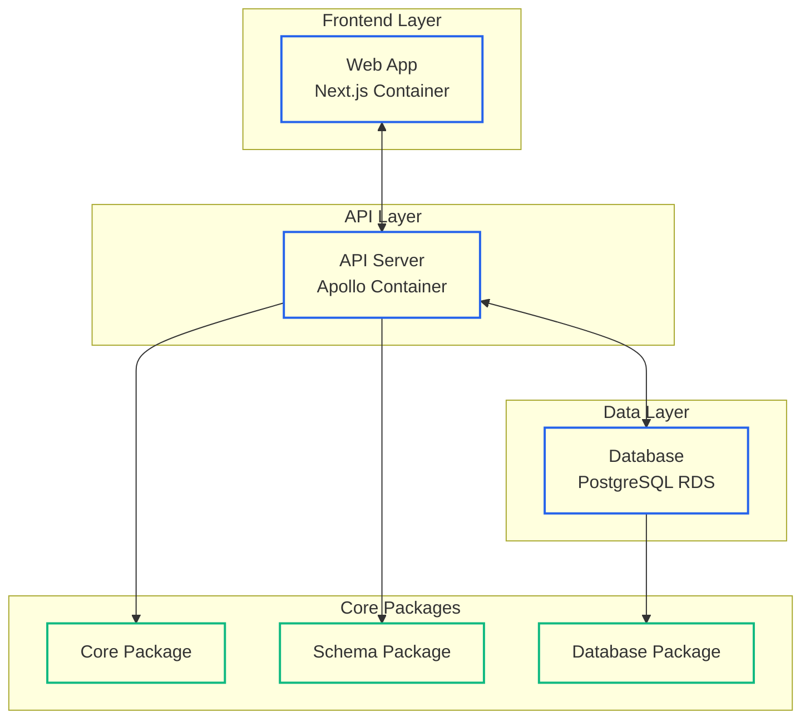
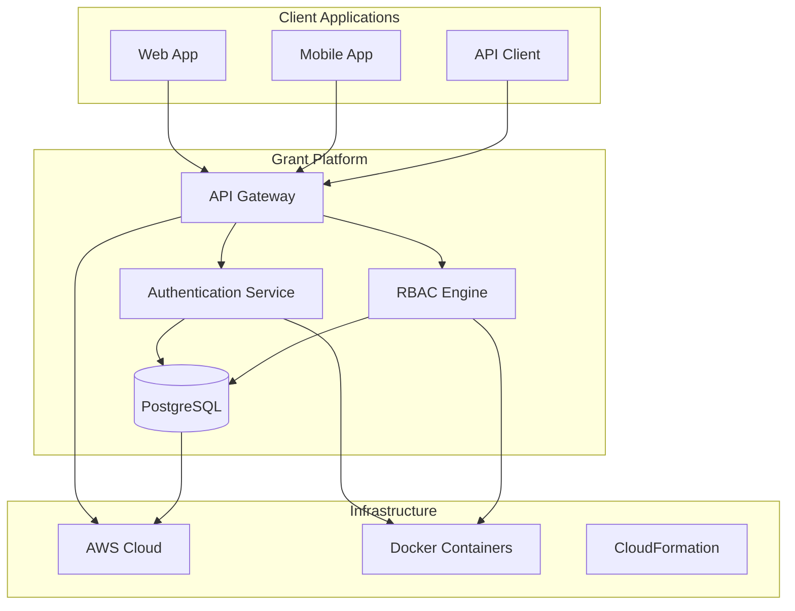
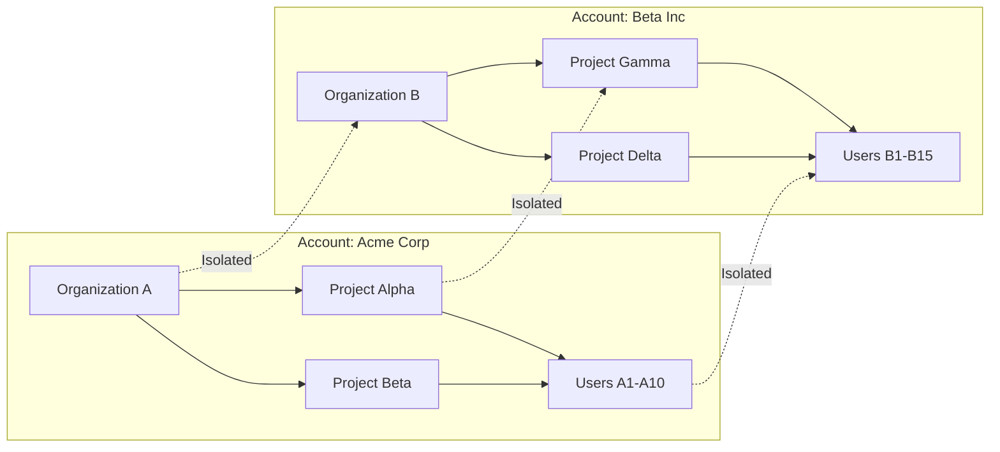
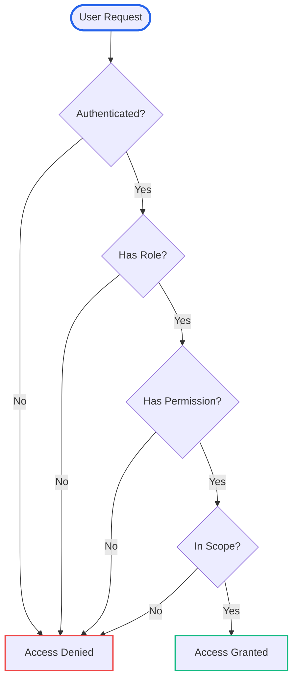

# What is Grant Platform?

Grant Platform is an open-source, multi-tenant RBAC/ACL (Role-Based Access Control / Access Control List) platform designed to provide comprehensive identity and access management for modern applications.

## Key Features

### 🔐 Multi-Tenant RBAC/ACL

- **Account-based multi-tenancy** with organization and project isolation
- **Flexible permission system** with action-based scoping
- **Role and group management** with inheritance and delegation
- **Real-time permission updates** across all connected systems

### 🏗️ Modern Architecture

- **Monorepo structure** with shared packages and independent apps
- **GraphQL API** with type-safe operations and subscriptions
- **PostgreSQL database** with Drizzle ORM and migrations
- **Containerized deployment** with Docker and AWS CloudFormation

### 🚀 Developer Experience

- **TypeScript-first** with full type safety
- **Comprehensive SDK** for Node.js, Express, Next.js, and more
- **Rich documentation** with examples and best practices
- **Active community** with Discord support and GitHub discussions

### 🌐 Deployment Options

- **Self-hosting** with CloudFormation templates
- **SaaS platform** with managed infrastructure
- **Docker containers** for easy deployment
- **AWS integration** with auto-scaling and monitoring

## Use Cases

### Internal RBAC

Manage employee access to internal systems, applications, and resources with fine-grained permissions and audit trails.

### Customer Portals

Provide secure, role-based access to customer-facing applications with organization and project-level isolation.

### API Access Control

Control access to your APIs with rate limiting, permission-based endpoints, and comprehensive audit logging.

### Compliance & Auditing

Meet compliance requirements with detailed audit logs, permission tracking, and data access monitoring.

## Architecture Overview

### Core Components

- **Web App** - Next.js frontend with authentication and user management
- **API Server** - Apollo GraphQL server with comprehensive RBAC/ACL
- **Database** - PostgreSQL with Drizzle ORM and migration system
- **Core Package** - Shared RBAC/ACL logic and middleware
- **Schema Package** - GraphQL schema and generated types
- **Database Package** - Database schemas, migrations, and utilities

## Why Grant Platform?

### For Developers

- **Type-safe** GraphQL API with generated TypeScript types
- **Comprehensive SDK** with middleware for popular frameworks
- **Rich documentation** with examples and best practices
- **Active development** with regular updates and community contributions

### For Organizations

- **Open source** with transparent development and community support
- **Self-hosting** option with no vendor lock-in
- **Scalable architecture** that grows with your needs
- **Compliance ready** with audit logging and data protection

### For DevOps

- **Containerized** deployment with Docker and Kubernetes support
- **CloudFormation templates** for one-click AWS deployment
- **Monitoring integration** with comprehensive metrics and logging
- **Automated scaling** with AWS Fargate and RDS

## System Architecture

Grant Platform follows a modern, scalable architecture designed for multi-tenancy and high performance:

## Multi-Tenancy Model

Our account-based multi-tenancy ensures complete isolation between organizations:

## Permission Flow

Here's how permissions are evaluated in Grant Platform:

## Getting Started

Ready to get started with Grant Platform? Here are your next steps:

1. **[Quick Start Guide](/quick-start)** - Get up and running in minutes
2. **[Architecture Deep Dive](/architecture/overview)** - Understand the system design
3. **[Self-Hosting Setup](/deployment/self-hosting)** - Deploy on your infrastructure
4. **[API Reference](/api/)** - Explore the GraphQL API

## Community & Support

- **GitHub** - [Source code and issues](https://github.com/logusgraphics/grant-platform)
- **Discord** - [Community discussions](https://discord.gg/grant-platform)
- **Email** - [Support and inquiries](mailto:support@grant.logus.graphics)

---

**Next:** [Quick Start Guide](/quick-start) to get Grant Platform running locally or in production.
